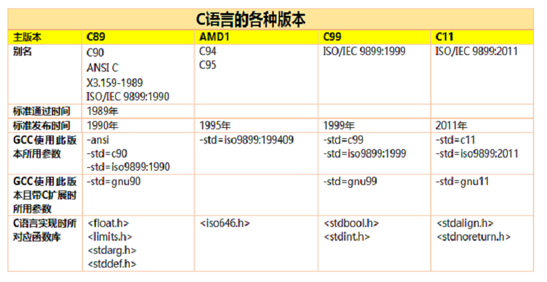

# 《C语言入门经典（第四版）》

## 1.变量大小问题

​		不同种类的操作系统和不同位数的操作系统中C语言变量所占位数的大小可能不同，可以用sizeof([变量类型])来判断，如下图：
​      由以下程序可以基本判断，一个随机的不超过int类型范围的整数的默认类型是int型，一个随机的小数默认类型是double型（ 超过double会报错）。
​       根据本人亲自试验，数据类型的具体长度还可能与编译器有关。与本书第35页，2.5节 整数变量的说明相符合。

```c
#include<stdio.h>
int main(){
printf("char 的长度是：%ld\n",sizeof(char));
printf("short 的长度是：%ld\n",sizeof(short));
printf("int 的长度是：%ld\n",sizeof(int));
printf("long 的长度是：%ld\n",sizeof(long));
printf("long long 的长度是：%ld\n",sizeof(long long));
printf("float 的长度是：%ld\n",sizeof(float));
printf("double 的长度是:%ld\n",sizeof(double));

printf("一个随机整数的默认长度是：%ld\n",sizeof(1213));
printf("一个随机小数的默认长度是：%ld\n",sizeof(123.12));
return 0;
}
```

- 运行结果： 
  
```
  centos 64
  char 的长度是：1
  short 的长度是：2
  int 的长度是：4
  long 的长度是：8
  long long 的长度是：8
  float 的长度是：4
  double 的长度是:8
  一个随机整数的默认长度是：4
  一个随机小数的默认长度是：8
```

- Windows xp 32位（虚拟机）


- ubuntu16 amd64（虚拟机）


## 2.编码规范（一）

为了规范变量的使用和命名，通常在变量赋的值之后加上其拥有的固定标识，具体如下：
```c
long big_number = 10099L;    //写成小写的l 也可以，但是为了识别度最好不要这样做。
long long number = 139819LL;
unsigned int count = 10U;
unsigned long count_t = 10000UL;
0x546484;               //十六进制
015                            //八进制
float point = 1.432f;                         //小写，在C语言中只要有小数点就是double类型，在后面加f是为了与double类型区分开来。
long double great = 4234242.53455L;
浮点型数据表示法之一：1.6 è0.16*101è 0.16E1f（E可小写,f表示浮点类型，不加f表示double）
```


## 3.运算操作符（之一）
取模运算符：%
作用：求余数。
常用的“一元操作符”：-（减号运算符
逗号运算符：(val1, val2, val3, val4, ...)
此表达式的结果 为最后一个逗号后面的值。如下例：

- 示例：
```c
#include <stdio.h>

int main(int argc, char const *argv[])
{
	int a = (3,5);
	int b = (5,4);
	int c = (5,6);

	printf("a = %d\n", a);
	printf("b = %d\n", b);
	printf("c = %d\n", c);
   printf("%d\n", (a++,b++,c++));
	printf("a = %d\n", a);
	printf("b = %d\n", b);
	printf("c = %d\n", c);

	return 0;
}
```
- 运行结果：
  
```
  a = 5
  b = 4
  c = 6
  6
  a = 6
  b = 5
  c = 7
```

  

## 3.5 伪随机数
- 示例1：
```c
#include <stdio.h>
#include <stdlib.h>

int main(int argc, char const *argv[])
{
	int chosen = 0;
	int num[10];
	for (int i = 0; i < 10; ++i)
	{
		num[i] = rand();
		printf("%d\t", num[i]);
	}
	printf("\n");
	return 0;
}
```
- 运行结果：
  
```
  第一次：
   ./../../exectue/random ⇲
  1804289383      846930886       1681692777      1714636915      1957747793424238335        719885386       1649760492      596516649       1189641421
  第二次：
   ./../../exectue/random ⇲
  1804289383      846930886       1681692777      1714636915      1957747793424238335        719885386       1649760492      596516649       1189641421
  第三次：
  ./../../exectue/random ⇲
  1804289383      846930886       1681692777      1714636915      1957747793424238335        719885386       1649760492      596516649       1189641421
  第四次：
   ./../../exectue/random ⇲
  1804289383      846930886       1681692777      1714636915      1957747793424238335        719885386       1649760492      596516649       1189641421
```
- 解析：
  		rand() 函数定义在 头文件 <stdlib.h> 中，每次调用都会调用一个随机值，这个值0到在 头文件<stdlib.h> 定义的 RAND_MAX 之间。由rand()产生的随机数较伪随机数，因为随机数只能在自然的过程中产生，而不能通过运算法则产生。函数 rand() 使用一个起始的种子生成一系列数字，而且 rand() 是一个没有参数传入的函数，所以这个种子是不会变化的，所以每次运行程序产生的序列数是相同的。

- 示例2：
```
#include <stdio.h>
#include <time.h>
#include <stdlib.h>

int main(int argc, char const *argv[])
{
	srand(time(NULL));
	int num[10];
	int limit = 100;
	for (int i = 0; i < 10; ++i)
	{
		num[i] = rand() % limit;
		printf("%d\t", num[i]);
	}
	printf("\n");

	return 0;
}
```
- 运行结果:
```
  第一次运行：
  ./../../exectue/srandom ⇲
  42      89      7       59      27      81      60      11      91      34
  第二次运行：
   ./../../exectue/srandom ⇲
  13      52      51      22      67      58      89      1       33      85
  第三次运行：
  ./../../exectue/srandom ⇲
  24      78      95      60      77      31      45      97      33      84
  第四次运行：
  ./../../exectue/srandom ⇲
  29      92      67      42      27      73      36      12      26      25
  第五次运行：
  ./../../exectue/srandom ⇲
  57      71      41      32      98      98      39      37      85      10
```
- 解析：
	

     函数 srand() 是定义在 头文件 <stdlib.h> 的另一个与随机数有关的函数。sand() 函数可以用作为参数传递给函数 rand() 的特定的种子值来初始化序列数，如上例，其用法是在 rand()函数 之前 向其传入一个参数 来初始化 种子值。
```c
srand(time(NULL));
int change = 0；
change  = rand();
```
​		为了使得每次运行时的 种子值不同，这里用到了时间戳，因为时间戳是在不断变化的，所以每次种子值都会不同。这里 调用时间戳 用到了定义在 头文件 <time.h> 中的 time() 函数，time() 函数需要一个参数 NULL : time(NULL)

​       要使得可以随机数的范围可以限定，如上例的方法是 每产生一个随机数就将其 与指定的最大范围求余数，余数必定比其小。

## 4.浮点型数据（之一）
​    printf()函数输出时，指定对应输出类型为”%f”,如果为”%d”就会输出一个垃圾值。（根据本大侠试验，至少gcc不会让你编译通过，古老的vc6.0会输出一个你不知道怎么来的值）如图：


## 5. printf函数字段输出控制格式
```
%[wdith] [.precision] [modifier]f
```
wdith 	指定输出字符的宽度，默认输出时，字符右对齐，如果要左对齐在 % 后加一个 - 号就可以。【例】%-10.4f
precision 指定输出小数点后的位数
modifier	当输出类型为long double 时为L,否则省略

- 读取数据格式定制符

|         操作         | 需要的控制字符串 |
| :------------------: | :--------------: |
| 读取short类型的数值  |       %hd        |
|  读取int类型的数值   |        %d        |
|  读取long类型的数值  |       %ld        |
|  读取float类型的值   |     %f 或 %e     |
| 读取double类型的数值 |    %lf 或 %le    |


## 6. 带小数点的数默认情况下时 double 类型

```c
float num = 10.0f; 	//【1】
float num = 10.0;	//【2】
```
【1】与【2】效果相同，不同的是，由于带有小数点的数默认类型是double类型，所有【2】在执行时会有不必要的类型转换操作。

## 7.scanf() 输入匹配问题

​		scanf（）函数 得到的输入值与指定的输入类型不一致时，不会报错，会赋予一个垃圾值。
## 8.常量的两种定义方式

- **#define  PI 3.1415**

  ​		约定所有字母大写，在程序编译之前，所有的 PI 都会被替换为定义的值，源程序不会改变，编译器内部会发生改变。

- **const  [float ] Pi= 3.1415f；**

  ​		定义一个不可改变的变量，编译时发现程序试图更改时会报错，编译不通过。

## 9.数据类型的极限值

- 示例1：
```c
#include <stdio.h>  /* For command line input and output */
#include <limits.h> /* For limits on integer types */
#include <float.h>  /* For limits on floating-point types */
int main()
{
    printf("Variables of type char store values from %d to %d\n", CHAR_MIN, CHAR_MAX);
    printf("Variables of type unsigned char store values from 0 to %u\n", UCHAR_MAX);
    printf("Variables of type short store values from %d to %d\n", SHRT_MIN, SHRT_MAX);
    printf("Variables of type unsigned short store values from 0 to %u\n", USHRT_MAX);
    printf("Variables of type int store values from %d to %d\n", INT_MIN, INT_MAX);
    printf("Variables of type unsigned int store values from 0 to %u\n", UINT_MAX);
    printf("Variables of type long store values from %ld to %ld\n", LONG_MIN, LONG_MAX);
    printf("Variables of type unsigned long store values from 0 to %lu\n", ULONG_MAX);
    printf("Variables of type long long store values from %lld to %lld\n", LLONG_MIN, LLONG_MAX);
    printf("Variables of type unsigned long long store values from 0 to %llu\n", ULLONG_MAX);

    printf("\nVariables of the smallest non-zero value of type float is %.3e", FLT_MIN);
    printf("\nVariables of the largest value of type float is %.3e", FLT_MAX);
    printf("\nVariables of the smallest non-zero value of type double is %.3e", DBL_MIN);
    printf("\nVariables of the largest value of type double is %.3e", DBL_MAX);
    printf("\nVariables of the smallest non-zero value of type long double is %.3Le", LDBL_MIN);
    printf("\nVariables of the largest value of type long double is %.3Le", LDBL_MAX);

    printf("\nVariables of the type float provide %u decimal digits precision.", FLT_DIG);
    printf("\nVariables of the type double provide %u decimal digits precision.", DBL_DIG);
    printf("\nVariables of the type long double provide %u decimal digits precision.\n", LDBL_DIG);

    return 0;
}
```
- 运行结果：
```
Variables of type char store values from -128 to 127 <br />
Variables of type unsigned char store values from 0 to 255 <br />
Variables of type short store values from -32768 to 32767 <br />
Variables of type unsigned short store values from 0 to 65535 <br />
Variables of type int store values from -2147483648 to 2147483647 <br />
Variables of type unsigned int store values from 0 to 4294967295 <br />
Variables of type long store values from -9223372036854775808 to 9223372036854775807 <br />
Variables of type unsigned long store values from 0 to 18446744073709551615 <br />
Variables of type long long store values from -9223372036854775808 to 9223372036854775807 <br />
Variables of type unsigned long long store values from 0 to 18446744073709551615 <br />

Variables of the smallest non-zero value of type float is 1.175e-38 <br />
Variables of the largest value of type float is 3.403e+38 <br />
Variables of the smallest non-zero value of type double is 2.225e-308 <br />
Variables of the largest value of type double is 1.798e+308 <br />
Variables of the smallest non-zero value of type long double is 3.362e-4932 <br />
Variables of the largest value of type long double is 1.190e+4932 <br />
Variables of the type float provide 6 decimal digits precision. <br />
Variables of the type double provide 15 decimal digits precision. <br />
Variables of the type long double provide 18 decimal digits precision. <br />
```
- 解析：
		头文件 <limits.h> 和 <float.h> 头文件分别导入整型和浮点型数据的极限值。这里指定符号%u输出无符号整数值，如果用%d输出无符号类型的最大值，则最左边的位（带符号类型的符号位）为1的数值就得不到正确的解释。
对浮点型的极限值使用指定符%e，表示这个数值是指数形式。同时指定精确到小数点后的3位数，因为这里的输出不需要非常精确。printf() 函数显示的值是 long double 类型时，需要使用 L 修饰符。  L 必须是大写，这里没有使用小写字母。%f 指定符 表示没有指数的数值。它对于非常大或非常小的数来说相当不方便。

## 10.强制类型转换
### 10.1. 基本形式

```c
int a = 100;
float b = 89.301f;
int c = a + (int)b;
printf("c = %d\n",c);
```

- 运行结果：
  
  ```
  c = 189
  ```
  
  

### 10.2.自动类型转换
```c
#include<stdio.h>
int main(){
int a = 100;
float b = 89.301f;
int c = a + (int)b;
printf("c = %d\n",c);
/*很奇怪的结果，这个结果与 a 和 b的值无关，a+b 的值是个定值，疑似与gcc编译器有关
*/
printf("a + b  = %d\n",(a+b));  
printf("a + b  = %f\n",a+b);   //int类型被自动转换为浮点型
return 0;
}
```

- 运行结果 ：
  
```
c = 189
a + b  = 2147483640
a + b  = 189.300995
```


### 10.3.隐式类型转换的规则
- 简单规则：
  将值域小的操作数类型转换为另一个操作类型。
- 详细规则：
  （1）如果有一个操作数的类型是long double，就把一个操作数转换为long double类型。
  （2）否则，如果一个操作数的类型是double，就把另一个操作数转换为double类型。
  （3）否则，如果一个操作数的类型是float，就把另一个操作数转换为float类型。
  （4）否则，如果两个操作数的类型都带符号的整数或无符号的整数，就把级别较低的操作数转换为另一个操作数的类型。无符号整数类型的级别操你个低到高为：
  signed char， short， int， long， long long
  每个无符号整数类型的级别都与对应的带符号类型相同，所以unsigned int 类的级别与int
  类型相同。 
  (5)否则，如果带符号整数类型的操作数级别低于无符号整数类型的级别，就把带符号整数类型的操作数转换为无符号整数类型。
  (6）否则，如果带符号整数类型的值域包含了五五好整数类型所表示的值，就把无符号整数类型转换为带符号整数类型。
  (7) 否则，两个操作数都转换为带符号整数类型对应的无符号整数类型。
### 10.4.赋值语句中的隐式类型转换
```c
    #include<stdio.h>
    int main(){
    int a = 189;
    float b = 89.391f;
    int c = a + (int)b;
    int d = a + b;
    printf("c = %d\n",c);
    printf("d = %d\n",d);  //a+b的结果应为浮点型，但是赋值给int类型的d时，被自动转换为int类型
    printf("a + b  = %d\n",(a+b));
    printf("a + b  = %f\n",a+b);
    return 0;
    }
```

- 运行结果:
```
c = 278
d = 278
a + b  = 2147483640
a + b  = 278.390991
```

## 11.字符串类型
```c
#include<stdio.h>
int main(){
char ch;
    printf("请输入一个大写字母:");
    scanf("%c",&ch);
    while(!(ch >= 'A' && ch <= 'Z')){
    printf("您的输入有误，请重新输入：");
    scanf("%c",&ch);
    }

char big_letter = 'a' - 'A' + ch;

printf("%c\n",big_letter);
return 0;
}
```
- 运行结果：
```
请输入一个大写字母:3
您的输入有误，请重新输入：您的输入有误，请重新输入：U
u
```
### 11.1.宽字符类型
   - 示例
```c
#include<stdio.h>
#include<stddef.h>      /*wchar_t类型定义在此头文件中 */
int main(){
wchar_t w_ch = L'A';
printf("%lc\n",w_ch);
printf("请输入一个wchar_t类型的字符：");
wchar_t wch;
scanf("%lc",&wch);
printf("您输入的字符为:%d\n",wch);
return 0;
}
```

- 运行结果：
```
 A
    请输入一个wchar_t类型的字符：j
    您输入的字符为:106
```
- 说明：
  在定义wchar_t类型时，需要在char类型的字符常量前面加上修饰符 L .
  wchar_t 类型是一个整数，可以对该类型的值进行算数运算。
  在使用 scanf() 函数输入时，可以使用 %lc格式指定符。

## 12.枚举类型

- 示例

```c
#include <stdio.h>
int main()
{
    enum Weekday
    {
        Monday,
        Tuesday,
        Wednesday,
        Thursday,
        Friday,
        Staturday,
        Sunday
    };

    // enum Weekday         //定义枚举类型时声明变量类型
    // {
    //  Monday,
    //  Tuesday,
    //  Wednesday,
    //  Thursday,
    //  Friday,
    //  Staturday,
    //  Sunday
    // } today,
    //  tomorrow;
    // enum Weekday         //定义枚举类型时声明变量类型并初始化变量
    // {
    //  Monday,
    //  Tuesday,
    //  Wednesday,
    //  Thursday,
    //  Friday,
    //  Staturday,
    //  Sunday
    // } today = Monday,
    //   tomorrow = Thursday;
    
    // enum Weekday
    // {
    //  Monday,
    //  Tuesday,
    //  Wednesday,
    //  Thursday,
    //  Friday,
    //  Staturday,
    //  Sunday
    // } today = Monday,
    //   tomorrow = today + 1;
    
    enum Size
    {
        small = 1,
        midium,
        large
    };
    
    enum FirstQuarter
    {
        January,
        February = 2,
        March
    };
    
    enum //未命名的枚举类型
    {
        red,
        orange,
        white,
        yellow,
        green
    } shirt_color;
    
    enum Weekday today = Tuesday;
    enum Size size = midium;
    enum FirstQuarter month = January;
    enum FirstQuarter month_d = March;
    shirt_color = green;
    printf("%d\n", today);
    printf("%d\n", size);
    printf("%d\n", month);
    printf("%d\n", month_d);
    printf("%d\n", shirt_color);
}
```

- 运行结果：
```
 1
 2
 0
 3
 4
```
- 解析：
1).利用枚举类型可以定义一个**新的整数类型**。该类型的**值域是**我们**指定的**几个可能的**值**。
2).如上实例，新的类型名称 Weekday 跟在 关键字 enum 后面，这个类型名称称为 枚举的标记。Weekday 类型的变量值可以是类型名称后面的大括号中的名称指定的任意值。这些名称叫做枚举器 或枚举常量，其数量可任意。
3).**枚举是一个整数类型**，**第一个**枚举器的值默认**从 0 开始**，**每个**枚举器的值都**比**它**之前**的枚举器**大1**.
4).若只给一个枚举类型的第一个枚举器赋值，则依然遵循 每个枚举器的值都比它之前的枚举器大1的原则，后面的枚举器的值在此第一个枚举器的基础上依次加1；

## 13.复数类型
- 示例
```c
#include<stdio.h>
#include<complex.h>         /* 定义复数有关参数和方法 */
int main(int argc, char const *argv[])
{
    double complex z1 = 2.0 + 3.0*I;  // <complex.h> 头文件把I定义为等价于_Complex_I
    printf("复数complex的实数部分：%f,虚数部分：%f\n",creal(z1),cimag(z1));
    return 0;
}
```
- 运行结果：
```
复数complex的实数部分：2.000000,虚数部分：3.000000
```

## 14.op= 赋值形式
- 示例
```C
#include <stdio.h>
int main(int argc, char const *argv[])
{
    int num = 9;
    int ten = 10;
    num /= 3;
    printf("num /= 3 运算之后 = %d\n", num);
    num *= 3;
    printf("num *= 3 运算之后 = %d\n", num);
    num %= 3;
    printf("num %%= 3 运算之后 = %d\n", num);
    ten <<= 3;
    printf("ten <<= 3 运算之后 = %d\n", ten);
    ten >>= 3;
    printf("ten >>= 3 运算之后 = %d\n", ten);
    ten &= 3;
    printf("ten &= 3 运算之后 = %d\n", ten);
    ten ^= 3;
    printf("ten ^= 3 运算之后 = %d\n", ten);
    ten |= 3;
    printf("ten |= 3 运算之后 = %d\n", ten);
    return 0;
}
```

- 运行结果:
```
num /= 3 运算之后 = 3
num *= 3 运算之后 = 9
num %= 3 运算之后 = 0
ten <<= 3 运算之后 = 80
ten >>= 3 运算之后 = 10
ten &= 3 运算之后 = 2
ten ^= 3 运算之后 = 1
ten |= 3 运算之后 = 3
```

## 15. 常见的数学函数
|函数 |操作|
|:--:|:--:|
|<math.h>|头文件包含了各种数学函数的声明|
|floor(x)|返回不大于x(double类型)的最大整数|
|ceil(x) |返回不小于x(double类型)的最小整数|
|fabs(x)| 返回x的绝对值|
|log(x) |返回x的自然对数(底为e)|
|log10(x) |返回x的对数(底为10)|
|exp(x) |返回$e^x$的值|

## 16.布尔值
- 示例：
```c
#define TRUE 1 /*宏定义*/
#define FALSE 0
#include <stdio.h>
#include <stdbool.h> /* 此头文件中将 _Bool 定义为 bool*/
int main()
{
    /* 利用枚举类型自定义 */
    enum Bool
    {
        False,     //全小写gcc编译器不允许
        True
    };
    _Bool is_right = 1;  //未自定义或引入 <stdbool.h> 头文件时，布尔类型的写法
    bool is_false = 0;
    printf("%d\n", is_right);
    printf("%d\n", is_false);
    return 0;
}
```
- 运行结果：
    1
    0

## 17.条件运算符的优先级


## 18.常用的测试字符函数

常用的**测试字符函数**包含在**<ctype.h>**头文件中。
常用的函数有：
测试小字母：**islower()**，大写字母：**isupper()**
等等。

## 19.数组
数组定义的冷门知识：
```c
int k=3,s[k];
printf("The size of int is:%d\n", sizeof(int));
printf("The size of array s is:%d\n", sizeof s);
```

关于如上数组定义类型，在有关练习题里视为不正确的定义，但是经过在centos gcc 编译器的编译运行下发现没有问题。
- 运行结果：
The size of int is:4
The size of array s is:12
- 示例：
```c
int arr[10];
#include <stdio.h>
int main(int argc, char const *argv[])
{
	int arr[10] = {1,2,3,4,5,6,7,8,9};
	printf("%d\n", arr[8]);
	printf("%d\n", arr[40]);
	return 0;
}
```
- 运行结果：
```
9
0
```

- 解析：
  当访问数组的索引不在定义范围时，编译器不会报错，系统会自动赋值，但是会产生错误。

### 19.1 数组与内存
  long number[10];
  声明一个数组时，声明的数组的类型决定了每个元素需要的字节数，数组名称指定了数组从内存的什么地方开始储存，索引值指定了从开头到所需的元素之间有多少个元素。数组元素的地址是数组开始的地址加上元素的索引值乘以每个元素类型所需的字节数。


可以通过 & 运算符获取数组元素的内存地址。
- 示例:
```c
#include <stdio.h>
int main(int argc, char const *argv[])
{
	int arr[10] = {1,2,3,4,5,6,7,8,9};
	printf("%d\n", arr[8]);
	printf("元素arr[2]的内存地址:%p\n", &arr[2]);
	printf("元素arr[3]的内存地址:%p\n", &arr[3]);
	printf("元素arr[6]的内存地址:%p\n", &arr[6]);
	printf("元素arr[2]与元素arr[3]内存地址之间的距离:%d\n", &arr[3]-&arr[2]);
	printf("元素arr[2]与元素arr6]内存地址之间的距离:%d\n", &arr[6]-&arr[2]);
	printf("int 类型数据的长度：%ld\n", sizeof(int));
	printf("%p\n",0x7ffc85489d0c - 0x7ffc85489d08);
	return 0;
}
```
- 运行结果：
```
元素arr[2]的内存地址:0x7ffd25fcbad8
元素arr[3]的内存地址:0x7ffd25fcbadc
元素arr[6]的内存地址:0x7ffd25fcbae8
元素arr[2]与元素arr[3]内存地址之间的距离:1
元素arr[2]与元素arr6]内存地址之间的距离:4
int 类型数据的长度：4
0x4
```
- [ ] 解析：
   从运行结果可以看到，每两个相邻元素之间的内存地址相差 4 正好是 int 类型所占字节的个数，至于为何相邻两个元素内存之差为1，有待研究。

### 19.2 数组的初始化
（1）完整的初始化：
```c
int num[5] = {1,2,3,4,5};
```
（2）部分初始化：(如果初始值的个数少于元素数，没有初始值的元素就设成0)
```c
int num[5] = {1,2,3};
```
（3）不指明元素个数的初始化:(编译器会自动判断出元素的个数)
```c
int num[] = {1,2,3,4};
```

### 19.3  确定数组的大小
- 示例：
```c
#include <stdio.h>
int main(int argc, char const *argv[])
{
	double num = 10.0;
	double values[] = {1.6,2.5,3.6,5.5,9.3};
	printf("%ld\n", sizeof num);
	printf("%ld\n", sizeof(num));
	printf("%ld\n", sizeof(double));
	// printf("%ld\n", sizeof double);		//Error
	printf("%ld\n", sizeof values);
	printf("%ld\n", (sizeof values) / (sizeof(double)));

	return 0;
}
```
- 运行结果：
   **sizeof 关键字计算数据类型时，必须要在后面加上括号，若是计算变量类型则不用**；
sizeof 关键字也可以用来计算数组的的内存大小，可以利用这个功能计算出数组元素的个数。

### 19.4 多维数组
- 示例：
```c
#include <stdio.h>
int main(int argc, char const *argv[])
{
	int arr[3][3] = {
		{1,3,4},
		{2,5,8},
		{12,6,9}
	};
	printf("%p\n", &arr[0][2]);
	printf("%p\n", &arr[1][0]);
	return 0;
}
```
- 运行结果：
```
0x7ffe85e160c8
0x7ffe85e160cc
```
由以上例子可知，形似矩形的数组实际上是按行顺序存储在内存中，
下图给出了一个多维数组的内存图：


### 19.5 多维数组的初始化
- 示例：
```c
#include <stdio.h>
int main(int argc, char const *argv[])
{
	int num[3][4] = {
		{1,2,3,4},
		{11,12,13,14},
		{21,22,23,24},			//最后一行后的逗号可写可不写，在gcc中
	};


	int numbers[2][3][4] = {
		{
			{1,2,3,4},
			{11,12,13,14},
			{21,22,23,24},
		},
	
		{
			{31,32,33,34},
			{111,112,113,114},
			{211,212,213,214},
		}
	};
	
	printf("元素num[0][0]的值是：%d\n", num[0][0]);
	
	printf("元素numbers[0][2][3]的值是：%d，内存地址是：%p\n", numbers[0][2][3],&numbers[0][2][3]);
	printf("元素numbers[1][0][0]的值是：%d，内存地址是：%p\n", numbers[1][0][0],&numbers[1][0][0]);
	return 0;
}
```
- 运行结果：
```
元素num\[0\]\[0\]的值是：1
元素numbers\[0\]\[2\]\[3\]的值是：24，内存地址是：0x7ffc8642c69c
元素numbers\[1\]\[0\]\[0\]的值是：31，内存地址是：0x7ffc8642c6a0
```

## 20.字符串和文本处理
### 20.1 字符串
字符串在内存中存储方式，如下图：


​		从上图可以看出，C语言中的字**符串总是由‘\0’字符结束**，所以字符串的长度永远比字符串中的字符多1.所以在定义字符数组长度时，数组能存储字符要比定义的数组长度少一个。
- 示例：
```c
#include <stdio.h>
int main(int argc, char const *argv[])
{
	char str1[] = "To be or not to be";
	char str2[] = ",that is the question";
	int count = 0;

    while(str1[count] != '\0'){
        count++;
    }
    printf("The length of the string \"%s\" is %d characters.\n",str1,count);

    count = 0;

   while(str2[count]){	// '\0'字符的ASCI码是 0，所以也可以这样判断
		count++;
	}
	printf("The length of the string \"%s\" is %d characters.\n",str2,count);	

	return 0;
}
```
- 运行结果：
```
The length of the string "To be or not to be" is 18 characters.
The length of the string ",that is the question" is 21 characters.
```

- 解析：
  C语言中没有字符串数据类型，可以用字符数组表示。
  要输出一个字符串数组，可以用输出控制符 “%s“，在引用存储在数组中的字符串时，只需使用数组名即可 ，printf() 函数会在第一个参数的 %s 位置，输出 字符数组 str1 和 str2 中连续的字符，直到遇到  ‘\0’ 为止。

### 20.2字符串数组
- 示例：
```c
 #include <stdio.h>
  int main(int argc, char const *argv[])
  {
  char sayings[][32] = {
  	"good morning",
  	"good afternoon",
  	"good evening"
  };

  for (int i = 0; i < 3; ++i)
  {
  	printf("%s\n", sayings[i]);
  }

  return 0;
  }
```

- 运行结果：
```
good morning
good afternoon
good evening
```

- 分析：
在定义初始化字符串数组时，不需要用括号将每个字符串括号括起来，编译器能推断出每个字符串初始化数组的一行。
在字符串数组中，要引用数组中包含一个字符串的一整行，只需在方括号中包含一个索引值。
在字符串数组中，可以不指定行数，但是必须指定最后一维的大小。

- 小知识：

  在以上例子用到了for 循环，在使用gcc编译器时，arrstr.c:10:2: ***error: 'for' loop initial declarations are only allowed in C99 mode***的错误，百度之后得知在使用 gcc编译时加上参数 **-std=c99** 表示使用c99标准编译，即可通过编译，查看gcc版本号  gcc version 4.8.5 20150623 (Red Hat 4.8.5-36) (GCC) ，又在Ubuntu16 上使用 gcc编译，发现可正常编译通过，查看gcc版本号 gcc version 5.4.0 20160609 (Ubuntu 5.4.0-6ubuntu1~16.04.11) ,因此可知，先前使用的gcc版本默认不支持 c99 标准。由此引申出一个问题， C语言的标准，目前最新标准是 C11.本套参考书使用的是 ISO/IEC 9899 标准，即C89，也叫ANSI C.以下是C语言各版本列表：



### 20.3 字符串库函数
- 示例：
```c
#include <stdio.h>
#include <string.h>
int main(int argc, char const *argv[])
{
	char str1[] = "To be or not to be,";
	char str2[] = "this is a question.";
	// char str3[] = strcpy(str1,str2);

	printf("%s\n", strcat(str1,str2));	//把str2添加到str2末尾，并且返回str1
	
	printf("strcat(str1,str2)后str1的值：%s\n", str1);
	printf("strcat(str1,str2)后str2的值：%s\n", str2);
	//printf("%s\n", strncat(str1,str2,10));
	//printf("strncat(str1,str2,10)后str1的值：%s\n", str1);
	
	printf("str1 的大小：%d，str1的长度：%d\n", sizeof str1, strlen(str1));
	printf("str2 的大小：%d，str2的长度：%d\n", sizeof str2, strlen(str2));
	
	if (sizeof str1 >= sizeof str2)	//使用时需要判断被取代的数组长度是否大于取代数组的大小
	{
		printf("%s\n", strcpy(str1,str2));
		printf("strcpy(str1,str2)后str1的值：%s\n", str1);
	}else{
		printf("被取代数组比替代数组小\n");
	}
	/* 第三个参数是一个整型，指定了要复制的字符数。 */
	/* 当源字符串（要取代的字符串）的长度大于要复制的字符串（被取代的字符串）数时， */
	/*strncpy()函数就不会在目标字符串中添加字符 '\0' ,因此目标字符串没有终止字符就会出现以下情况 */
	printf("%s\n", strncpy(str1,str2,5));
	
	char str3[] = "hello";
	char str4[] = "very good";
	
	printf("%s\n", strncpy(str4,str3,5));
	printf("strncpy(str4,str3,5)后str4的值：%s\n", str4 );
	printf("%s\n", strncpy(str3,str4,3));
	printf("strncpy(str3,str4,3)后str4的值：%s\n", str4 );
	
	const char greet[] = "hello,world!";
	
	char hello[] = {'h','e','l','l','o',',','w','o','r','l','d','!'};
	printf("字符串 \"%s\"的大小是 %d\n",greet, sizeof greet );
	printf("字符串 \"%s\"的长度是 %d\n",greet, strlen(greet) );
	printf("字符数组 \"%s\"的大小是 %d\n",hello, sizeof hello );
	
	return 0;
}
```
- 运行结果：
  
```
    To be or not to be,this is a question.
    strcat(str1,str2)后str1的值：To be or not to be,this is a question.
    strcat(str1,str2)后str2的值：this is a question.
    str1 的大小：20，str1的长度：38
    str2 的大小：20，str2的长度：19
    this is a question.
    strcpy(str1,str2)后str1的值：this is a question.
    this is a question.
    hellogood
    strncpy(str4,str3,5)后str4的值：hellogood
    hello
    strncpy(str3,str4,3)后str4的值：hellogood
    字符串 "hello,world!"的大小是 13
    字符串 "hello,world!"的长度是 12
    字符数组 "hello,world!"的大小是 12
```

- 解析：
  字符串库函数包含在头文件 **<string.h>** 里。
  需要注意的是，由于**所有字符串函数的实参都是字符串的名称**，即首地址，因此，在进行操作之后，相应的实参会改变，例如上例的 strcat()，在传入str1和str2之后就把str1的值改变了。

- （1）**strcpy(str1, str2);**
  将第二个字符数组str2 复制到第一个字符数组str2 中。
  注意：
  必须确保数组 str1 的长度能容纳数组 str2，由于 strcat() 函数不会检查 数组大小，所以**必须在使用时判断 str1 数组 大小是否能容纳数组 str1 的大小**。
  
- （2）str**n**cpy(str1，str2，num);
   **第三个参数**是一个整型，**指定**了要**复制**的**字符数**。 
	  当源字符串（要取代的字符串）的长度大于要复制的字符串（被取代的字符串）数时，strncpy() 函数就不会在目标字符串中添加字符 '\0' ,因此目标字符串没有终止字符。
	
- （3）**strcat(str1，str2) ;**和 **strncat(str1，str2，num);**
  **将str2 复制到 str1 的末尾 并 返回 str1**，如果只把元字符 str2 的一部分附加到目标字符串上，可以用 strncat() 函数，**第三个** size_t 类型的参数，**指定**要复制的**字符数**。
  注意：和将一个字符串复制到另一个字符串的所有操作一样，这个函数也需要足够的空间容纳复制之后的字符串。

- [ ] 注意 sizeof 关键字和 strlen() 函数之间的区别，在本例中出现了如上 诡异的运行结果，
	str1 的大小：20，
	str1的长度：38.
	待学习完指针后再深究
	
- strlen() 与 sizeof 初探：
  
   - 示例：
```c
#include <stdio.h>
#include <string.h>
int main(int argc, char const *argv[])
{
    char *str = "how are you?";
    printf("The sizeof str is: %d\n", sizeof str); 
    printf("The strlen(str) is: %d\n", strlen(str)); 
    return 0;
}
```
- 运行结果：
```
The sizeof str is: 8
The strlen(str) is: 12
```

- 解析：
      至少在gcc编译器里，sizeof 本例的字符串大小会与字符串个数那么不一致，因此为了规范，在以后的编程中，strlen() 函数只用来获得字符串的长度（即组成的字符的个数，不包括字符串末尾的 '\0'，标识符），sizeof 关键字只用来获得 变量占用内存大小。

### 20.4 字符串比较和搜索函数

`1`  比较函数示例：

```c
#include <stdio.h>
#include <string.h>
#include <stdbool.h>

int main(int argc, char const *argv[])
{
	char *str1 = "abOut you";
	char *str2 = "About";
	bool result = (str1 == str2);

    int res = strcmp(str1,str2);
    int res1 = strncmp(str1,str2,0);
    int res2 = strncmp(str1,str2,1);
    int res3 = strncmp(str1,str2,2);
    int res4 = strncmp(str1,str2,3);

    printf("The result of (str1 > str2) is: %f\n", result);
    printf("The result of strcmp(str1,str2) is:%d\n", res);
    printf("The result of strncmp(str1,str2) is:%d\n", res1);
    printf("The result of strncmp(str1,str2) is:%d\n", res2);
    printf("The result of strncmp(str1,str2) is:%d\n", res3);
    printf("The result of strncmp(str1,str2) is:%d\n", res4);
    printf("The result of ('a' - 'A') is: %d\n", ('a' - 'A'));

    return 0;
}
```

- 运行结果：
```
The result of (str1 > str2) is: 0.000000
The result of strcmp(str1,str2) is:32
The result of strncmp(str1,str2) is:0
The result of strncmp(str1,str2) is:32
The result of strncmp(str1,str2) is:32
The result of strncmp(str1,str2) is:32
The result of ('a' - 'A') is: 32
```
- 解析：
  
  比较函数很奇怪，并不是比较两个字符串的大小或长度，而从单个字符开始比较，如下图示：
  
  
  
  从上例可以看 **strcmp()** 函数会逐个**比较每个字符之间的 ASCII 码**，如果**不同**则会直接**返回**这个两个字符之间**差值**，如果相同则比较下一个字符，直到发现下一个不同字符按返回差值为止。
  **strncmp()**函数**第三个参数**是**指定**比较，字符串的**前几位**。需要注意的是，strncmp() 函数的**计数**与数组索引不一样，是**从 1 开始**的，从上例我们可以看出，当第三个参数为 **0** 时，返回的是 0 ，而不是第一个不同字符的 ASCII 码 差值。

`2`  字符串搜索函数：

```c
#include <stdio.h>
#include <string.h>

int main(int argc, char const *argv[])
{
	char *str = "How are you? Are you happy now?";
	char key = 'a';	    //the second param is int or char type, a single character.
	char *key_str = "happy";
	printf("The search string is:\n%s\n", str);
	printf("The key word is:\n%c\n", key);
	printf("The key string is:\n%s\n", key_str);
	char *result = NULL;
	result = strchr(str, key);
	printf("The result of strchr(str, key) is: %p\n", result);
	printf("After exectuing strchr(str, key), the next letter of result is: %c\n", *(result + 1));

	char *res = NULL;
	res = strrchr(str, key);
	printf("The result of strrchr(str, key) is: %p\n", res);
	printf("After exectuing strrchr(str, key), the next letter of res is: %c\n", *(res + 1));

	if(strstr(str,key_str)){
		printf("str \"%s\" was found.\n", key_str);
	}
	return 0;
}
```

- 运行结果：
```
The search string is:

How are you? Are you happy now?

The key word is:

a

The key string is:

happy

The result of strchr(str, key) is: 0x4007d4

After exectuing strchr(str, key), the next letter of result is: r

The result of strrchr(str, key) is: 0x4007e6

After exectuing strrchr(str, key), the next letter of res is: p

str "happy" was found.
```

- 解析：

  原型：(定义在头文件 **<string.h>** 中)

  **char *strchr(const char *s, char c); **

  函数 **strchr()** 用来**从头开始**搜索字符，第一个参数是被用来被搜索的字符串，第二个参数是用来搜索的关键字，如果找到给定关键字，则返回 **在字符串中找到的****第一个**给定字符的地址**，如果未找到则返回 NULL.

  函数 **strrchar()** 用法与函数 strchr()  基本相同，不同的是，其搜索的顺序是 **从尾搜索**，因此如果能查到指定字符，则返回的是**最后一个** 与关键字相同字符的地址。

  **strstr()** 字符串搜索函数，与字符搜索函数类似，用来搜索 子串。


`3` 分析转换字符串
字符串分类函数：（如下表）

- 字符串分类函数：

|   函数    |        测试内容        |
| :-------: | :--------------------: |
| islower() |        小写字母        |
| isupper() |        大写字母        |
| isalpha() |     大写或小写字母     |
| isalnum() | 大写或小写字母，或数字 |
| iscntrl() |        控制字符        |
| isprint() | 可打印字符 ，包括空格  |


`4`  \*宽字操作：（略）

```c
#include<wchar.h>
int main()
{
    wchar_t text[100];
	//code
    printf("%S",text)
    return 0;
}
```


## 21.指针初初初初初初初初探
### 21.1 基础知识
- 指针的使用示意图


- 示例：
```c
  #include <stdio.h>
  int main(int argc, char const *argv[])
  {
  	long num = 100L;
  	const long *pointer = NULL;	//pointer initial
  	pointer = &num;
  	printf("num =  %ld\n", num);
  	printf("*pointer =  %ld\n", *pointer);
  	printf("pointer =  %p\n", pointer);
  	

	// *pointer = 300L;		//assignment of read-only location '*pointer'
	num =200L;
	long result = *pointer + 5;
	printf("result = %ld\n", result);
	printf("num =  %ld\n", num);
	printf("pointer =  %p\n", pointer);
	printf("pointer memorize size: %d\n", sizeof pointer);

 	printf("请输入一个整数:");
	int number;
	int *add = &number;
	scanf("%d",add);
	printf("您输入的是：%d\n", number);

	return 0;
}
```
- 运行结果：
```
num =  100
*pointer =  100
pointer =  0x7ffd12f85d08
result = 205
num =  200
pointer =  0x7ffd12f85d08
pointer memorize size: 8
请输入一个整数:999
您输入的是：999
```

- 解析:
   在声明一个指针时，如果暂时不确定其值，最好将其**初始化为 *NULL***,NULL 时标准库中定义的一个常量，是一个不指向任何内存位置的值，因此它不指向任何对象的指针，不会意外覆盖内存。
  printf("pointer memorize size: %d\n", sizeof pointer);语句打印出的数是 8 ,表明指针（内存地址）占8字节，当前操作系统是 8X8位，即 64位。
  ***const long *pointer*** = NULL; 语句定义了一个**常量指针**，表示pointer指针**指向的变量不可改变**，但是**可以对变量num**自身**重**新**赋值**。
  使用scanf()函数时，由于第二个参数只需要传递一个地址，所以可以将定义好的指针直接传递。
  命名规则：指针的的命名时，最好将  **p** 作为指针的第一个字母。

### 21.2 数组与指针
- 实例1：
```c
#include <stdio.h>
#include <string.h>
int main(int argc, char const *argv[])
{
	char multiple[] = "a string";
	char *p = multiple;

	printf("p = %p\n", p);
	printf("&multiple[0] = %p\n", &multiple[0]);
	for (int i = 0; i < strlen(multiple); ++i)
	{
		printf("multiple[%d] = %c * (p+%d) = %c; &multiple[%d] = %p p+%d = %p\n",
			i,multiple[i],i,*(p+i),i,&multiple[i],i,p+i);
	}
	return 0;
}
```

- 运行结果;
```
  p = 0x7fffc70cfee0
  &multiple[0] = 0x7fffc70cfee0
  multiple[0] = a * (p+0) = a; &multiple[0] = 0x7fffc70cfee0 p+0 = 0x7fffc70cfee0
  multiple[1] =   * (p+1) =  ; &multiple[1] = 0x7fffc70cfee1 p+1 = 0x7fffc70cfee1
  multiple[2] = s * (p+2) = s; &multiple[2] = 0x7fffc70cfee2 p+2 = 0x7fffc70cfee2
  multiple[3] = t * (p+3) = t; &multiple[3] = 0x7fffc70cfee3 p+3 = 0x7fffc70cfee3
  multiple[4] = r * (p+4) = r; &multiple[4] = 0x7fffc70cfee4 p+4 = 0x7fffc70cfee4
  multiple[5] = i * (p+5) = i; &multiple[5] = 0x7fffc70cfee5 p+5 = 0x7fffc70cfee5
  multiple[6] = n * (p+6) = n; &multiple[6] = 0x7fffc70cfee6 p+6 = 0x7fffc70cfee6
  multiple[7] = g * (p+7) = g; &multiple[7] = 0x7fffc70cfee7 p+7 = 0x7fffc70cfee7
```

- 解析;

  ​		由以上示例可知，数组名称的地址与数组的第一个元素的地址相同，可以通过指针的来访问数组的各个元素，数组的索引值每加上一就等于从从数组名的地址加上一个数组的变量类型所占字节数大小。

- 注意：
  **数组名称是一个固定的地址，而不是一个指针变量**

  **数组名称是一个固定的地址，而不是一个指针变量**

  **数组名称是一个固定的地址，而不是一个指针变量**

```c
char hello[10];
hello = "good morning?";    //ERROR
```

  **因此，数组名不可像指针那样直接用首地址赋值的方式初始化字符串**。


- 实例2：
```c
#include <stdio.h>
#include <stdlib.h>

int main(int argc, char const *argv[])
{
	char *pstr = NULL;
	// pstr = (char *)malloc(10 * sizeof(char));
	pstr = "I don't know the way to create a string by using poiter.";
	printf("%s\n",pstr );

	char *pmessage = NULL;
	pmessage = (char *)malloc(10 * sizeof(char));

	if (pmessage)
	{
		pmessage = "So Beautiful,so white.";
		printf("%s %d\n", pmessage, sizeof pmessage);
	}else{
		printf("memorize is not enough");
	}
	
	// free(pmessage);
	// pmessage = NULL;
	
	return 0;
}
```

- 运行结果：	

```
I don't know the way to create a string by using poiter.
So Beautiful,so white. 8
```

  

- 注意：
    定义一个字符串指针之后，可以 直接将字符串 “赋值” 给指针，形如 
```c   
pmessage = "So Beautiful,so white.";
```
​	系统会自动字符一个一个地匹配到对应的偏移地址中。也可以像如下方式初始化字符串：
```c
char hi[] = {"long time no see."}; 
```
或者：
```c
char hi[] = "long time no see."; 
```
**带不带花括号都行**。

### 21.3 多维数组

- 实例：

```c
#include <stdio.h>
int main(int argc, char const *argv[])
{
int a[2][2] = {
                {1,2},
                {3,4}
              };

int b[2][2][2] = {
                {
                    {1,2},
                    {3,4}						
                },
                {
                    {5,6},
                    {7,8}						
                }
            };
	
printf("%d\n", b[1][1][1]);
printf("%d\n", *(*(*(b+1)+1)+1));

printf("%d\n", a[1][1]);
printf("%d\n", *(*(a+1)+1));

printf("%p\n", *(a+1));
printf("%p\n", &a[1]);
printf("%d\n", **(a+1));

printf("%d\n", *a[0]);

printf("%d\n",sizeof a);
printf("%d\n",sizeof a[0]);
printf("%d\n",sizeof a[0][0]);

int *ptr = (int *)&a;
int *paf = (int *)&a[0];

printf("%d\n", **(a));
printf("%p\n", paf);

printf("%d\n", *((int *)&a));
printf("%p\n\n", ptr);

char *p = "hello,world!";
printf("%s\n", p);
printf("%d\n", *(ptr+3));
printf("%d\n", *(ptr+1));

return 0;
}
```

- 运行结果：

```
8
8
4
4
0x7ffd5c892d08
0x7ffd5c892d08
3
1
16
8
4
1
0x7ffd5c892d00
1
0x7ffd5c892d00

hello,world!
4
2
```

- 浅析：
  多维数组的 数组名（如上 a ），首行子数组（如上 a\[0\] ）,首个元素（如上 a\[0\]\[0\]）的地址都相同，等于首个元素的地址。并且，数组名（如上 a ），首行子数组（如上 a\[0\] ）的地址和值也相同。

  **数组不等于指针变量，数组名亦不是指针变量，因此在程序的实际运行中编译器不会给数组名分配内存。**

  虽然数组名（如上 a ），首行子数组（如上 a\[0\] ）三者相同，但是三者不是同一个东西。根据《C语言深度剖析》第二版的说法，数组名（如上 a ） 是 多维数组首元素的首地址。&a是数组的首地址。按照二维数组就是一个有n个元素为一维数组的推断，前一句话似乎没有什么问题。如上例数组a是二位数组，有两个元素，分别是a\[0\]和a\[1]，因此数组名a就是 数组a的首个元素a\[0\] 的首地址，而a\[0\]是包含两个元素的数组，所以 a\[0\] 是一个 int 类型的 数组长度为2 的指针，所以 
  \*( \*(a+1)+1)  =  \*(a + 2 x sizeof(int) + 1 x sizeof(int))　, 所以**在二维数组中，a 代表的是地址就是首行数组的地址，\*a 代表的是首个元素的地址**。
  数组在内存中实际上是以顺序存储的方式存储在内存上的，如下图：（截图来自《C语言深度剖析》第二版）

  

  

  

- [ ] 备注：指针变幻莫测，一时难以消化，还有关于指针的若干问题如&a与&a问题等等，没有弄清楚。先不去深究，待知识积累过后有个全局观念再去求索。
### 21.4 内存的使用
#### 21.4.1 内存的基础知识一

​		  在程序执行器件分配内存时，内存区域中的这空间称为 堆（heap）,还有另一个内存区域，称为 **堆栈（stack）**，其中的空间**分配给函数的参数和本地（局部）变量**。在执行完该函数后存储参数和本地变量的内存空间就会释放。**堆内存的分配和释放，由IT界搬砖人员控制。**

#### 21.4.2 动态分配内存的三种方法

**使用动态内存分配可以在执行时创建足以容纳所需数量的数组。**

- 示例1：
```c
#include <stdio.h>
#include <stdlib.h>
int main(int argc, char const *argv[])
{
    //int *pNumber = (int *)malloc(10 * sizeof(int));
    int *pNumber = NULL;
    pNumber = (int *)realloc(pNumber ,10 * sizeof(int));

    int *pNum = NULL;

    pNumber = (int *)calloc(10 ,sizeof(int));

    if(pNumber == NULL){
        printf("内存不足！");
    }

    if(pNumber == NULL){
        printf("内存不足！");
    }

    // printf("%d\n", sizeof pNumber);

    *pNumber = 1;
    *(pNumber + 1) = 2;
    for (int i = 0; i < 10; ++i)
    {
        printf("%d\n", *(pNumber + i));
    }
    // printf("%x\n", pNumber);
    // printf("%d\n", *pNumber);
    free(pNumber);
    printf("===================================================\n");
    // printf("%x\n", pNumber);
    // printf("%d\n", *pNumber);
    for (int i = 0; i < 10; ++i)
    {
        printf("%d\n", *(pNumber + i));
    }
    return 0;
}
```

- 运行结果：

```
1
2
0
0
0
0
0
0
0
0
===================================================
0
0
0
0
0
0
0
0
0
0
```
- 解析：
  1. 动态内存分配函数  **定义在 <stdlib.h>** 头文件中。
  
  2. 在声明指针时最好把它初**始化为 NULL**。
  
  3. 使用动态分配内存函数，会返回一个 void* 类型的指针，void* 类型的指针可以指向任意类型的数据，但是不能使用 *操作符操作，所以需要强制转换为适当的类型。**如果分配成功，则返回分配好的内存地址的第一个字节的地址，分配失败会返回一个 NULL 指针，所以分配之后最好进行判断是否分配成功** 
  
  4. **calloc()** 函数的优点：
       `1` 它把内存分配给定大小的数组，
     `2`  **初始化**了所有分配的内存，**所有位**都 **为0**
     
  5. **free()** 函数：
        释放内存，参数 **原分配内存返回的指针**
  *以下详细内容来自《C和指针》一书*
        
  6. **realloc() **函数
     
       用于修改一个原先已分配的内存的大小，可以扩大或缩小内存
       如果他用来**扩大一个内存块**，那么这块内存**原先的内容依然保留**，**新**增加的**内存添加到原先内存块的后面**，新**增加的**内存并**未**以任何方式进行**初始化**。如果它用于**缩小**一个**内存**块，该内存块**尾部**分会**被拿掉**。
       
       因此，在**使用 realloc 之后**，你**不能再使用指向旧内存的指针**，而是应该用**realloc()** 函数所**返回的新指针**。

#### 2.4.4.3 getchar() 函数

- 示例：

```c
#include <stdio.h>
int main(int argc, char const *argv[])
{
	char ch;
	while( (ch = getchar()) != '\n' ){
		putchar(ch);
	}
	return 0;
}
```

- 运行结果：
```
1111111111 ⇲
1111111111
```
- 解析：
  **getchar()函数每次只能输入一个字符，但是可以通过wihle循环控制其何时退出。**
  
  
  
#### 2.4.4.4 指针数组
##### *扩展 size_t 类型

​		 size_t 类型，一个与机器相关的unsigned类型的整型，在32位机器中占4字节，64位机器中占 8 字节，是一种 “一种用来记录大小的数据类型”，例如在 sizeof 操作符中，返回值就是 size_t 类型。

- 示例：
```c
/* Program 7.13 Arrays of Pointer to Strings */
#include <stdio.h>
#include <stdlib.h>
#include <string.h>

const size_t BUFFER_LEN = 128;	/* Length of input buffer */
const size_t NUM_P = 100;		/* maximum number of strings */

int main(int argc, char const *argv[])
{
	char buffer[BUFFER_LEN];	/* Input buffer */
	// char *pS[NUM_P] = {NULL};	//error: variable-sized object may not be initialized 
	// excess elements in array initializer 
	char *pS[NUM_P]; 		/* Array of string pointers */
	char *pbuffer = buffer;		/* Poiinter to buffer */
	int i = 0;			/* Loop counter */

	printf("\nYou can nter up to %u messages each up to %u characters.", NUM_P, BUFFER_LEN-1);
	
	/* Read the strings from the keyboard */
	for (i = 0; i < NUM_P; ++i)
	{
		pbuffer = buffer; 	/* Set pointer to beginning of buffer. */
	
		printf("\nEnter %s message, or press Enter to end\n", i > 0 ? "another" : "a");
		/* Read a string of up to BUFFER_LEN characters */
		while((pbuffer-buffer < BUFFER_LEN-1) && 
			((*pbuffer++ = getchar()) != '\n'));
		
		/* Check for empty line indicating end of input */
		if ((pbuffer-buffer) < 2)
		{
			break;
		}
	
		/* Check for string too long */
		if ( ( pbuffer - buffer ) == BUFFER_LEN && *(pbuffer-1) != '\n')
		{
			printf("\nString too long - maximum %d characters allowed.", BUFFER_LEN);
			i--;
			continue;
		}
		*(pbuffer - 1) = '\0';		/* Add terminator */
		pS[i] = (char*)malloc(pbuffer-buffer);	/* Get memory for string */
		if (pS[i] == NULL)
			{
				printf("\nOut of memory - ending program");
				return 1;		/* ...Exit if we didn't */
			}
			/* Copy string from buffer to new memory */	
			strcpy(pS[i],buffer);
	}
	
	/* Output all the strings */
	printf("\nIn reverse order, the  strings you entered are :\n");
	while(--i >= 0)
	{
		printf("%s\n", pS[i]);	/* Display strings last to first */
		free(pS[i]);		/* Release the memory we got */
		pS[i] = NULL;		/* Set pointer back to NULL for safety */
	}
	
	return 0;
}
```
- 运行结果：

```
You can nter up to 100 messages each up to 127 characters.
Enter a message, or press Enter to end
hello,⇲

Enter another message, or press Enter to end
nihao,⇲

Enter another message, or press Enter to end
the world!⇲

Enter another message, or press Enter to end
⇲

In reverse order, the  strings you entered are :
the world!
nihao,
hello,
```
- 解析：
  注意本例的释放内存操作，在释放之后还对内存地址 逐一置空，以保证内存的安全性。
  - [ ] free() 方法使用时老是崩溃。。。有待深究。
#### 24.4.5 指针使用常见错误（来自《C与指针》）
```c
int *p;
*p = 18;
```

这条语句在语法并没有错误，gcc 编译器也会通过。但是，
指针p并没有被初始化，我们**并不知道 p 所指向的是哪个变量，这个初始化值是个非法的地址**，最坏情况会导致系统错误，因此，**任何时候变量（包括指针变量在内）最好进行初始化**。

## 22.程序结构
### 22.1 变量的作用域和生存周期

- 示例:
```c
#include <stdio.h>
int main(int argc, char const *argv[])
{
    int b = 1000;
    int count = 0;


    {
        int a = 100;
    }
    // note: each undeclared identifier is reported only once for each function it appears in
    // printf("%d,%d\n", a,b);
    printf("b = %d\n",b);

    do{
        int count = 0;
        printf("Inner count = %d\n", count++);
        b = 0;

        printf("b from  outer = %d\n", ++b);

    }while(++count < 9);

    printf("count = %d\n", count);
    printf("b = %d\n", b);
    return 0;
}
```
- 运行结果：
```
  b = 1000
  Inner count = 0
  b from  outer = 1
  Inner count = 0
  b from  outer = 1
  Inner count = 0
  b from  outer = 1
  Inner count = 0
  b from  outer = 1
  Inner count = 0
  b from  outer = 1
  Inner count = 0
  b from  outer = 1
  Inner count = 0
  b from  outer = 1
  Inner count = 0
  b from  outer = 1
  Inner count = 0
  b from  outer = 1
  count = 9
  b = 1
```
- 解析：
		如上例，变量a是创建在一个独立**块**里的**变量**，它的**作用域**就**是**从 与之最近的左**花括号**到右花括号**之间**，在块的**花括号结束之后 ，它就不复存在**。故在其作用域外引用该变量就无法通过编译。
		在do while循环中，因为保证循环体至少执行一次，所以，**do while 循环执行的次数总与条件判断的次数相同**。
		如上例，变量 count 在main() 函数和 do while 循环 中都进行了定义和声明，在do while 循环**内部的 变量 count 把 外部 main()函数中的 count 进行了覆盖**，但是外部的 count 依然存在；而当 do while 循环执行完成之后，内部count的变量已不存在。所以最后的结果是外部 count 的最终结果。
		而变量 b ,在循环体内部进行了重新赋值 操作，所以，此时变量 b 的值与 do while 循环内部对 b 的操作息息相关。

### 22.2 函数

#### 22.2.1 基本形式
- 定义方式
```c
Return_type Function_name(Parmeters - separated by commas)
{
statement;
}
```
- 调用方式
```c
Function_name(List of Arguments - separated by commas )
```
- 值传递

```c
  float average(float x,float y)
  {
    x++;
    ++y;
    return (x + y) / 2;.0f
  }
```

### 22.2.2 函数的声明

- 示例
```C
#include <stdio.h>
float average(float,float);
char greet_morning(char *);

float greet_night(char *name)
{
	printf("Hello,good night,%s\n",name);
	return 0.3f;
}

int main(int argc, char const *argv[])
{

	char name[] = "dayelu";
	greet_morning(name);
	float x_r = 8.0f;
	float y_r = 14.0f;
	
	float ave = average(x_r,y_r);
	
	printf("average = %f\n", ave);
	printf("x_r = %f\n", x_r);
	printf("y_r = %f\n", y_r);
	greet_evening(name);
	greet_night(name);
	return;
}

char greet_morning(char *name)
{
	printf("Hello,good morning,%s\n",name);
	return '+';
}

int greet_evening(char *name)
{
	printf("Hello,good evening,%s\n",name);
	return;
}

float average(float x,float y)
{
    x++;
    ++y;
    printf("x = %f\n", x);
	printf("y = %f\n", y);
    return (x + y) / 2.0f;
}
```
- 运行结果：
```
Hello,good morning,dayelu
x = 9.000000
y = 15.000000
average = 12.000000
x_r = 8.000000
y_r = 14.000000
Hello,good evening,dayelu
Hello,good night,dayelu
```
- 解析：
  		当main()函数调用 其他函数时，**需要知道需要知道**被调用函数的**参数**，**返回值等的信息**，如果被调函数**在main() **函数**之前定义**，main() 函数就可获得这些信息（**无需声明**）并继续执行程序，如函数

   float  greet_night()。如果被调用函数在 main() 函数**之后定义**，则**需要在main() **函数**之前声明函数的原型**，如上例 float average(float,float);char greet_morning(char *); 否则编译器就无法通过编译。
    		值得注意的是，函数 greet_evening() 既没有在main() 之前声明，也没有在main() 函数之前定义，程序却能通过编译。这是因为 **在不知道 接收外部函数的返回值时，编译器通常会 假定函数将返回一个整型值**，这种隐式的认定对于返回值非整型的函数常常会报出类型不兼容的错误。所以该程序能侥幸通过编译。【1】此段黑体字内容来自《C和指针》一书
    		由于 float ave = average(x_r,y_r);  是**按值传递**的方式，传递的只是 x_r,y_r的副本，因此可以看到，即使在执行average() 方法之后，这俩家伙的值并没有改变。

### 22.2.3 指针作为参数

- 示例1：（非指针变元）
```c
/* Program 8.4 The change taht doesn't */
#include <stdio.h>
// int change(int number);		/* Function prototype */

int main(int argc, char const *argv[])
{
	int number = 10;
	int result = 0;
	result = change(number);
	printf("\nIn main, result = %d\tnubmer = %d", result, number);
	return 0;
}

/* Definition of the function change() */
int change(int number)
{
	number = 2 * number;
	printf("\nIn function change, number = %d", number);
	return number;
}
```
- 运行结果：
```
In function change, number = 20
In main, result = 20    nubmer = 10
```

- 示例2：（指针变元）
```c
#include <stdio.h>
// int change(int *pnumber);
int main(int argc, char const *argv[])
{
	int number = 10;
	int result = 0;
	int *pnumber = &number;
	result = change(pnumber);
	printf("\nIn main, result = %d\tnubmer = %d", result, number);
	return 0;
}

int change(int *pnumber)
{
	*pnumber = 2 * (*pnumber);
	printf("\nIn function change, number = %d", *pnumber);
	return *pnumber;
}
```
- 运行结果：
```
In function change, number = 20
In main, result = 20    nubmer = 20
```

- 解析：
		例1中，函数change() 接收 变量 number 的 副本，所以 main() 的 number 的取值不会受change() 函数的变化而变化。
		例2中，和例1一样，在 change() 函数中也有一个和mian()函数中命名相同的变量，但是由于这两个变量作用域不相同，因此相互不影响。**当指针 pnumber 作为变元（参数）传递给 change() 函数时**，其实**同样是值传递**，编译器**不传递原来的指针**，而**是将指针变量中的地址副本传送给函数**。但是**由于地址相同**，因此**也**同样**能操作**该地址存储的变量。
- 示例3：
functions.h
```c
  /* switch x,y */
  int func(int *x, int *y)
  {
  int *p;
  p = x;
  x = y;
  y = p;
  printf("\nx = %d, y = %d.\n", *x, *y);
  printf("\nx = %p, y = %p.\n", x, y);
  return 0;
  }

int fund(int *x, int *y)
{
	int t;
	t = *x;
	*x = *y;
	*y = t;
	return 0;
}
```
swap.c
```c
#include <stdio.h>
#include "functions.h"

extern func(int *x, int *y);
extern fund(int *x, int *y);

int main(int argc, char const *argv[])
{
	int x = 8;
	int y = 7;
	printf("Before switch, x = %d, y = %d.\n", x, y);
	func(&x, &y);
	printf("\nx = %p, y = %p.\n", &x, &y);
	printf("After switch, x = %d, y = %d.\n", x, y);
	printf("\n");
	// printf("Before switch, x = %d, y = %d.\n", x, y);
	// fund(&x, &y);
	// printf("After switch, x = %d, y = %d.\n", x, y);

	return 0;
}
```
- 运行结果：
```
Before switch, x = 8, y = 7.

x = 7, y = 8.

x = 0x7ffee085c4c8, y = 0x7ffee085c4cc.

x = 0x7ffee085c4cc, y = 0x7ffee085c4c8.
After switch, x = 8, y = 7.
```
- 解析：
		虽然 func() 函数的参数是指针，但是实际上，其实即使参数是指针同样是值传递，编译器不传递原来的指针，而是将**指针变量中的地址副本**传送给函数，所以**交换的地址是函数内部 x和y的值**，**虽然两者参数名相同，但是其各自的参数 完全没又关系，仅仅是同名而已**，而不是实参的地址！！！！！！

### 22.2.4 常量参数

- 示例：
```c
#include <stdio.h>
#include <stdlib.h>
#include <stdbool.h>

bool change(char *const pmessage);

int main(int argc, char const *argv[])
{
	char *pmessage = NULL;
	pmessage = (char *)malloc( 10 * sizeof(char));
	if (pmessage)
	{
		pmessage = "yipinyixiaozuiwoxin";
	}else{
		printf("memory is not enough.\n");
	}

	change(pmessage);
	
	return 0;
}

bool change(char *const pmessage)
{
	printf("%s\n", pmessage);
    /* error: assignment of read-only parameter 'pmessage' */
	// pmessage = "jinxihexi";
	// printf("%s\n",pmessage );
	return true;
}
```

- 运行结果：
```
yipinyixiaozuiwoxin
```
- 解析：
  使用 const 关键字修饰函数参数表示将传送给参数的变元看作一个常量。由于变元是按值传送的，所有只有一个指针时，这个关键字才有效。一般将 const 关键字应用于指针参数，指定函数不修改指向该指针的值，即函数体中的代码**不修改指针变元指向的值**。本例中，由于给 change() 函数传递的是 指针，且指定参数为常量，所以试图修改这个地址所存储的变量时，编译就无法通过。

- 辨析：
  **const char \*str,char \*const str和char const \*str的区别** 

  const char \*str 与 char const *str 含义相同，const 关键字限定的是 *str，即指针 str 指向的变量被定义为常量不可改变，但是指针本身的值可以改变。

  char *const str 与以上二者刚好相反，const 关键字限定的是 指针str ，即指针变量本身不可改变，但是其指向的变量可以改变。

### 22.2.5 指针作为返回值
- 示例1：
```c
#include <stdio.h>

long *IncomePuls(long* pPay);

int main(int argc, char const *argv[])
{
	long your_pay = 30000L;
	long* pold_pay = &your_pay;
	long* pnew_pay = NULL;
	pnew_pay = IncomePuls(pold_pay);

	printf("Old pay = $%ld\n", *pold_pay);
	printf("New pay = $%ld\n", *pnew_pay);
	
	return 0;
}

long* IncomePuls(long* pPay)
{
	*pPay += 10000L;
	return pPay;
}
```
- 运行结果：
```
Old pay = $40000
New pay = $40000
```
- 示例2：

```c
#include <stdio.h>

long *IncomePuls(long* pPay);

int main(int argc, char const *argv[])
{
	long your_pay = 30000L;
	long* pold_pay = &your_pay;
	long* pnew_pay = NULL;
	pnew_pay = IncomePuls(pold_pay);

	printf("Old pay = $%ld\n", *pold_pay);
	printf("New pay = $%ld\n", *pnew_pay);
	
	return 0;
}

long* IncomePuls(long* pPay)
{
	long pay = 0;
	pay = *pPay + 10000;
	return &pay;
}
```
- 运行结果：
```
 warning: function returns address of local variable [-Wreturn-local-addr]
  return &pay;
```

- 解析：
以上两个例子基本相同，不同之处在于，例2返回的是 函数自身的本地变量的地址，结果编译器运行不通过。由此引出C语言的一个定律：
**绝不返回函数本地变量的地址。**
由于 函数内部的局部变量**作用范围有**限，，在函数执行到块尾时被释放供其他函数使用，因此，将其作为返回值使用显然会超出其作用范围，其地址存储的值是一个已经被使用过的垃圾值，造成无法预料的结果。

### \*22.2.6 数组名作为变元

```c
int str_out(char *p[], int n)
{
	for (int i = 0; i < n; ++i)
	{
		printf("%s\n", *p);
		free(*p);
		*p++ = NULL;
	}
	return 0;
}
```

## 23.再探函数

### 23.1 函数指针
声明：**int (*pfunction) (int)**
含义：指向 返回值为 int 类型，参数为 int 类型的函数的指针

- 示例：通过指针调用函数

```c
#include <stdio.h>
int puls(int num);
int main(int argc, char const *argv[])
{
	int (*pfunc) (int);
	int num = 99;

	pfunc = puls;
	 
	printf("%d\n", pfunc(num));
	return 0;
}

int puls(int num)
{
	return ++num;
}
```

- 运行结果：
100
- 解析：
  将**对应的类型**的**函数的地址（函数名）**赋值给**相同类型**（**返回值类型相同，参数个数相同，类型一一对应**）指针就可以直接用指针变量调用函数。

### 23.2 函数指针数组
声明：int (*pfunc[10]) (int)
含义：包含**10个** 指向 返回值为 int 类型，参数为 int 类型的**函数**的指针 的 数组

- 示例：
```c
#include <stdio.h>

int puls(int num);
int minus(int num);

int main(int argc, char const *argv[])
{
	int (*pfunc[5]) (int)  = {puls,minus};;
	int num = 99;

	printf("%d\n", pfunc[0](num));
	printf("%d\n", pfunc[1](num));
	
	return 0;
}

int puls(int num)
{
	return ++num;
}

int minus(int num)
{
	return --num;
}
```
- 运行结果：
```
100
98
```
- 解析：
首先注意，此处对两个外部函数的声明必不可少！！！因为主函数第一次需要用到的位置是向函数指针数组中传递**函数的地址**等等的信息，而不是仅仅返回值而已，所以即使是返回值是 int 类型的函数也必须在主函数前声明。因此为了程序的准确性和可靠性，在任何时候对在主函数之后定义的函数都有必要在主函数之前声明。
此处**函数指针数组 的初始化**也很简单粗暴，直接初始化为一个个函数名就行了，然后通过数组索引直接调用相关函数。
### 23.3 作为变元（参数）函数指针
- 示例：
```c
#include <stdio.h>

int puls(int num);
int content(int (*pfunc) (int),int num);

int main(int argc, char const *argv[])
{
	int num = 99;
	printf("%d\n", content(puls,num));
	return 0;
}

int content(int (*pfunc) (int),int num)
{
	return pfunc(num);
}

int puls(int num)
{
	return ++num;
}
```

- 运行结果：
```
100
```
- 解析：
由以上例子可以看到函数**int content(int (*pfunc) (int),int num) **，第一个参数是一个指向函数的指针，而在这个函数内部的执行体是  return pfunc(num);  ，所以这个函数的函数名和参数都来自外部，接用另一种方式间接执行了它所引用的函数。这个函数本身很简单，没有什么特别。但是可以联想到，在python和Java的多线程的 \_\__init\_\__()  构造方法中都有类似的 把函数名及其参数列表作为参数构造新线程的行为，其底层的代码实现就可能用到此类将函数指针作为变元的方法。由此可见在各类以C语言构建的高级语言中，其对象 与 C指针的关系。

### 23.4 函数中的变量
#### 23.4.1 静态变量

- 示例：

```c
#include <stdio.h>
int increase();
int aincrease();

int main(int argc, char const *argv[])
{
	for (int i = 0; i < 4; ++i)
	{
		printf("the %d th time run increase(), static value = %d\n", i, increase());
		printf("the %d th time run aincrease(), auto value = %d\n", i, aincrease());
	}
}

int increase()
{
	static int sinner = 8;	/* static value only inital once when the function run */
	return ++sinner;
}

int aincrease()
{
	int ainner = 8;
	return ++ainner;
}
```
- 运行结果：

```
the 0 th time run increase(), static value = 9
the 0 th time run aincrease(), auto value = 9
the 1 th time run increase(), static value = 10
the 1 th time run aincrease(), auto value = 9
the 2 th time run increase(), static value = 11
the 2 th time run aincrease(), auto value = 9
the 3 th time run increase(), static value = 12
the 3 th time run aincrease(), auto value = 9
```

- 解析：
由运行结果，包含静态变量的函数虽然含有初始化静态变量的语句，但是不会每次进入执行块就初始化，可以看出，静态变量的两个特性：
1). 虽然**静态变量在**函数的**作用域内**定义，但当**退出该函数后**，这个静态变量**不会被删除**。
2). 自动变量每次进入作用域时，都会初始化一次，但是声明为**static 的变量只在程序开始初始化一次** （once only），仅仅一次。

#### 23.4.2 函数之间的共享变量
- 例1：
```c
#include <stdio.h>
int shareint = 8;

int increase(int *);
int aincrease(int *);
int sincrease(int);

int main(int argc, char const *argv[])
{
	for (int i = 0; i < 4; ++i)
	{
		printf("the %d th time run increase(), value = %d\n", i, increase(&shareint));
	}
	printf("\n");
	for (int i = 0; i < 4; ++i)
	{
		printf("the %d th time run aincrease(), value = %d\n", i, aincrease(&shareint));
	}
	printf("\n");
	for (int i = 0; i < 4; ++i)
	{
		printf("the %d th time run sincrease(), value = %d\n", i, sincrease(shareint));
	}
}

int increase(int *value)
{
	return ++*value;
}

int aincrease(int *value)
{
	return ++*value;
}

int sincrease(int value)
{
	return ++value;
}
```
- 运行结果：
```
the 0 th time run increase(), value = 9
the 1 th time run increase(), value = 10
the 2 th time run increase(), value = 11
the 3 th time run increase(), value = 12

the 0 th time run aincrease(), value = 13
the 1 th time run aincrease(), value = 14
the 2 th time run aincrease(), value = 15
the 3 th time run aincrease(), value = 16

the 0 th time run sincrease(), value = 17
the 1 th time run sincrease(), value = 17
the 2 th time run sincrease(), value = 17
the 3 th time run sincrease(), value = 17
```
- 解析：
全局（共享）变量定义在**头文件之下**，包括 main() 函数的 **所有函数之前**，因此，当两个自增函数调用它时，它会一直增加。
需要注意的时，虽然 shareint  是共享变量，但是当作为参数时，仍是按值传递的方式传递，虽然与函数内部变量同名，但是一旦执行完毕依然不会改变其值。需要注意。

- - 例2：（来自练习题）
```c
#include <stdio.h>
int a,b;

void fun()
{
	a = 100;
	b = 200;
	printf("In the function fun() , a = %d, b = %d\n", a, b);
}

int main(int argc, char const *argv[])
{
	int c,d,e;
	int a = c = e = 100, b = 100;
	fun();
	printf("In the main() a = %d, b = %d\n", a,b);
	return 0;
}
```
- 运行结果：
```
In the function fun() , a = 100, b = 200
In the main() a = 100, b = 100
```

- 解析：
上例中 头文件之下的变量是 全局变量，因此，在函数 fun() 中可以改变它们， 在 main() 函数中又重新定义了两个局部变量a ，b，这两个变量与 全局变量 a,b 无关，**只是变量名相同罢了**，由于与在 main() 函数中，变量名相同时，**局部变量会屏蔽全局变量**，所以在主函数中的 a,b 的值仍是 其最初的值。
注意，只要变量声明后，在C语言里，变量是可以连等赋值的。

### 23.5 递归函数
- 包含：
    1. 递归式
    2. 递归出口
- 示例:
```c
#include <stdio.h>

int main(int argc, char const *argv[])
{
	printf("Plese input a integer number:");
	int num = 0; 
	scanf("%d",&num);
	int result = recursion(num);
	printf("The result is: %d\n", result);
	return 0;
}

int recursion(int num)
{
	if (num == 1)
	{
		return num;
	}else{
		return num + recursion(num - 1);
	}
}
```
- 运行结果：
```
Plese input a integer number:3 ⇲
The result is: 6
```

### 23.6 变元（参数）可变函数
- 示例：
```c
#include <stdio.h>
#include <stdarg.h>

double average(double num1, double num2,...);  //声明

int main(int argc, char const *argv[])
{
	printf("The length of int is: %ld, the length of double is: %ld\n", sizeof(int), sizeof(double));

	double num1 = 59.4;
	double num2 = 67.7;
	double num3 = 100.1;
	// double num3 = 100;
	double num4 = 89.1;
	double result = average(num1,num2,num3,num4);
	
	printf("result is: %lf\n",result);
	return 0;
}

double average(double num1, double num2,...)
{
	double sum = num1 + num2;
	double count = 2;
	double value = 0.0;
	double result = sum / count;

	va_list parg;    //声明一个va_list 类型的数据
	
	va_start(parg,num2);  //初始化 parg
	/* va_arg()函数接收参数 parg 获得未知长度参数列表的首地址，接受参数 数据类型 作为偏移地址移动指针 */
	while((value = va_arg(parg,double) )!= 0.0)
	{
		sum += value;
		result = sum / ++count;
	}
	
	va_end(parg);  //释放parg内存
	
	return result;
}
```
- 运行结果：
```
The length of int is: 4, the length of double is: 8
result is: 79.075000
```
- 解析：
  可变参数需要用的**宏** 定义在头文件  **<stdarg.h>**  中。
  定义可变变元函数需要用到 四 个 宏，**va_list** ，**va_start**，**va_arg **和 **va_end**

  ​        **va_list() ** 用于定义 一个可变参数列表对象，实际上是一个指针，用于存放未知参数列表的首元素的首地址；
  
  ​        **va_start() ** 函数用来初始化 **va_list** 变量，需要传递俩参数，第一个参数就是 **va_lsit** 变量，第二个参数是最后一个可确定参数（如本例就是 num2 ）。传入这两个参数后，使用 va_list 变量就可以，使用这个变量推断出 可变参数的地址（具体细节不知道）。
  ​        **va_arg()**  函数用来移动 **va_list** （指针）的位置。需要传递俩参数，第一个参数就是 初始化后的 **va_list **  变量，第二个参数是 数据类型，相当于一个偏移量，知道数据类型后，每次调用** va_arg() ** 函数指针 位置每次就会根据这个 数据类型的大小 向后移动相应的位数。
  ​        需要注意的是，数据类型 是 需要自己确定的，期望传入的数据类型，va_liist() 函数不会检查 实参和形参 的数据类型，只会按传入的数据类型移动指针。因此，不管是 传入参数 还是 定义 参数类型时都需要谨慎对待，否则会得不到期望的结果。
  如上例输入的首行就是本人在输入 参数 时所犯的错误进行调试的结果，
  输入参数 100 和 100.0 会有完全不一样结果。
  ​       **va_end()** 参数用来处理“善后”工作。它将 parg 重置为指向 NULL，这个操作在程序中必不可少。
  
- 复制 va_list
  用法示例：

  ```c
  va_list parg_copy;
  copy(parg_copy,parg);
  ```
  - 说明;
    此函数定义在头文件 **<stdarg.h>** 中
    copy() 函数可以复制任何状态下，包括未初始化，已初始化等等状态的 va_list 变量，需要注意的是，在 复制的变量未执行 va_end() 之前，不能将 va_list 对象 parg_copy 用作另一个复制过程的目的地。 

- 可变变元 函数设计的基本原则:
  •	 在变元数目可变的函数中， 至少要有一个固定变元。
  •	必须调用**va_start()** 初始化函数中可变变元列表指针的值。 变元指针的类型必须声明为**va_list** 类型。
  •	必须有确定每个变元类型的机制。可以假设默认的类型， 或用一个参数来指定变元的类型。 例如， 在 aver ag e ()函数中， 可以有另一个固定的变元， 它的值是0时，表示变元的类型是double, 它的值是1时，表示变元的类型是lo ng。 如果在va_argO调用中指定的变元类型不对应于调用函数时指定的变元值， 函数就不能 正常工作。
  •	必须有确定何时终止变元列表的方法。 例如， 在可变的变元列表中，最后一个变元有固定的值， 称为 “哨兵” 值， 它可以检测， 因为它不同于其他变元的值。 或者在某个固定的变元中包含变元的个数或变元列表中的可变变元个数。
  •	**va_arg()**  的第二个变元指定了变元值的类型， 这个指针类型可以在类型名的后面 加上＊来指定。最好检查一下编译器的文档说明， 了解其他限制。
  •	在退出变元数目可变的函数前，必须调用va_end(), 否则，函数将不会正常运作。

### 23.7 main() 函数

- 示例：

```c
#include <stdio.h>

int main(int argc, char const *argv[])
{
	printf("%d\n", argc);
	int i = 0;

	while(argv[i++])
	{
	        /* 刚开始 无脑写的也是 i++ 结果报错，再使用 自增自减 运算时千万要注意这一点，以杜绝数组越界 */
		printf("%s\n", argv[i-1]);
	}
	
	printf("\n");
	
	for (int i = 0; i < argc; ++i)
	{
		printf("%s\n", argv[i]);
	}
	
	return 0;
}
```

运行结果：

```
 ./../../exectue/main nihao "hh    ffds"  ⇲
3
./../../exectue/main
nihao

hh    ffds

./../../exectue/main
nihao
hh    ffds
```

- 解析： 
  在main()  函数中，第一个参数是 参数列表的长度，系统会根据参数个数记录。其后是可变长度的参数，由 char 类型的指针数组 接受，空格字符作为接收 每个参数（字符串）的分割。如果要在参数中需要含有空格，可以用 双引号 将该参数包围起来。 

### 23.8 结束程序

1. return
   return 语句在 main() 函数中有特殊的意义（其他函数莫有），相当于使用
   return 语句指定的值调用 exit() 函数，因此，return 语句的值会返回给操作系统。

2. 定义在头文件 <stdlib.h> 中的两个函数：
   1）**abort()**；
   立即终止程序，表示程序非正常结束。
   2）**exit(arg)**；
   参数 **0 代表正常结束**。具体的返回值取决于操作系统。

### 23.9 函数库：头文件

   常见的头文件：

| **<stdio.h>** | **输入输出函数** |
| :-----------: | :--------------: |
| **<stdarg.h>** | **支持变元个数可变的函数的宏** |
| **<math.h>** | **数学浮点函数** |
| **<stdlib.h>** | **内存分配函数** |
| **<string.h>** | **字符串处理函数** |
| **<stdbool.h>** | **bool 类型和布尔值true 和false** |
| **<complex.h>** | **支待复数** |
| **<ctype.h>** | **字符分类函数** |
| **<wchar.h>** | **宽字符转换函数** |

## 24. 基本输入输出操作

### 24.1 流的基本概念
- 流：
c语言中的每个输入源和输出目的地都称为 流（stream) .输入流 读，输出流 写。
流与文件一一对应，而不是和设备一一对应。

### 24.2 标准流
C语言有3个在 <stdiio.h> 头文件中预定义的标准流，分别是 stdin,stdout 和 stderr.还有两个非C语言的标准流，stdprn 和 stdaux。使用这些流不需要作任何准备，知识要使用适当的函数库来给它们发送数据，它们都预先赋予了特定的物理设备。如下表：
																				**标准流**

| **流**| **设备** |
| :---: | :-----: |
| **stdin**| **键盘** |
| **stdout**| **显示屏幕** |
| **stderr**| **显示屏幕** |
| **stdprn**| **打印机** |
| **stdaux**| **串口** |

- **stderr与stdout的区别 :**
  输入到 **stdout** 的流**在内存上缓存**，数据不会马上发送到设备上,而是在物理设备上对数据进行**异步传输**；**stderr **不缓存，**直接传送到设备上**。

- **stdin ** 和 **stdout**  都可以 **重定向** 到文件上，而不是默认的键盘和屏幕。


### 24.3 键盘输入

#### 24.3.1 格式化输入

函数 **scanf()** 从 **stdin** 流中读入字符。原型如下：

```c
int scanf(char *format,...);
```

- 第一个参数是 char 类型的指针，即**字符串指针**。可以这么写：

  ```c
  char **str**[] = "%lf";
  scanf(**str**, &variable);
  ```

- 第二个参数是 **变量的地址**，而不是变量的值。
  **scanf()** 函数从 **stdin**  流中读入数据，直到格式控制字符串结束或者**某个输入条件错误**为止。

- **返回值** 是 **读入**的**输入值的个数**，可以用用来检测输入过程是否正确。
  **wscanf()** 函数与scanf() 基本相同，**第一个参数必须是 wchar * 类型字符串**，形如；

  ```c
  wscanf(L"%lf"，&var);
  ```

  

- 格式控制字符串：
在格式控制字符中，添加**一个或多个空白字符**，如空格（‘ ’），制表符（‘\t’），
换行符（'\n'）,sacnf()  会**忽略空白字符**，**直接读**入输入中**下一个非空白字符**。只要出现
	一个空白字符，就会造成无数个连续的空白字符被忽略，因此空白的作用是为了让代码更
好看吧。除使用 **%c**、**%[]**、**%n** 外。
如果需要忽略 输入中分隔各个值的逗号，只需要在格式字符串的前面加上逗号。
常见形式：

```
” %	*	fieldwith	  h 或 l 或 L 或 ll   conservation_character“

%	表示格式指定符的开头，不能省略；
```


**\***	表示要忽略的输入值，可选，包含它表示忽略下一个输入值，键盘输入中不常用，文件
 重定向中会用到。

**fieldwith**	指定输入字段中字符数，可选，是一个整数，指定 scanf() 读入的字符数。可以使输入的一连串数字没空白。常用于读文件。

**h 或 l 或 L 或 ll**	转义字符前缀，可选，对应关系如下：
**h = short**	对应转换指定字符只能是整型（如，d，I，o，u 或 x），表示输入的对
应的参数会被转换成 short 类型。需要注意的时，和 printf() 函数能把对应的参数自动转换成整型不一样，如果输入类型是字符类型，编译器不会报错，但是得不到正确结果，如下例1，运行结果是 0

**l 或 L = long**	在 int 转换指定符之前表示 long ；在 float 转换指定符之前表示double; 在 c 指定符的前面 加上 1 表示宽字符转换，所以会读入为 w_char 类型；如果 给 e、E、f、g 或 G 加上前缀L，表示输入值的类型是 long double。

**ll = long long**	给定整数转换指定 ll 前缀，表示 入应储存为  long long 类型。

**conservation_character**		转义字符，表示对应输入流转换成什么类型。


- 例1：输入异常的终止和空白字符的输入

```c
#include <stdio.h>
#include <stdlib.h>

int main(int argc, char const *argv[])
{
	static int count;
	int value = 0;
	char *str = NULL;
	str = (char *)malloc(10 * sizeof(char));

	int *pval = NULL;
	pval = &value;
	printf("Please input a number and a string,divide by ',':\n");
	
	if (str)
	{
		count = scanf("%d,%s", pval,str);
	}else{
		printf("memory is not enough.\n");
	}
	
	printf("value = %d.\n", value);
	printf("%d\n", 'L');
	printf("There is %d data input scanf().\n", count);
	printf("str = %s.\n", str);
	
	free(str);
	str = NULL;
	return 0;
}

```

- 运行结果:
  1）第一次运行：

  ```
  Please input a number and a string,divide by ',':
  L,hh ⇲
  value = 0.
  76
  There is 0 data input scanf().
  str = .
  ```

  

  2）第二次运行：

  ```
  Please input a number and a string,divide by ',':
  67,       taiqitoukawuuyn ⇲
  value = 67.
  76
  There is 2 data input scanf().
  str = taiqitoukawuuyn.
  ```

  
  
- 分析：
  第一次云行，因为第一个输入的数据 与 期望的 **数据类型 不匹配**，所以产生输入**异常**函数直接**终止**运行，所以 函数 scanf() 返回值 是 0；
  第二次运行正常，需要注意的一点是，%s 输入控制符在读取字符串的时候，**从**输入字符串的**非空白字符**的第一个开始读入，直到字符串结束。  


- 例2：忽略下一输入值（**%***）的用法

```c
#include <stdio.h>
#include <stdlib.h>

int main(int argc, char const *argv[])
{
	char *str = NULL;
	str = (char *)malloc(10 * sizeof(char));
	int value = 0;
	int value2 = 0;
	double fnum = 0.0;

	printf("Please input a float number,two integer numbers and a string.\n");
	int count = scanf("%lf,%*d,%3d,%s",&fnum,&value,str);
	
	printf("fnum = %lf.\n", fnum);
	printf("value = %d.\n", value);
	printf("value2 = %d.\n", value2);
	printf("str = %s.\n", str);
	printf("There is %d numbers be inputed scanf().\n", count);
	free(str);
	str = NULL;
	return 0;
}
```

- 运行结果：

  ```
  Please input a float number,two integer numbers and a string.
  12.44,12,46,nihofs  ⇲
  fnum = 12.440000.
  value = 46.
  value2 = 0.
  str = nihofs.
  There is 3 numbers be inputed scanf().
  ```

  

- 重点解析:
  在 格式控制字符串 中含有  **“%*”**  符号代表忽略对应位置输入的变量，因此不需要也不允许为其保留一个输入位，如上例，包括  **“%*”** 的四个  **“%”**  格式控制字符串， 对应的只有三个输入变量（有四个编译就会报错），但是输入的时候可以（**必须**）输入 四个 对应的接收变量。从结果来看，输入过程中，确实跳过了带  **“%*”**  格式控制字符串，因此 scanf() 的返回值为3，表示只有三个在输入过程中，只有三个变量被赋值给对应的接收变量。
  格式控制字符串  **"%lf“**  代表其所接收的变量类型必须为 double 类型。


- 例3：特殊的输入控制符：**%[ ]**

```c
#include <stdio.h>
#include <stdlib.h>

int main(int argc, char const *argv[])
{	
	char *str = NULL;
	str = (char *)malloc(5 * sizeof(char));
	if (str)
	{
		printf("Please a serial characters.\n");
		scanf("%[2,3,5,r,t,A,h]",str);
		printf("%s\n", str);
		free(str);
		str = NULL;
	}else{
		printf("memory is empty.\n");
	}
	return 0;
}
```

- 运行结果：
```
Please a serial characters.
258auh⇲
25
```
- 解析：
    **scanf()** 函数会依次读入字符串，直到 存在字符 **不在 [ ] 中字符的范围**内时，终止读入。所以读到字符 a 时便不再往后读入。


- 例4：除**指定字符以外**输入的字符的控制字符串（**%[^]**）

```c
#include <stdio.h>
#include <stdlib.h>

int main(int argc, char const *argv[])
{	
	char *str = NULL;
	str = (char *)malloc(5 * sizeof(char));
	if (str)
	{
		printf("Please a serial characters.\n");
		scanf("%[^,]",str);
		printf("str = %s\n", str);
		free(str);
		str = NULL;
	}else{
		printf("memory is empty.\n");
	}
	return 0;
}
```
- 运行结果;
```
Please a serial characters.
dasjofjo,fasdff,fsaf,fsfert,tertll,o90op⇲
str = dasjofjo
```

- 解析：
**%\[^,\]** 表示读入**除逗号以外**的所有字符，遇到逗号终止读入。


- 例5：指数形式（**e**）输入**浮点型**数据

  ```c
#include <stdio.h>
int main(int argc, char const *argv[])
{
    float fno = 0.0f;
    // int num1, num2, num3;
    int num;
    // printf("\n");
    scanf("%f,%d",&fno,&num);
    // scanf("%f,%o,%x,%X",&fno,&num1,&num2,&num3);
    printf("fno = %f.\nfno(e) = %e.\nnum(o) = %o.\n"
           "num(x) = %x.\nnum(X) = %X.\n",fno,fno,num,num,num);
    return 0;
}
  ```
  
- 运行结果：
    ```
    3.134e+3,78⇲
    fno = 3134.000000.
    fno(e) = 3.134000e+03.
    num(o) = 116.
    num(x) = 4e.
    num(X) = 4E.
    ```

- 解析:
    浮点型数据输入时，可以用**指数形式**，例如：**3.134e+3**，e+ 后面的数字表示10的指数，
**%x** 和 **%X** 在**scanf()** 函数中没有区别，但**在printf()** 函数中不一样，如上例所看到的那样，**十六进制中的字母 大小写不一样**，而已。


- 例6：

    ```c
    #include <stdio.h>
    #include <stdlib.h>

    int main(int argc, char const *argv[])
    {	
        char *str = NULL;
        char ch = NULL;
        str = (char *)malloc(5 * sizeof(char));
        if (str)
        {
            printf("Please a serial characters and a char.\n");
            scanf(" %c,%[^,]", &ch, str);
            printf("str = %s\n", str);
            printf("ch = %c\n", ch);
            free(str);
            str = NULL;
        }else{
            printf("memory is empty.\n");
        }
        return 0;
    }
    ```
- 运行结果：
    ```
    Please a serial characters and a char.
    J,FJODSFJ908098,898JJO ⇲
    str = FJODSFJ908098
    ch = J
    ```
- 解析：
在输入单个字符时，空格也会被当作一个字符，如果要在单个字符输入的时候忽略空格只需在 输入控制符 前添加空格。
- 总结：
可以在输入格式字符串中包含一些不**是格式转换指定符的字符**（本例如“**，**”）。为此，**输入的字符串中必须有这些字符**（本例如“**，**”），且 scanf() 函数读取但不存储它们。但是这些**非**格式转换字符**必须**和输入的字符**完全相同**，只要有一个不同，scanf() 函数就会终止输入。

#### 24.3.2 非格式化输入（从键盘）
- gets()
```c
char *gets(char *str);
```
- 解析：
将连续的字符读入指针 str 所指的内存中，直到按下回车键为止。返回值就是存储字符串的地址。

#### 24.3.3 其他输出函数
```c
int puts(const char *string)
```
- 例：
```c
puts("Are you OK?");
```
- 解析:
输出语句并将光标移动到下一行。

- 其他：
```c
int putchar(int c); //函数将单个字符 c 输出到 stdout 上，并返回所显示的字符。
```

- 小结：

  本部分 基本输入输出操作 的内容 很多，本书对 这部分内容的安排很随意，不上心，开始小结就介绍的不清楚，对于 I/O 操作的三大种形式，即单个字节，文本行和二进制三种 I/O 都没有没有点出来，给像我这样心浮气躁的人阅读的时候带来不少困难。而且后续小结对 这三类的 基本 I/O 经常穿插，操作函数的介绍全面但是不平衡，因此 本部分 基本 I/O 操作 另立一个笔记，内容来自 排版 更合理的 《C和指针》一书。 （可是这本叫做《C和指针》的书，翻译得好不能让人心情愉快。）


## 25. 结构化数据

### 25.1 结构体

#### 25.1.1 基本概念

1. 关键字 **struct** 用于定各种类型的变量集合，即结构。
2. 定义格式：（来自《c和指针》）
```
struct tag {member-list } variable-list
```
3. 注意：

  1）**tag 仅仅表示结构体名，是一个标签而已**，不是结构体变量，所以不能直接使用。
  2）结构体内定义的变量**不可**在结构体中初始化；

- 例1：
```c
#include <stdio.h>

int main(int argc, char const *argv[])
{
	struct
	{
		int age;
		char name[20];
	} Miao;

	struct horse     //定义结构体同时声明结构体变量
	{
		int age;
		int height;
	} Sliver;
	
	struct horse duantui[20];   //先定义，后声明一个结构体数组
	
	struct xuhanhorse     //定义，声明，初始化同时进行
	{
		int age;
		int height;
		char name[20];
		char mother[20];
		char father[20];
	} Dobbin =  {
				24, 17, "Dobbin", "Trigger", "Flossie"
				};
	
	struct xuhanhorse Piebald, Bandy;
	
	struct xuhanhorse Trigger = {   //先定义声明，后初始化
			30, 15, "Trigger", "Smith", "Wesson"
			};
	
	Dobbin.age = 12;
	
	struct xuhanhorse *phorse;   //声明一个结构体指针
	
	phorse = &Dobbin;
	int *p_age = &Dobbin.age;
	
	printf("%p\n",phorse);
	printf("%p\n",p_age);
	
	printf("The size of xuhanhorse is: %d\n", sizeof(Piebald));
	printf("The size of xuhanhorse is: %d\n", sizeof(struct xuhanhorse));
	printf("The Dobbin's age is: %d.\n", Dobbin.age);
	
	return 0;
}
```
- 运行结果：

  ```
  0x7ffc1b9f2be0
  0x7ffc1b9f2be0
  The size of xuhanhorse is: 68
  The size of xuhanhorse is: 68
  The Dobbin's age is: 12.
  ```

- 解析：
  如上例所示。结构体的声明与定义和初始化有多种方法。
  需要注意的是结构体声明和初始化的格式 ，**即使已经定义了一个结构体变量，在声明时仍然要 带上 struct 关键字**，如：**struct xuhanhorse *phorse;**  与枚举类型相似。在初始化时也一样，结构体变量也不能直接像变量那样赋值，需要带上  **struc  + 结构体名称**  表示类型名。
  可以使用 **typedef** 关键字进行**结构体的声明**，可以简化书写格式：（来自《c和指针》）

  ```c
  typedef struct {
      int a;
      float b;
      char c;
  } Simple;
  ```

    由此定义的 Simple 不再是个结构体标签名，而是**结构体类型名**，后续对此类型的变量可以做如下**简化书写**：
    ```c
  Simple x, y[20], *y;
    ```


- 例2：结构体的初始化方式之一

    ```c
    #include <stdio.h>
    int main(int argc, char const *argv[])
    {
        struct data
        {
            int i;
            char c;	
            float a;
        }test;

        struct data demo[10] = {
            3, 'i', 3.33,
            2, 't', 
        };

        printf("demo[0].c = %c\n", demo[0].c);
        printf("demo[1].c = %c\n", demo[1].c);
        return 0;
    }
    ```
    
- 运行结果：
  demo[0].c = i
  demo[1].c = t

- 解析：
  由于结构体内部储存方式时按**顺序排列存储**，所以当初始化结构体数组时，可以像初始化数组那样，但是要按照对应类型一一赋值。


#### 25.1.2 结构体的动态内存分配

- 例：
```c
#include <stdio.h>
#include <ctype.h>
#include <stdlib.h>

int main(int argc, char const *argv[])
{
	struct horse
	{
		int age;
		int height;
		char name[20];
		char father[20];
		char mother[20];	
	};

	struct horse *phorse[50];
	int hcount = 0;
	char test = '\0';
	
	for (int i = 0; i < 50; ++i)
	{
		printf("\nYou want to enter details of a%s horse (Y or N)? ",
				hcount ? "another ":" ");
		scanf(" %c", &test);
		if (tolower(test) == '\n')
		{
			break;
		}
	
		phorse[hcount] = (struct horse*)malloc(sizeof( struct horse ) );
		printf("\nEnter the name of the horse: ");
		scanf("%s", phorse[hcount]->name );
	
		printf("How old is %s? ",phorse[hcount]->name );
		scanf("%d", &phorse[hcount]->age );
	
		printf("\nHow high is %s (in hands)? ", phorse[hcount]->name );
		scanf("%d",&phorse[hcount]->height );
	
		printf("\nWho is %s's father? ",phorse[hcount]->name );
		scanf("%s", &phorse[hcount]->father );
	
		printf("\nWho is %s's mother? ",phorse[hcount]->name );
		scanf("%s",&phorse[hcount]->mother );
	
	}


	for (int i = 0; i < hcount; ++i)
	{
		printf("\n\n %s is %d years old, %d  hands high,", phorse[i]->name, phorse[i]->age, phorse[i]->height);
		printf(" and has %s and %s as parent.\n", phorse[i]->father, phorse[i]->mother);
		free(phorse[i]);
	}
	
	return 0;
}
```


#### 25.1.3 结构体的嵌套
- 示例：
```c
struct horse
{
    struct Date dob;
    int heght;
    char name[20];
    char father[20];
    char mother[20];
};

struct horse Dobbin;
Dobbin.height = 14;
Dobbin.dob.day = 5;
```

- 解析：
C语言允许结构体多重嵌套，但是C编译器只允许结构最多有**15层**。


#### 25.1.4 声明结构体中的结构体
- 例：
```c
struct horse
{
    struct Date
    {
        int day;
        int month;
        int year;
    } dob;
    int height;
    char name[20];
    char father[20];
    char mother[20];
};
struct Date mydate;   // ERROR
```

- 解析：
Date 结构体声明在结构体horse 内部，因此不能再 horse 结构体外部声明。


#### 25.1.5 结构体成员的间接访问
```c
#include <stdio.h>
int main(int argc, char const *argv[])
{
	// int *p;
	// *p = 18;
	typedef struct cat
	{
		char *name;
		int age;
		char sex;
	} Miao;

	Miao littleBlack, *orange;
	littleBlack.name = "little black";
	littleBlack.age = 4;
	littleBlack.sex = 1;
	
	struct cat littleWhite;
	
	littleWhite.name = "little white";
	littleWhite.age = 3;
	littleWhite.sex = 0;
	
	printf("%s\n", littleWhite.name);
	printf("%d\n", littleBlack.age);
	orange = &littleBlack;
	orange->name = "little orange";
	printf("%d\n", (*orange).age);
	
	return 0;
}
```
- 运行结果：
```
little white
4
4
```

- 解析：
如上例，要访问结构体成员可以通过多种方式访问，可以通过一个 结构体变量来访问，也可以用指针来访问，在给定一个结构体变量的地址后， 一般情况下，由于 圆点操作符的 算数优先级 比 * 运算符要高，所以只能像这样 (*orange).age 带括号的访问，C语言提供了 “->”  操作符（也称箭头操作符）来简化访问，允许指针通过箭头操作符直接访问结构体成员。


#### 25.1.6 将结构体指针用作结构体成员
- 例1：（单链表）
```c
struct horse
{
    int age;
    int height;
    char name[20];
    char father[20];
    struct horse *next;
}
```
例2：（双链表）
```c
struct horse
{
    int age;
    int height;
    char name[20];
    char father[20];
    struct horse *next;
    struct horse *previos;
}
```

#### 25.1.7 将结构体作为函数的变元
- 例：
```c
#include <stdio.h>

int main(int argc, char const *argv[])
{
	struct cat
	{
		int age;
		char *name;
		float weight;
	} LuoCat= {2,"Luo Cat",2.5},*pblack;

	pblack = &LuoCat;
	// LuoCat = {2,"Luo Cat",2.5};	// 错误的初始化格式格式
	
	int getAgeP(struct cat const *pcat)
	{
		// return (*pcat).age;
		return pcat->age;
	}
	
	int getAge(struct cat Miao)
	{
		return Miao.age;
	}
	
	printf("age = %d\n",getAge(LuoCat));
	printf("age = %d\n",getAgeP(pblack));
	
	return 0;
}
```
- 运行结果;

  ```
  age = 2
  age = 2
  ```

  

- 解析：
  如上例，结构体作函数的为形式参数（变元），需要声明结构体类型，即 struct 关键字 加 标签名 加变量名的格式；
  结构体指针作为函数的形式参数（变元），需要注意的是，在实参传入函数中不要忘记初始化指针变量。由于是传递的指针，因此有改变结构体的风险，可以和上例一样加上一个 const 关键字，表示指针 **指向的结构体变量** 不可改变。

    ```c
    int getAgeP(struct cat const *pcat)
    int getAgeP(struct cat *const pcat)
    ```
  注意以上二者的区别，前者再次强调，表示的是：
  指针指向的变量不可改变，后者是 该指针不可改变


### 25.2 共享内存:联合体

- 示例:

    ```c
    #include <stdio.h>
    int main(int argc, char const *argv[])
    {
        union u_example
        {
            float decval;
            int pnum;
            double my_value;
        }U1;

        U1.my_value = 125.5;
        U1.pnum = 10;
        U1.decval = 100.5f;

        printf("decval = %f pnum = %d my_value = %lf\n", U1.decval, U1.pnum, U1.my_value);

        return 0;
    }
    ```
    
- 运行结果；

  ```
  decval = 100.500000 pnum = 1120468992 my_value = 125.500016
  ```

  

- 解析:
  如上例，联合体的声明与结构体基本没什么区别
  从运行结果可以看出，**联合体中只有最后一个变量的值在初始化后结果是正确的**，这是因为，由于 联合体 是**共享同一块内存空间**，my_value 精度并未丧失是因为修改的是其不重要的部分。
  联合体的所占字节**大小是其最大成员所占空间**。


### 25.3 typedef 的简化作用
#### 25.3.1 简化结构体

- 例1：

```c
struct pts
{
    int x;
    int y;
} ;
typedef struct pts Point;
Point start_pt;
Point end_pt;
```
- 例2：

```c
typedef struct pts
{
    int x;
    int y;
} Point;
Point my_pt;
```

#### 25.3.2 修改变量类型名

- 例：

```c
typedef double weight;
weight piston = 6.5;
```

#### 25.3.3 简化代码

- 例：

```c
typedef struct pts *pPoint;
pPoint pfirst;
```
#### 25.3.4 简化指针函数

- 例：

```c
typedef int (*function_pointer)(int,int);
function_pointer pfun;
function_pointer pfun1 = sum;
```


## 26. 处理文件

以下函数定义在 **<stdio.h>** 头文件里

### 26.1 打开文件
- 例：
```c
FILE *fopen(char *name, char *mode);
```
若文件不存在，返回 NULL

### 26.2 文件重命名
- 例：
```c
int rename(const char *oldname, const char *newname);
```
若改名成功返回 0，否则返回非零值。调用时，必须关闭文件，否则操作失败。
若路径有错，文件不存在，操作失败。
### 26.3 关闭文件
```c
int fclose(FILE *pfile);
```
若成功关闭，则返回 0 ，否则返回 EOF（end of file）
```c
int fflush(FILE *pfile);
```
将留在缓冲区内的数据强制写入文件。
### 26.4 删除文件
```c
remove("filename");
```
### 26.5 写入文本文件
```c
int fputc(int c,FILE *pfile);
```
向文件中写入一个字符，
成功，返回写入的字符，否则返回EOF
> putc() 函数等价于 fputc() ，区别是 putc() 是标准库里的一个宏。
> 

### 26.6 读入文本文件
```c
int fgetc(FILE *pfile);
```
从文件中读入一个字符，
若成功，返回为int类型读到的字符，否则返回EOF
> getc() 函数等价于 fgetc() ，区别是 getc() 是标准库里的一个宏。
> 

- 示例1：
    ```c
    #include <stdio.h>
    int main(int argc, char const *argv[])
    {
        char *filename = "test1.txt";
        FILE *pfile = fopen(filename,"w");
        fputc('c',pfile);
        fclose(pfile);

        FILE *pfiler = fopen(filename,"r");
        char mchar = fgetc(pfiler);
        printf("%c\n", mchar);
        fclose(pfiler);
        // remove(filename)
        return 0;
    }
    ```
- 运行结果：
    ```
    c
    ```
### 26.7 将字符串写入文本
```c
int fputs(char *pstr, FILE *pfile);
```
第一个参数，是要写入文件的字符串指针
若成功返回 0 ，否则返回 EOF
### 26.8 从文本文件中读入字符串
```c
char *fgets(char *pstr, int nchars, FILE *pfile);
```
从 pfile 所指向的文件将字符串读入 pstr 所指向的内存。一直读到 '\n' 或 nchars - 1 个字符为止。
- 示例：
```c
#include <stdio.h>
#include <stdlib.h>
int main(int argc, char const *argv[])
{
char *filename = "test1.txt";
FILE *pfile = fopen(filename,"w");
char *instr = "write something today.";
fputs(instr, pfile);
fclose(pfile);

FILE *pfiler = fopen(filename,"r");
char *pstr = (char *)malloc(10 * sizeof(char));
char *str = fgets(pstr, 18, pfiler);
printf("%s\n", str);
fclose(pfiler);
free(pstr);
pstr = NULL;
return 0;
}
```
- 运行结果：
```
write something t
```
### 26.9 格式化文件输入输出
```c
int fprintf( FILE *stream, const char *format, [ argument ]...)；
int fscanf(FILE * stream, const char * format, [argument...]);
```

- 区别：
  除了第一个参数是 文件指针，其他跟去掉 f 时一样。

### 26.10 其他文件操作函数及用途

|       函数        |             作用             |
| :---------------: | :--------------------------: |
|   **fprintf()**   |          写出到文件          |
|   **printf()**    |          写出到屏幕          |
|   **fscanf()**    |          从文件读入          |
|    **scanf()**    |          从键盘读入          |
| **rewind(pfile)** | 将文件指针位置移动到开头位置 |

- 示例：

```c
#include <stdio.h>

int main(int argc, char const *argv[])
{
	char *filename = "myfile.bin";
	FILE *pfile = fopen(filename,"wb");
	char pdata[] = "how are you? are ok ?";
	char *instr = "I'm fine, thanks.";

	fprintf(pfile, "%s\n", pdata);
	rewind(pfile);
	if (fscanf(pfile, "%s", instr))
	{
		printf("%s\n", instr);
	};
	printf("%d\n", __LINE__);
	puts(__TIME__);
	puts(__FILE__);
	puts(__TIME__);
	fclose(pfile);
	return 0;
}
```

- 运行结果：

```
I'm fine, thanks.
16
08:08:35
rewindemo.c
08:08:35
```


> 更多文件操作请看本书第十二章。。。。


## 27. 预处理器

### 27.1 外部变量及函数
- 示例：
```c
extern int number;
extern double weight;
```

- 解析：
通常把这些 **extern** 语句放在**另一个头文件**，在需要使用时，用 **#include** 语句包含该头文件，所有的 **extern** 语句就合并到需要访问这些变量的程序文件中。

### 27.2 #define 与 #undef

- 示例：
```c
#define MAXLEN 256
#define MYSTR  "This is a string" 
#undef MAXLEN
```

> **#define 指令常用来定义数组长度。**
>
> **#undef** 指令用来 **取消已定义** 的 **#define** 指令。

### 27.3 文件包含：#include

- 示例：

```c
#include <stdio.h>		//（1）
#include "functions.h"	//（2）
```

- 解析：

  示例中（1）当文件名在 “< >” 尖括号中时，预处理器会在系统目录中查找该文件，（2）当文件名在 双引号（“ ”）中时，预处理器会在当前目录中查找该文件，但是有时候编译器会指定相关的位置。

### 27.4 宏替换

```
#define macro_name(list_of_identifiers)	substitution_string
```

> **语句进行的是参数的替换，而不是函数的定义。**


- 示例1：

```c
#define Print(My_var) printf("%d", My_var); 
Print(ival) //在预处理期间，展开为: printf("%d", ival); 
```

- 示例2：
```c
#define max(x,y)	x > y ? x : y 
result = max(myval, 99); //在预处理期间，展开为: 
result = myval > 99 ? mycal : 99;  
result = max(myval++, 99); //在预处理期间，展开为: 
result = myval++ > 99 ? mycal++ : 99; //有时候在宏定义时可以加上括号，防止意外。 
```
- 示例3：可以使用 “ \ ” 符号进行多行连接

```c
#define min(x, y)  \
((x)<(y) ? (x):(y))
```

- 示例4：字符串参数替换

```c
#define PrintStr(arg)   printf("%s", #arg) PrintStr(Output) 
//在预处理期间，展开为: printf("%s", "Output")  
```

- 示例5：合成替换
```c
#define join(a, b)  a##b strlen(join(var,123)) //在预处理期间，展开为: strlen(var123) 
```


***

**分界线**(以下内容作为补充来自**《C Primer Plus》第6版**)

***


### 27.5 条件编译

#### 27.5.1 #ifdef、#else 和 #endif 指令

- 语法：

```c
#ifdef FLAGS // FLAGS 表示标识符
//code
#else		 // 可选
//code
#endif
```


- 示例：

```c
#ifdef MAVIS		// 如果已经用 #define 定义了 MAVIS，则执行下面的指令
#include "horse.h"
#define STABLES 5
#else				// 如果没有定义 MAVIS,则执行下面的指令
#include "cow.h"
#define STABLES 15
#endif
```

- 解析：

  **#ifdef** 指令说明，如果预处理器已经定义了后面的 **标识符**（MAVIS），则执行 **#else** 之前的所有指令并编译所有 C 代码。如果预处理器未定义 MAVIS ，且存在 **#else** 指令，则执行 **#else** 和 **#endif** 之间的代码。

#### 27.5.2 #ifndef 指令

##### 27.5.2.1 判断标识符是否未定义

- 示例：

```c
#ifndef SIZE
#define SIZE 100
#endif
```

- 解析：

  **#ifndef** 指令与 **#ifdef** 指令用法类似，也可以和 **#else** 一起用，但是逻辑相反。


##### 27.5.2.2 防止重复包相同宏定义

- 语法：

```c
#ifndef NAME_H_		//作为唯一标识符，务必保持前两行的标识符一致！！！
#define NAME_H_
//code
#endif
```


- 示例：

1. names.h

```c
#ifndef FILENAME_H_
#define FILENAME_H_

#define SLEN 32

struct names_st
{
	char first[SLEN];
	char last[SLEN];
};

typedef struct names_st names;

void get_names(names *);
void show_names(const names *);
char *s_gets(char *st, int n);

#endif
```


2. functions.h

```c
#ifndef NAME_H_
#define NAME_H_

#define SLEN 32

struct names_st
{
	char first[SLEN];
	char last[SLEN];
};

typedef struct names_st names;

void get_names(names *);
void show_names(const names *);
char *s_gets(char *st, int n);

#endif
```


3. doubincl.c

```c
#include <stdio.h>
#include "names.h"
#include "names.h"
#include "functions.h"

int main(int argc, char const *argv[])
{
	greet();
	printf("%d\n", SLEN);
	names winner = {"Less", "Ismoor"};
	printf("The winner is %s %s\n", winner.first, 
		winner.last);
	return 0;
}
```


- 运行结果：

```
hello!
32
The winner is Less Ismoor
```

- 解析:

  如上 doubincl.c 文件中，头文件 names.h 被导入了两次，但是程序依旧能正常编译运行。这是由于在首次导入头文件 names.h 时，当预处理器读取到**#ifndef NAME_H_**指令时，由于标识符 NAME_H_ 未被定义 所以会执行 其后直至 **#endif** 之间的命令，首先 **#define NAME_H_** 指令将 NAME_H_  定义，然后执行其他C代码；
  
  当再次导入头文件 names.h 时，读取到 指令 **#ifndef NAME_H_** 时，NAME_H_ 已被定义，所以预处理器会忽略下面语句，因此避免了重复包含相同宏定义的问题。
  
- **注意！！！**

  上例两个头文件的前两行指令**为何标识符的名称是以 文件名的大写字母和点号代替下划线的方式命名？**


​		其实在本例中两个头文件的标识符可以是任何符合宏定义命名规则的方式放命名，只要**两个文件中的标识符不同**即可编译通过并运行，但是当**需要导入的头文件过多时**，难免会出现混乱的情况，无法保证每个标识符是唯一的，用什么方法保证命名的唯一呢？答案就是用文件名，由于在文件系统中，**每个文件名(包含文件路径在内)都是唯一的**，因此使用文件名命名就能保证标识符的唯一性。由于在C语言标准库中，标识符的命名通常在 文件名前也加一个下划线如在 **stdio.h** 中的 **_STDIO_H** ，因此为了区分上述的命名方式。


#### 27.5.3 #if 和 #elif 指令

- 语法：

```c
#if condition_expression // 整型常量表达式,非零为真
// code
#elif condition_expression	// 可选
//code
#endif
```

- **defined**()

  **defined** 是一个预处理运算符，如果它的参数是被 **#defined** 定义过，则返回1，否则返回 0；因此 

  **#ifdef**	与	**if defined()**

  **ifndef**	与	**if !defined()**

  作用相同。	

  

#### 27.5.4 常用的预定义宏


|宏|含义|
|:-: | :----: |
|**\_\_FILE\_\_** | 表示当前源代码文件名的字符串字面量|
|**\_\_LINE\_\_** | 表示当前源代码文件中行号的整型常量|
|**\_\_TIME\_\_** | 翻译代码的时间，格式为 "hh : mm :ss" |
|**\_\_DATE\_\_** | 预处理的日期（"Mmm dd yyyy" 形式的字符串字面量，如 Nov 23 2017）|
|**\_\_STDC\_\_** | 设置为1时，表明实现遵循C标准 |
|**\_\_STDC\_HOSRTED\_\_** | 本机环境设置为1，否则设置为0 |
|**\_\_STDC\_VERSION\_\_** | 支持**C99**标准，设置为 **199901L**，支持**C11**标准，设置为**201112L** |


#### 27.5.5 #line 和 #error

- **#line** 用法

  **#line** 指令用来重置  **\_\_LINE\_\_** 和 **\_\_FILE\_\_** 宏报告的 **行号** 和 **文件名**。

- 示例：

  ```c
  #include <stdio.h>
  int main()
  {
  	#line 90 "digitmap.y"
      printf("current line number %d ,current file %s\n", __LINE__, __FILE__);
  
      printf("TIME is %s,DATE is %s\n", __TIME__, __DATE__);
  	return 0;
  }
  ```

- 运行结果：

  ```
  current line number 90 ,current file digitmap.y
  TIME is 20:13:05,DATE is Sep  7 2019
  ```

  

- **#error** 用法

  **#error** 指令让预处理器发出一条错误信息。

- 综合示例：

  ```c
  #include <stdio.h>
  int main()
  {
  	#line 90 "digitmap.y"
      printf("current line number %d ,current file %s\n", __LINE__, __FILE__);
  
      printf("TIME is %s,DATE is %s\n", __TIME__, __DATE__);
  
      #if __STDC_VERSION__ != 201112111111L
      #error Not C11
      #endif
  
  	return 0;
  }
  ```

- 运行结果：

  ```
  digitmap.y: In function ‘main’:
  digitmap.y:95:6: error: #error Not C11
  ```
