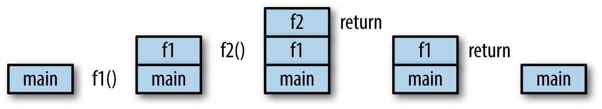

*Introducing Go* 一书笔记

---

[TOC]

---


# 1. Hello,world!

老规矩，先看看一个编程语言最简单的程序 `Hello,wold!`，如何编辑到运行。看

**程序1.1**：`hello.go`

```go
package main
import "fmt"
// this is a comment
func main(){
	fmt.Println("Hello,World!")
}
```

- 运行方式一，直接运行源程序：

```
go run hello.go
Hello,World!
```

- 运行方式二，编译再运行：

```
go build hello.go 
./hello 
```

- 解析：

`line 1` : `package main`

 这是 Go 中 包的声明，**每个 Go 程序都必须从这行代码开始**。

关于 Go 语言的包：包 是 Go语言组织和复用代码的方式。

`line 2` : `import "fmt"` 

跟 python 类似，**`import`** 关键字用来引入其他包。

Go 也可以对包使用 **别名**，语法为 `import alias ”packagename"` ，比如如下 **程序 1.2**

注意，**导入包时，包命要用双引号**。

`fmt` 包是个实现了标准输入输出的包，所以接下来会很常见。

`line 3` : `// this is a comment` 

注释，没有什么好说的。Go 的注释和 C 语言一样支持 单行（**//**）和 多行（**/\*\*\*/**）注释。

`line 4` ：`func main(){` 

函数声明，名为 `main` 无参无返的函数；

 **`func `** 关键字，用来定义函数；

**`main`** 函数，和 C 语言一样，程序的入口，最先被执行的函数；

值得注意的是这行末尾的 **左花括号 `{`**，这个符号在函数声明时，**只能处于 函数名 所在行的末尾**，而不**能另起一行**！否则则不会通过运行。如下

 **程序1.2**：

```go
package main
import f "fmt"
func main()		// error 或括号必须位于此行末，不能另起一行。
{
	f.Println("Hello,World!")
}
```

结果：

```
# command-line-arguments
./hello.go:3:6: missing function body
./hello.go:4:1: syntax error: unexpected semicolon or newline before {
```

`line 5` ：`fmt.Println("Hello,World!")`

打印输出 "Hello,World!" 。注意以下两点：

1. `Println` 函数首字母大写。在 Go 中，变量和字母的命名规则：名称**首字母大写表示公有**，相当Java 的 `public` 关键字，**首字母小写表示私有**，相当Java 的 `public` 关键字。Go 语言更提倡使用驼峰命名法，此处简要说明，更多更详细更准确的 命名规则看官方文档去。
2. 和其他编译型语言不一样，Go 语言 语句 **不需要用 分号 `;` 结尾！**


# 2. 数据类型

## 2.1 整型

> 内容修改自 菜鸟教程 [Go 语言数据类型](https://www.runoob.com/go/go-data-types.html)

Go 也有基于架构的类型，例如：`int`、`uint` 和 `uintptr`。

| 标识符 | 类型 | 范围 |
| :---: | :--: | :--: |
| `uint8` | 无符号 8 位整型 | 0 到 255 |
| `uint16` | 无符号 16 位整型 | 0 到 65535 |
| `uint32` | 无符号 32 位整型 | 0 到 4294967295 |
| `uint64` | 无符号 64 位整型 | 0 到 18446744073709551615 |
| `int8` | 有符号 8 位整型 | -128 到 127 |
| `int16` | 有符号 16 位整型 | -32768 到 32767 |
| `int32` | 有符号 32 位整型 | -2147483648 到 2147483647 |
| `int64` | 有符号 64 位整型 | -9223372036854775808 到 9223372036854775807 |

一般整型的话就使用 `int` 类型就OK .

## 2.2 浮点型

有两种：单精度 （**`float32`**） 和 双精度（**`float64`**）.

还有一种 **复数** 类型，也分两种：`complex64` and
`complex128`. 

 顺便提一下，Go 也有类似 `None` 表示啥都没有的意思，是为 **`nil`**,更多详细信息，请。。。

附表一张：[Go 语言的各种数据类型的默认零值](https://www.jianshu.com/p/cc1eb93b2f6c)

| Type           | 默认值                  |
| -------------- | ----------------------- |
| Interger       | 0                       |
| Float          | 0                       |
| Complex Number | 实数部分：0 虚数部分：0 |
| Byte           | 0                       |
| Rune           | 0                       |
| String         | ""                      |
| Bool           | false                   |
| Array          | 元素的默认值            |
| Slice          | nil                     |
| Map            | nil                     |
| Channel        | nil                     |
| Interface      | nil                     |
| Struct         | 字段类型的默认值        |
| Pointer        | nil                     |
| Function       | nil                     |

- 四种基本算术运行类型：

加（**+**），减（**-**），乘（*****），除（**/**），求余（**%**）。


来看个程序：**程序 2.1**

```go
package main

import f "fmt"

func main(){

	var x float64 = 1
	var y int = 1
	f.Println("Hello,World!")
    // statement
}
```

以上是主程序，至于最后一条语句，分三种执行看看会有什么不同的结果：

- ` case 1`：

```
	// f.Println("x + y = ", x + y)	
```

对，你没看错，唯一一个语句还被注释掉了，就是以上程序，啥都不加，运行看看会有什么结果：

```
x declared but not used
y declared but not used
```

是的，在 Go 中，**不允许变量声明了却不使用。**

- `case 2`：

```go
	f.Println("x + y = ", x + y)	
```

运行结果：

```
invalid operation: x + y (mismatched types float64 and int)
```

是的，**不同的数据类型不能用来做基础算术运算。**

- `case 3`：

```
	f.Println("x + y = ", x + float64(y))
```

运行结果：

```
Hello,World!
x +y =  2
```

发现没有，`float64(y))`，**强制数据类型转换** 的方式跟 Python 很像，数据类型作为函数名，被转数据做参数，返回结果为需要的数据类型。


## 2.3 字符串

> Go语言的字符串是一个用 UTF-8 编码的变宽字符序列，它的每一个字符都用一个或多个字节表示。

1. 双引号

```go
"Hello,world!"
```

2. 获得字符串的第 **`n + 1`** 个字符

```go
"Hello,world!"[1]	// e 序号从零开始
```

3. 获得**字符串长度**

```go
len("Hello,world!")
```

4. 连接字符串

```go
"Hello," + "world!"
```

跟 Python 一模一样。


还有一点：

```go
Println(`I
                  love
                            you.`)
```

打印结果：

```
I
					love
							you.
```

这个 **反引号 ``** 是不是跟 Python 的 **三引号** （**`'''`** 或 **`"""`**） 效果一样的 ？


## 2.4 布尔类型

两个：`true` 和 `false`

**程序 2.2**

```go
func main() {
    fmt.Println(true && true)
    fmt.Println(true && false)
    fmt.Println(true || true)
    fmt.Println(true || false)
    fmt.Println(!true)
}
```

运行结果：

```
true
false
true
true
false
```


# 3. 变量

- **变量的类型声明与赋值**

变量的类型声明与赋值可以不同时进行，可以只进行类型声明不赋值，甚至可以不进行类型声明，直接赋值。

1. 先类型声明，后赋值：

```go
var x string
x = "hello,world!"
```

2. 类型声明，同时赋值

```go
var x string = "hello,world!"
```

3. 只进行类型声明，不赋值

```go
var x float64
```

4. 不进行类型声明，直接赋值

```go
var x = "hello,world"
y := "你好，世界"
```

- 总结一下：

由以上的例子，我们可知。在 Go 语言中，对变量的赋值可大致分为三种情况：

1. **不赋值**，这种情况下**必须声明变量类型**。声明之后，Go 会给它一个默认的初始零值。**2.2 节** 有一张表，可参考各种数据类型的默认零值。

2. 声明类型，并且赋值。类型声明和赋值可以一步到位，也可以分开进行。Go 语言变量声明语法：

   **`var`**关键字	***变量名***	***数据类型标识符***

   这与 C 语言数据类型声明的语法**完全相反**。记住是完全相反。比如，数组的定义：

   ```
   // C 语言
   int a[5] = {1,2,3,4};
   // Go 语言
   x := [5]float64{ 98, 93, 77, 82, 83 }
   ```

3. 不声明类型，直接赋值。此种情况由编译器进行 类型推导。语法有两种，一种继续使用 `var` 关键字，另一种不使用，而是使用更简单的  **`:=`** 操作符。

   由于后一种语法更简洁新颖，因此，大多数人使用这种方式赋值。


- 命名：

通常以字母开头，除首字母之外，其他字母可以是 数字，字母，下划线。

习惯用驼峰命名法，`camelCase`.


- **作用域**（**Scope**）：

**程序 3.1**：

```go
package main
import "fmt"

var x string = "Hello, World"

func main() {
    var y string = "你好，世界。"
	fmt.Println(x)
    f()
    fmt.Println(y)
}

func f() {
	fmt.Println(x)
    // fmt.Println(y)	// #1 error : undefined: y
}
```

- 解析：

变量 `x` 处于所有函数最外层，所以所有函数都能访问到它。

变量 `y` 处于 `main` 函数内部，作用域也再此。所以只有在函数内部才能访问到它。

简单来说，**变量的作用域**就处于**离它最近**的**花括号`{}`之内**。


- **常量**

**程序 3.2**：

```go
package main
import "fmt"
func main() {
	const x string = "Hello, World"
    const y = "你好，世界"	// 注意这里是 “=”，不是 “:=”
    y = "再见，世界"	// error 常量值不允许改变
	fmt.Println(x)
    fmt.Println(y)
}
```

- 运行结果

```
Hello, World
你好，世界
```

- 解析：

1. 和其他语言一样，常量是不可以被改变的。

2. 和变量一样，常量的定义也可以不声明数据类型，让编译器去进行 类型推导，其格式如下：

   **`const`**关键字	***变量名***	**等于号 `=`**	变量值

   记住，是 **等于号**，不是 **`:=`**


- **多重赋值**

```go
var (
    a = 5
    b = 10
    c = 15
)
```

了解一个程序：**程序 3.3**：

```go
package main
import "fmt"
func main() {
    fmt.Print("Enter a number: ")
    var input float64
    fmt.Scanf("%f", &input)
    
    output := input * 2
    
    fmt.Println(output)
}
```

`fmt` 标准库的又一个函数，`Sacnf` ,看着形式，跟 C 语言的 `scanf` 有什么区别？


# 4. 控制结构

## 4.1 循环语句

Go 语言语法上做了诸多创新，例如 `for` 关键字就是一例。

*以下内容参考自* [Go 语言 for 循环](https://www.runoob.com/go/go-for-loop.html)

在 Go 语言中，**循环**结构**只有**一个关键字，那就是 **`for`** 关键字。也就是说，一个  **`for`** 关键字 相当于

1. C 语言的 `for` 关键字：语法格式为：

   **`for init; condition; post { }` **

如下例：

```go
func main() {
    for i := 1; i <= 10; i++ {
        fmt.Println(i)
	}
}
```

*Go 语言也支持 自增（++），自减（--）运算符*

2.  C 语言的 `while` 关键字，语法格式为：

    **`for condition { }`**,

如下例：

```go
func main() {
    i := 1
    for i <= 10 {
        fmt.Println(i)
        i = i + 1
    }
}
```

3.  C 语言的 `for(;;)` ,Rust 的 `loop`，语法格式为：

   **`for { }`**，如下例：

```go
func main() {
        sum := 0
        for {
            sum++ // 无限循环下去
        }
        fmt.Println(sum) // 无法输出
}
```

- **init**： 一般为赋值表达式，给控制变量赋初值；*
- **condition**： 关系表达式或逻辑表达式，循环控制条件；*
- **post**： 一般为赋值表达式，给控制变量增量或减量。*


当然，除此之外，Go 还支持 `for item in  array` 语法的循环迭代，如下例：**程序 4.1**

```go
package main
import "fmt"

func main() {
        strings := []string{"google", "runoob"}
        for i, s := range strings {
                fmt.Println(i, s)
        }


        numbers := [6]int{1, 2, 3, 5}
        for i,x:= range numbers {
                fmt.Printf("第 %d 位 x 的值 = %d\n", i,x)
```


## 4.2 `if` 语句

和其他语言的 `if`语句差别不大，且看 **程序 4.2** :

```go
if i % 2 == 0 {
    // divisible by 2
} else if i % 3 == 0 {
    // divisible by 3
} else if i % 4 == 0 {
    // divisible by 4
}else{
    fmt.Println("nothing")
}
```

需要说明的是，`if` 表达式 **只会执行 第一个** 条件表达示**（condition）** 计算结果为 **`true`** 的关联代码块，跳过其他 条件分支。

例如本例，若 `i=6` 时，就只会执行与 `if i % 2 == 0 ` 相关联的语句块，而不会判断任何其他条件分支。


## 4.3 `switch` 语句

与 C 语言类似，`case` 关键字后面接条件表达式，`default` 关键字用来执行任何条件都不满足的情况。

除了老生常谈的语句末尾不用分号以外，还**不需要**用 **`break`** 跳出，以防止 匹配到满足条件的分支之后仍然会向下执行的问题。看下例：

```go
switch i {
	case 0: fmt.Println("Zero")
	case 1: fmt.Println("One")
	case 2: fmt.Println("Two")
	case 3: fmt.Println("Three")
	case 4: fmt.Println("Four")
	case 5: fmt.Println("Five")
	default: fmt.Println("Unknown Number")
}
```

和 `if` 语句一样，`switch` 语句也只会执行第一满足条件的关联代码块。


# 5. 数组，切片 和 Map

## 5.1 数组

- 定义：一系列 **相同数据类型** 的集合。

  数组包含的每个数据被称为 数组 **元素**（element）.

  数组包含的 **元素个数** 被称为 数组的 **长度**。

  

- 声明方法：

  ```go
  var x [5]int
  var x []float64	// 长度为 0 的数组
  ```

  代码示例 1：

  ```go
  package main
  import "fmt"
  func main(){
      var x [5]int
      x[4] = 100
      fmt.Println(x)
  }
  ```

  运行结果：

  ```
  [0 0 0 0 100]
  ```

  解析：

  和 C 语言一样，下标从零开始，另外

  和 C 语言不一样，在 Go 语言中**未被初始化数组元的素会被自动赋值为 0**，而不是像 C 语言那样赋予一个随机值。

  

- 特点：

  Go 语言中，数组 **长度在定义后就不可更改**。

  声明长度时可以是一个常量 或 常量表达式（常量表达式是指在 **编译期间** 即可计算结果的表达式）。

  **数组长度** 是该数组的一个内置常量，**可**以使用 **内置函数 `len()` 来获取**。

  代码示例 2：

  ```go
  package main
  
  import "fmt"
  
  func main() {
  	var x [5]float64
  	x[0] = 98
  	x[1] = 93
  	x[2] = 77
  	x[3] = 82
  	x[4] = 83
  	var total float64 = 0
  	for i := 0; i < len(x); i++ {
  		total += x[i]
  	}
  	fmt.Println(total / float64(len(x)))
  }
  ```

  运行结果：

  ```
  86.6
  ```

  解析：

  由于 `total` 是 `float64` 类型，`len(x)` 是 `int` 类型，所以类型不匹配。

  和 C 语言又不一样，Go 语言不支持自动类型转换，所以，

  为了保留数据精度，所以需要用 `float64()` 方法把 `int` 类型强制转换为 `float64` 类型。

  

- 数组的另一种遍历方式

  对于数组这种 可迭代变量（iterator  variable），可以用一种特殊格式的循环，代码示例 3 如下：

  ```go
  var total float64 = 0
  for i, value := range x {
  	total += value
  }
  fmt.Println(total / float64(len(x)))
  ```

  上面的 `i` 是元素的下标，`value` 是元素的值。

  这跟 `python` 的 `for k,v in enumerate(array)` 是不是一模一样？

  但其实，上面的代码语法是由问题的，前面讲到过：

  在 Go 中，**不允许变量声明了却不使用。**

  这里也是一样，变量 `i` 一次都未被使用过，因此这里 `for` 循环正确的写法应该是：

  ```go
  for _, value := range x {
  	total += value
  }
  ```

  没错，就是 下划线（**`_`**）用来告诉编译器，不需要使用这个可迭代的变量。

  

- 数组创建的另一种方式：

  前面例子创建数组的方式：

  ```go
  var x [5]float64
  x[0] = 98
  x[1] = 93
  x[2] = 77
  x[3] = 82
  x[4] = 83
  ```

  真是又丑又长，有没有更简单的方式呢？当然有，示例如下：

  ```go
  x := [5]float{98, 93, 77, 82, 83}
  ```

  还可以这样，在花括号内添加注释：

  ```go
  y := [5]float64{
      98,
      93,
      77,
      82,
      // 83,
  }
  ```

  还有一种，更灵活的方式：

  ```go
  arr := [...]int{1,2,3}
  ```

  **`...`**  会让编译器根据实际情况来分配空间。

  

## 5.2 切片

前面讲到了数组的长度是固定的，一旦被创建，就不可改变。

这样的话，对数组进行元素插入删除的操作就很不方便，有鉴于此，切片就诞生了。Go 语言中，直接操作数组很少，基本上都是使用其切片。

- 概念：

  和 `python` 一样，Go 语言中的切片指的也是数组的一部分。

  和数组类似，切片也有索引（下标）和 长度，不同的是，切片的长度是可变的。

- 切片的创建：

  切片的创建要使用内置函数 **`make()`**，代码示例：

  ```go
  // 创建一个长度不大于5的 float64 类型数组相关的切片
  x := make([]float64, 5)
  // 第三个参数表示，切片的最大容量
  x := make([]float64, 5, 10)
  ```

  

  - [ ] 关于切片的长度和容量，有什么关系和区别？

  

  切片通常关联一个数组，可以看作是数组的引用，其长度不大于其关联的数组长度。

  ---

  以上是创建一个空切片的方法，创建切片还有另一种方法，

  **`[low : high]`** 表达式，跟 `python` 一样，从 **`low`** 开始，至 **`high`** 之前一个元素结束，是的不包含 **`high`**.

  ，示例如下：

  ```go
  arr := [5]float64{1,2,3,4,5}
  x := arr[0:5]
  ```

  支持以下方式：

  ```go
  arr[:]		// 包含关联数组的所有元素，等价于 arr[0:len(arr)]
  arr[:4]		// 包含从下标零开始到指定下标之前的关联数组的所有元素,等价于 arr[0:4]
  arr[3:]		// 包含从指定下标开始到关联数组的最后一个元素，等价于 arr[3:len(arr)]
  ```


- 切片操作的内置函数：

  - **`append`**

    如果切片容量充足，将新元素直接插入切片的末尾位置，切片长度相应增加；

    如果容量不足，将新建一个数组，所有元素被复制过去，新元素被插入末尾位置，返回一个新的切片。

    用法示例如下：

    ```go
    func main() {
    	slice1 := []int{1, 2, 3}
    	slice2 := append(slice1, 4, 5)
    	fmt.Println(slice1, slice2)
    }
    ```

    运行结果：

    ```
    [1 2 3] [1 2 3 4 5]
    ```

    和 `python` 不一样，第一个参数是切片。

  
  - **`copy`**

    **`copy(dst,src)`** 函数有两个参数，**`dst`** 和 **`src`**，**`src`** 中所有元素将被复制到 **`dst`** 中。如果两个切片长度不一致，将取较短一方的长度。

    **`copy`** 只能操作同类型的切片。

    代码示例如下：

    ```go
    func main() {
    	slice3 := []int{1, 2, 3}
    	slice4 := make([]int, 2)
    	slice5 := make([]int, 8)
    	copy(slice4, slice3)
    	copy(slice5, slice3)
    	fmt.Println(slice3, slice4, slice5)
    }
    ```

    运行结果如下：

    ```
    [1 2 3] [1 2] [1 2 3 0 0 0 0 0]
    ```

- **`cap`** 

现在插播一个与数组和切片这种迭代类型相关的内含函数 **`cap`**，**` capacity `** 的缩写，返回迭代类型的 “容量”。一下解释来自网络 [Go内置函数cap](https://www.cnblogs.com/baiyuxiong/p/4770968.html)：

```
func cap(v Type) int

返回指定类型的容量，根据不同类型，返回意义不同。

数组: 元素个数 (和len(v)一样).

数组指针: *v的元素个数 (和len(v)一样).

Slice: the maximum length the slice can reach when resliced;如果v==nil, cap(v) 值为0；

Channel: channel 缓存区的容量, 以其中的元素为单位;如果v==nil, cap(v) 值为0；
```

下面我以数组和切片为例：

```go
package main

import "fmt"

func main() {
	arr1 := []int{1, 2, 3, 4, 5, 6}
	slic := make([]int, 5, 8)
	fmt.Println("初始化之后，")
	fmt.Println("arr1 = ", arr1)
	fmt.Println("slic = ", slic)

	fmt.Println()

	fmt.Println("cap(arr1) = ", cap(arr1))
	fmt.Println("len(arr1) = ", len(arr1))
	fmt.Println("cap(slic) = ", cap(slic))
	fmt.Println("len(slic) = ", len(slic))
	fmt.Println("slic 重新赋值之后，")
	slic = arr1[1:3]

	fmt.Println("slic = ", slic)

	fmt.Println("cap(slic) = ", cap(slic))
	fmt.Println("len(slic) = ", len(slic))
	fmt.Println()
	fmt.Println("slic 再次赋值之后，")
	slic = arr1[:]
	fmt.Println("slic = ", slic)
	fmt.Println("cap(slic) = ", cap(slic))
	fmt.Println("len(slic) = ", len(slic))
	fmt.Println()
	arr2 := []int{1, 2, 3, 4, 5, 6, 7, 8, 9}
	fmt.Println("arr2 = ", arr2)
	fmt.Println("cap(arr2) = ", cap(arr2))
	fmt.Println("len(arr2) = ", len(arr2))
	fmt.Println()
	fmt.Println("slic 再再次赋值之后，")
	slic = arr2[:]
	fmt.Println("slic = ", slic)
	fmt.Println("cap(slic) = ", cap(slic))
	fmt.Println("len(slic) = ", len(slic))
}
```

运行结果：

```
初始化之后，
arr1 =  [1 2 3 4 5 6]
slic =  [0 0 0 0 0]

cap(arr1) =  6
len(arr1) =  6
cap(slic) =  8
len(slic) =  5
slic 重新赋值之后，
slic =  [2 3]
cap(slic) =  5
len(slic) =  2

slic 再次赋值之后，
slic =  [1 2 3 4 5 6]
cap(slic) =  6
len(slic) =  6

arr2 =  [1 2 3 4 5 6 7 8 9]
cap(arr2) =  9
len(arr2) =  9

slic 再再次赋值之后，
slic =  [1 2 3 4 5 6 7 8 9]
cap(slic) =  9
len(slic) =  9
```

得出的结论与热心网友总结的差不多，数组的 “容量” 等于 长度，

切片的长度 始终等于元素的实际个数，

当切片实际元素个数小于等于切片定义的长度时，`cap` 函数的计算结果就是这个切片定义的长度；当切片实际元素个数大于切片定义的长度时，小于定义时的容量时，`cap` 函数的计算结果就是这个切片定义的容量，当切片实际元素个数大于切片定义的容量时，`cap` 函数的计算结果就是切片的实际元素个数。


## 5.3 Map

**`Map`** 是一个键值对组成的无序集合，有时候也被称为 关联数组，哈希表，或者字典。

定义示例如下：

```go
var x map[string]int
var x map[int]int
```

鉴于与 python 的字典高度相似，废话就不多说了，继续上栗子：

示例一：

```go
var x map[string]int
x["key"] = 10
fmt.Println(x)		// error
fmt.Println(x["key"])		// pass
```

示例二：删除元素（**`delete() 方法`**）

```go
x := make(map[int]int)
x[1] = 10
fmt.Println(x[1])
delete(x, 1)
```


示例三：查找 `Map` 中不存在的元素

```go
package main

import "fmt"

func main() {
	elements := make(map[string]string)
	elements["H"] = "Hydrogen"
	elements["He"] = "Helium"
	elements["Li"] = "Lithium"
	elements["Be"] = "Beryllium"
	elements["B"] = "Boron"
	elements["C"] = "Carbon"
	elements["N"] = "Nitrogen"
	elements["O"] = "Oxygen"
	elements["F"] = "Fluorine"
	elements["Ne"] = "Neon"
	// fmt.Println(elements["Li"])

	if name, ok := elements["Un"]; ok {
		fmt.Println(name, ok)
	}

	name, ok := elements["Un"]

	fmt.Printf("the value of name is \"%s\", type is %T.\n", name, name)
	fmt.Printf("the value of ok is \"%t\", type is %T.\n", ok, ok)
}
```

运行结果：

```
the value of name is "", type is string.
the value of ok is "false", type is bool.
```

解析：

`elements` 是一个几个化学元素的 `Map`，

```go
name, ok := elements["Un"]
```

查找一个不存在的元素，`name` 是其查找的结果，`ok` 告诉是否查找成功，是一个布尔值。


```go
fmt.Printf("the value of name is \"%s\", type is %T.\n", name, name)
fmt.Printf("the value of ok is \"%t\", type is %T.\n", ok, ok)
```

打印他们的值和类型，`Printf` 和 C 语言中的同名函数很类似，不同的是，

`"%t"` 表示的是布尔值，`"%T"` 表示的是数据类型。


```go
if name, ok := elements["Un"]; ok {
    fmt.Println(name, ok)
}
```

这是 Go 语言特有的语法和机制，python3.8 引进的海象运算符应该是受其启发。

`name, ok := elements["Un"];` 语句后面的 `ok` 是 `if` 的判断条件。

需要注意的是，这种格式下，`name` 和 `ok` 都是临时变量，也就是说离开 `if` 之后就会被释放，这也是这段代码后面再次添加一个 `name, ok := elements["Un"]` 的原因。

---

再来看一个更复杂的 `Map` 类型：

```go
func main() {
	elements := map[string]map[string]string{
		"H": map[string]string{
			"name":  "Hydrogen",
			"state": "gas",
		},
		"He": map[string]string{
			"name":  "Helium",
			"state": "gas",
		},
		"Li": map[string]string{
			"name":  "Lithium",
			"state": "solid",
		},
		"Be": map[string]string{
			"name":  "Beryllium",
			"state": "solid",
		},
		"B": map[string]string{
			"name":  "Boron",
			"state": "solid",
		},
		"C": map[string]string{
			"name":  "Carbon",
			"state": "solid",
		},
		"N": map[string]string{
			"name":  "Nitrogen",
			"state": "gas",
		},
		"O": map[string]string{
			"name":  "Oxygen",
			"state": "gas",
		},
		"F": map[string]string{
			"name":  "Fluorine",
			"state": "gas",
		},
		"Ne": map[string]string{
			"name":  "Neon",
			"state": "gas",
		},
	}
	if el, ok := elements["Li"]; ok {
		fmt.Println(el["name"], el["state"])
	}
}
```

看看就行，不打算深究了，不懂等着慢慢懂吧。


# 6. 函数

前面的一个例子：

```go
func main() {
	xs := []float64{98, 93, 77, 82, 83}
	total := 0.0
	for _, v := range xs {
		total += v
	}
	fmt.Println(total / float64(len(xs)))
}
```

现在将其模块化，即将求平均数部分的代码重写为一个函数：

```go
package main

import "fmt"

func average(xs []float64) float64 {
	total := 0.0
	for _, v := range xs {
		total += v
	}
	return total / float64(len(xs))
}

func main() {
	xs := []float64{98, 93, 77, 82, 83}
	fmt.Println(average(xs))
}
```

运行结果：

```
86.6
```

现在来分析一下 Go语言中，函数的基本格式：

```go
func average(xs []float64) float64 {}
```

关键字 **`func`** 引导函数名 `average`，

接着是括号 **`()`** 里面，是参数列表，形式为 **`name type, name type, ...`** ，此处只有一个参数 `xs []float64`，

括号后面是返回值类型 ，此处是 `float64`.

接下来和 C 语言就差不多了，花括号 **`{}`** 内是函数体，**`return`** 关键字返回值。

---

下面是 Go 语言和其他语言不太一样的地方：

1. 实参必须传递给函数

   示例一：

   ```go
   package main
   
   import "fmt"
   
   func f() {
   	fmt.Println(x)
   }
   
   func main() {
   	x := 5
   	f()
   }
   ```

   这很明显是错的，毋庸置疑，可做如下中两种修改：

   一种是这样，比较常规：

   ```go
   package main
   
   import "fmt"
   
   func f(x int) {
   	fmt.Println(x)
   }
   
   func main() {
   	x := 5
   	f(x)
   }
   ```

   另一种还可以这样，用全局变量的方式：

   ```go
   package main
   
   import "fmt"
   
   var x int = 5
   
   func f() {
   	fmt.Println(x)
   }
   func main() {
   	f()
   }
   ```

   

2. 函数调用栈

   现有示例如下：

   ```go
   func main() {
   	fmt.Println(f1())
   }
   
   func f1() int {
   	return f2()
   }
   
   func f2() int {
   	return 1
   }
   ```

   每次调用一个函数时，它就会被 `push` 进调用栈中，每次返回一个函数时，它就会被 `pop` 出调用栈。示意图如下：

   


3. **返回值可以有名称**

   示例如下：

   ```go
   package main
   
   import "fmt"
   
   func f2() (r int) {
   	r = 1
   	return
   }
   
   func main() {
   	fmt.Println(f2())
   }
   ```

   运行结果：

   ```
   5
   ```

   注意，这里的 `return` 语句 与 C 语言的 `return;` 返回一个没有意义的空值完全不一样，

   由于 Go 语言要显示定义返回值类型，如果返回值没有定义名称，形如：

   ```go
   func f2() int {}
   ```

   那么 `return` 后面势必要跟一个 `int` 类型的变量或者表达式，否则，编译器无法知道返回值是谁；

   但是，如果返回值有名字，那就完全不一样了，因为返回值有名字，我们就可以像对变量赋值那样对其进行赋值，此时，由于返回值已经被赋值了，此时 `return` 不需要跟任何表达式或变量的含义也就顺理成章地是返回这个被赋值的有名称的返回值了。

   因此，很明显，在 Go 语言中，`return`  后不接任何表达式或变量的语义显然就是，返回有名返回值被赋予的值。

   

4. **返回值可以是多个**

   和 python 一样可以有多个返回值，示例如下：

   ```go
   unc f3() (int, int) {
   	return 5, 6
   }
   
   func main() {
   	x, y := f3()
   	fmt.Println(x, y)
   }
   ```

   注意，这里实际返回值的个数要与声明的返回值个数一致，比如这个例子，即使同样类型的两个返回值，在声明时也要抄写 两个 `int` .

   在 Go 语言中，这种多值返回通常用是 结果和错误值（`x, err := f()`） 或 表示成功与否的布尔值（`x, ok := f()`）.


## 6.1 可变参数函数

与 C 语言的可变参数类似，当然，写起来要简单得多，示例如下：

```go
package main

import "fmt"

func add(args ...int) int {
	total := 0
	for _, v := range args {
		total += v
	}
	return total
}

func main() {
	fmt.Println(add(1, 2, 3))
}
```

运行结果：

```
6
```

解析：

格式为，在参数列中，参数名称后三个点（**`...`**） 接上变量类型 ，这三个点深得 C语言真传吧？

顺便说一下，经常用到的 `fmt.Println()` 的原型：

```go
func Println(a ...interface{}) (n int, err error)
```


这类可变参数函数传参时的实际参数还可以这样：

```go
func main() {
	xs := []int{1, 2, 3}
	fmt.Println(add(xs...))
}
```

是不是像极了 python 的 **`*`** 对列表或元组等对象进行 **解构**？

只不过，语法有点特殊，在变量名后加三个点（**`...`**）.


## 6.2 闭包（Closure）

请看下面的例子：

- 示例一：

```go
func main() {
	add := func(x, y int) int {
		return x + y
	}
	fmt.Println(add(1, 1))
}
```

在 main 函数内部创建了一个函数，

`add` 是一个 `func(x, y int) in` 类型的变量，即参数为两个 `int` 类型，返回值为一个 `int` 类型的 函数 类型的变量。


- 示例二：

```go
func main() {
	x := 0
	increment := func() int {
		x++
		return x
	}
	fmt.Println(increment())
	fmt.Println(increment())
}
```

运行结果：

```
1
2
```

解析：

如你所在，这个内部函数可以访问 和 修改 main 函数内部的局部变量。

---

插个小曲，这与 `python` 完全不一样，`python` 内部函数只允许访问而不允许修改外部（不包括外部函数之外）变量，有一篇博客介绍得不错，在这 [详解python函数的闭包问题（内部函数与外部函数详述）](https://www.jb51.net/article/161402.htm)

---

和 Rust 类似，Go 语言的闭包： **匿名函数** 和 它所用到局部变量组成一个闭包（自己对闭包粗浅的理解）。

---


示例三：

```go
func makeEvenGenerator() func() uint {
	i := uint(0)
	return func() (ret uint) {
		ret = i
		i += 2
		return
	}
}

func main() {
	nextEven := makeEvenGenerator()
	fmt.Println(nextEven()) // 0
	fmt.Println(nextEven()) // 2
	fmt.Println(nextEven()) // 4
}
```

解析：

这是闭包的另一种使用方式，匿名函数作为返回值。

和前面例子一样，匿名函数访问和修改了 所在函数内的局部变量。

注意，这里 `makeEvenGenerator` 方法的返回值声明

```go
func makeEvenGenerator() func() uint
```

和前面的函数都不一样，是个函数类型。


## 6.3 递归（Recursion）

和其他语言一样，本书给了很经典的 **factorial** 数列的例子：

```go
func factorial(x uint) uint {
	if x == 0 {
		return 1
	}
	return x * factorial(x-1)
}
```

例子比较简单，也没有提到尾递归等问题，这里就不细讲了。


## 6.4 `defer`，`painc` 和  `recover`

- **`defer`**

  **`defer`** 作用是在函数执行结束之前运行 **`defer`** 引导的语句块，

  语句与一些以 `try{}...finally{}` 语法为异常处理编程语言中的 `finally` 语句块类似，

  不同的是，**`defer`** 语句不需要像 `finally` 语句块那样，总是写在函数末尾部分，如下例：

  ```go
  package main
  
  import "fmt"
  
  func first() {
  	fmt.Println("1st")
  }
  
  func second() {
  	fmt.Println("2nd")
  }
  
  func main() {
  	defer second()
  	first()
  }
  ```

  运行结果：

  ```
  1st
  2nd
  ```

  除此之外， **`defer`** 语句可以有多个：

  ```go
  package main
  
  import "fmt"
  
  func first() {
  	fmt.Println("1st")
  }
  
  func second() {
  	fmt.Println("2nd")
  }
  
  func third() {
  	fmt.Println("3nd")
  }
  
  func main() {
  	defer first()
  	defer second()
  	defer third()
  }
  ```

  运行结果：

  ```
  3nd
  2nd
  1st
  ```

  从结果分析，很容易理解，因为 **`defer`** 语句总是在函数的最后一步执行，

  所以当有多个 **`defer`**  语句时，这个多个  **`defer`** 语句的执行顺序是从后往前依次执行。

   **`defer`** 语句 经常用来释放一些打开的资源，比如打开一个文件之后关闭：

  ```go
  f, _ := os.Open(filename)
  defer f.Close()
  ```

  这样的 **`defer`** 语句有以下三个优点：

  1. 在语法上让 `Open()` 与 `Close()` 更近，更容易理解。
  2. 当有多个 `return` 语句时（隐含在 `if...esle` 语句中），`Close()` 将会在所有 `return` 语句之前运行。
  3. 一个被 **`defer`** 关键字修饰的函数即使在发生运行时`panic` 时也会运行。（*Deferred functions are run even if a runtime panic occurs.*）


- **`panic`** 和 **`recover`**

  **`panic()`** 函数用来引发一个运行时错误，

  **`recover()`** 函数用来消除这个运行时`panic`，并且返回 **`panic()`**  传递的参数。我们可能希望如下示例是正确的：

  ```go
  package main
  
  import "fmt"
  
  func main() {
  	panic("PANIC")
  	str := recover() // this will never happen
  	fmt.Println(str)
  }
  ```

  运行结果：

  ```
  panic: PANIC
  
  goroutine 1 [running]:
  main.main()
          /home/dayelu/work/go/demo/errgo.go:6 +0x39
  exit status 2
  ```

  由于调用了 **`panic()`** 函数引起了运行时错误，程序的运行将会立刻停止，因此， **`defer`** 语句一起使用：

  ```go
  package main
  
  import "fmt"
  
  func main() {
  	defer func() {
  		str := recover()
  		fmt.Println(str)
  	}()
  
  	panic("PANIC")
  }
  ```

  运行结果：

  ```
  PANIC
  ```

  解释一下，这个 `func() {}()` 形式的函数是什么意思呢？

  目前这本书虽然讲了函数和闭包，但是目前章节位置，对匿名函数并没太多涉及。不过，没吃过猪肉还没见过猪跑吗？联系上下文也能猜测如下：

  首先，**`func`** 关键字后面没有参数名，直接跟个括号，铁定是一个匿名函数无疑，其次在函数体结束表记右花括号（**`}`**） 后面跟个括号**()**，应该是直接调用该匿名函数的意思。

  为什么这么猜测呢？因为 对比前面的例子，**`defer`** 关键字都是通过函数名直接调用函数，但是匿名函数没有函数名，因此只能用其他语法调用。而且 **`defer`** 关键字调用的是 "函数实例" ，而不是一个函数定义。

  最后，这样为什么能运行，前面已经讲到，**`defer`** 关键字调用的函数即使在 **`defer`** 语句所在的函数出现运行时错误或者说 `panic` 时，也会被运行。


## 6.5 指针

Golang 中的指针与 C 语言中的指针相似度极高：

指针是指向某一个变量的内存地址，用星号（**`*`**） 声明：

```go
var ip *int		// 指向 int 型数据的地址
var fp *float32	// 指向 float32 型数据的地址
```

当然用 **`new`** 关键字声明效果也是一样的：

```go
ip := new(int)
fp := new(float32)
```


用 **`&`** 符号获取变量的地址：

```go
package main

import "fmt"

func main() {
	var a int
	b := new(int)
	var c *int
	prt := &a
	b = &a
	c = &a
	fmt.Println(a)
	fmt.Println(prt)
	fmt.Println(b)
	fmt.Println(c)
}
```

运行结果：

```
0
0xc0000140a0
0xc0000140a0
0xc0000140a0
```

 当然，说到指针怎么能没有经典的变量交换的例子：

```go
package main

import "fmt"

func main() {
	a := 3
	b := 4

	fmt.Printf("Before handling swap function \n a is %d , b is %d.\n", a, b)
	swap(3, 4)
	fmt.Printf("After handling swap function \n a is %d , b is %d.\n\n", a, b)

	fmt.Printf("Before handling swap function \n a is %d , b is %d.\n", a, b)
	swap_ptr(&a, &b)
	fmt.Printf("After handling swap function \n a is %d , b is %d.\n", a, b)
}

func swap(a int, b int) {
	a, b = b, a
}

func swap_ptr(ptr_a *int, prt_b *int) {
	*ptr_a, *prt_b = *prt_b, *ptr_a
}
```

运行结果：

```
Before handling swap function 
 a is 3 , b is 4.
After handling swap function 
 a is 3 , b is 4.

Before handling swap function 
 a is 3 , b is 4.
After handling swap function 
 a is 4 , b is 3.
```


当一个指针被定义后没有分配到任何变量，它的的值为 **`nil`**。示例如下：

```go
var nptr *int
if nptr == nil {	// true
    fmt.Println("nptr is empty.")
}
```


# 7. 结构体和接口

## 7.1 结构体

- 定义：

  通过实例给出如下：

  ```go
  type Circle struct {
      x float64
      y float64
      r float64
  }
  ```

  **`type`** 关键字后面跟 结构体名 后接 **`struct`**

  由于上例中三个变量（在结构体中称为 **域（fields）**）都是一种数据类型，所以，也可以这么写：

  ```go
  type Circle struct {
      x, y, r float64
  }
  ```

- 初始化：

  1. 返回一个 `Circle` 结构体变量，每个域置零值。

  ```go
  var c Circle
  ```

  2. 返回一个 `Circle` 结构体类型的指针变量，每个域置零值。

  ```go
  c := new(Circle)
  ```

  3. 给每一个域赋值：

  ```go
  c := Circle{x: 0, y: 0, r: 5}	// 类似于关键字参数
  // or
  c := Circle{0, 0, 5}			// 类似于位置参数
  // or get a struct pointer
  c := &Circle{0, 0, 5}
  ```


- 域操作

  用圆点操作符（**`.`**）访问：

  ```go
  fmt.Println(c.x, c.y, c.r)
  c.x = 10
  c.y = 5
  ```

  结构体变量作为实参传递：

  ```go
  func circleArea(c Circle) float64 {
  	return math.Pi * c.r * c.r
  }
  
  c := Circle{0, 0, 5}
  fmt.Println(circleArea(c))
  ```

  结构体指针变量作为实参传递：

  ```go
  func circleArea(c *Circle) float64 {
  	return math.Pi * c.r * c.r
  }
  
  c := Circle{0, 0, 5}
  fmt.Println(circleArea(&c))
  ```

  不得不说，头上这个例子跟 C语言真是完全不一样，C语言中，结构体指针类型的变量要想访问结构体内部成员需要用箭头（ **`->`** ）操作符，是因为算术优先级的和书写方便原因，才跟结构体变量直接存取的圆点操作符（**`.`**）区分开来，Go 语言中，圆点操作符（**`.`**）同时兼有两种含义？

  是的：

  ```go
  package main
  
  import "fmt"
  
  func main() {
  	a := &Circle{7, 9, 5}
  	b := Circle{3, 2, 1}
  	fmt.Println(a.x, a.y, a.r)
  	fmt.Println(b.x, b.y, b.r)
  }
  
  type Circle struct {
  	x, y, r float64
  }
  ```

  运行结果：

  ```
  7 9 5
  3 2 1
  ```

  

## 7.2 方法（method）

和一些编程语言一样，在 Go 语言中，方法（method）和 函数（function）是不同的。语法示例如下：

```go
func (c *Circle) area() float64{
    return math.Pi * c.r * c.r
}
```

在**关键字 `func` 和 函数名之间**加上一个 ***receiver***（ ***receiver*** 就像一个有名称的参数，翻译成接收者好像不能准确地表达其含义，故不译），这就是 方法（method）。

*PS：顺便提一下，这本书没有提到的，常见的一点：简单地说，无论是方法、常量、变量还是结构体的名称，如果首字母小写，则可以被其他的**包**访问；如果首字母小写，则只能在本包中使用。这样简简单单地规定就省去像 Java 的 private 和 public 关键字。*

再来看看下面的例子：

```go
package main

import (
	"fmt"
	"math"
)

func main() {
	r := Rectangle{0, 0, 10, 10}
	fmt.Println(r.area())
}

func distance(x1, y1, x2, y2 float64) float64 {
	a := x2 - x1
	b := y2 - y1
	return math.Sqrt(a*a + b*b)
}

type Rectangle struct {
	x1, y1, x2, y2 float64
}

func (r *Rectangle) area() float64 {
	l := distance(r.x1, r.y1, r.x1, r.y2)
	w := distance(r.x1, r.y1, r.x2, r.y1)
	return l * w
}
```

1. `area()` 方法 可以被结构体变量用圆点操作符（**`.`**）直接调用，Go 语言会自动把这个  ***receiver*** 的地址作为参数传入这个方法，而不需要像前面的例子那样，必须向函数传递 一个指针变量。
2. 不同于普通函数，`area()` 方法 只能用于 结构体 `Rectangle` 的操作。


- 内嵌类型（**Embedded Types**）：

  在介绍这个概念之前，先介绍两个术语：

  |    术语     |               含义               |
  | :---------: | :------------------------------: |
  | **`is-a`**  |           **继承关系**           |
  | **`has-a`** | **成员关系**，其他类是本类的成员 |

  看下面的例子，开始介绍这个概念：

  ```go
  type Person struct {
  	Name string
  }
  
  func (p *Person) Talk() {
  	fmt.Println("Hi, my name is", p.Name)
  }
  
  
  type Android struct {
  	Person Person
  	Model  string
  }
  ```

  以上，结构体 `Person` 有，即**`has a`** 域 `Name`，

  结构体 `Android` 是，即**`is a`** 域 `Person` ，对于这种类似于继承的关系，Go 语言支持使用 内嵌类型（**Embedded Types**，也做匿名域） 表示这类域，如下例：

  ```go
  type Android struct {
  	Person
  	Model string
  }
  ```

  这里直接在结构体 `Android` 中定义了一个结构体 `Person` 类型，而没有给它赋予名称。

  这种情况下，我们要使用结构体 `Person` 的 `Talk()` 方法，可以这么调用：

  ```go
  a :=  new(Android)
  a.Person.Talk()
  ```

  除此之外，由于存在使用了内嵌类型，类似于继承（一部分人 Go 语言中没有面向对象的继承）的关系，所以，可以直接用 `Android` 类型的变量发访问：

  ````go
  a :=  new(Android)
  a.Talk()
  ````


## 7.3 接口（Interfaces）

###  7.3.1 接口的声明

```go
type Shape interface {
	area() float64
}
```

定义方式类似结构体，`type` 关键字开头，后面是接口名，最后面是 `interface` 关键字。

（*ps:为什么不直接用 interface 关键字而要加个 type 关键字呢？因为，`type` 的作用跟 C语言的 `typedef` 是一样的，除了给结构体赋予一个别名之外，还可用于基本类型，例如 `type Name String`* 这类型形式。）

不同的，接口里面不是各种类型变量的集合，而是 **方法签名（signature）** 的集合。


那么，接口有什么作用呢？

举个栗子，我们要算一组图形的面积，假设只有圆时，我可以定义一个如下函数：

```go
func totalArea(circles ...Circle) float64 {
	var total float64
	for _, c := range circles {
		total += c.area()
	}
	return total
}
```

一个可变参数的函数，可接受多个 `Circle` 结构体变量。

如果，如果，这组图形中还有 矩形呢？我们该怎么办？我们可能会这么写：

```go
// THIS IS INVALID
// 翻译：这是错的
func totalArea(circles ...Circle, rectangles ...Rectangle) float64 {
	var total float64
	for _, c := range circles {
		total += c.area()
	}
	for _, r := range rectangles {
		total += r.area()
	}
	return total
}
```

当然，如注释一样，这是错的，很明显，一前一后两个可变参数，别说编译器了，就是人都没办法区分，传入的多个参数中哪个是圆形哪个是矩形，所以，可做修改如下：

```go
func totalArea(circles []Circle, rectangles []Rectangle) float64 {
	var total float64
	for _, c := range circles {
		total += c.area()
	}
    
	for _, r := range rectangles {
		total += r.area()
	}
	return total
}
```

*PS：Go 语言函数居然是支持传数组类型的参数的！C 语言貌似也是支持，不过范围非常非常小，仅仅看到过一个字符型数组名传递的例子，而且实际应用中从来没有看到过，都是指针传递；Python 也支持数组或者说集合类型的数据类型传递，但是这会改变这个集合的内容，因此过来人都是不建议使用的*。

以上例子，程序上没有任何问题，但是如果，这组图形中不止有两种图形，还有其他多边形，那么每次加一种图形，这个函数的参数和函数体部分都要进行修改。

接口就是为了解决这个问题而存在的，这也涉及到接口的实现问题。


### 7.3.2 接口的实现

接口如何解决以上问题呢？

简单地说，一个接口变量可以被赋值为 “实现了这个接口的结构体（或者结构体指针）类型的字面量”，而被赋值之后的这个接口变量就可以调用这个结构体和接口共有的方法（虽然结构体或结构体指针实现接口的必要条件是接口有的方法结构体必须也有，但是结构体可以有自己独有的方法），

又因为，接口可以被多个结构体（或结构体变量）实现，所以接口变量就可以用同一方法名调用这些方法，而不必担心这些不同结构体的方法具体是怎么实现的。

那么接口如何实现呢？

*和 Java 这类面向对象语言不一样，Go 语言不需要用关键字（如 Java 的 `implements` ）来显示地实现。*

在 Go 语言里，只要**结构体**中的方法**实现**了**接口**中**所有方法**签名，就可以说结构体或者结构体指针类型（别问我怎么知道的，编译器说的）实现了接口。

*PS：虽然 在 Go 语言里的说法，虽然似乎只有 **`implments`** 接口，而没有 **`implments`** 方法的说法，为了便于理解，这里也说 “实现方法”。*


了解了 以上概念后，我们结合前面声明的接口，把上面的计算总面积之和的函数修改如下：

```go
type Shape interface {
	area() float64
}

func totalArea(shapes ...Shape) float64 {
	var area float64
	for _, s := range shapes {
		area += s.area()
	}
	return area
}
```

因为无论是 圆，矩形还是三角形，都有 `area()` 这个 **方法**，**或者说实现了** `Shape` 接口中的 `area()` **方法**。

如此我们只需要这样调用这个函数：

```go
totalArea(&c, &r)
```

为什么是 `&c` 而不是 `c` 呢？因为前面的 `area()` 方法的定义是：

```go
func (c *Circle) area() float64{}
```


接口还可以作为接口的一个域使用，如下：

```go
type MultiShape struct {
	shapes []Shape
}
```

前面的接口的实现已经讲到了，实现了接口的结构体或结构体变量都可以赋值给接口，

```go
multiShape := MultiShape{
    shapes: []Shape{
        Circle{0, 0, 5},
        Rectangle{0, 0, 10, 10},
    },
}
```

*PS：首先，解释下一个名词：**字面量（literal）**，百科百科的解释是：*

> *字面量（literal）是用于表达源代码中一个固定值的表示法（notation）.*

*简单地说就是某种类型数据的固定值，比如数字 1 是一个整型的固定数值，而小数 1.1 是一个 浮点型的固定数值，字符串 “hello” 又是一个字符串类型固定值，还有上面的例子中，`Circle{0, 0, 5}` 和 `Rectangle{0, 0, 10, 10}` 分别是 `Circle` 结构体 和 `Rectangle` 结构体类型的固定值。所以，它们都可称之为 **字面量（literal）**。*


接口 `Shape` 变量被赋予的值是什么呢？是**实现了**这个**接口所有方法** 的任意一个结构体字面量。

这样我们就可以将所有图形结构体的字面量放入一个 `MultiShape` 结构体变量内而不需要声明多个变量，可以用 `for` 循环迭代的方法将这些字面量一个一个传入 `totalArea(shapes ...Shape) float64` 方法中。

联系到前面的结构体的方法，我们知道，结构体方法的 ***receiver*** 可以直接用于访问结构体的域而不需要用函数传参，为了进一步简化 计算总面积的函数，我们可以将其改写为 结构体 `MultiShape` 的方法：

```go
func (m *MultiShape)totalArea() float64 {
	var area float64
    for _, s := range m.shapes {
		area += s.area()
	}
	return area
}
```

然后我们就可以这么直接调用这个方法：

```go
multiShape.totalArea()
```


这个计算所有图形总面的完整程序代码如下：

```go
package main

import (
	"fmt"
	"math"
)

type Shape interface {
	area() float64
	preimeter() float64
}

type Rectangle struct {
	x1, y1, x2, y2 float64
}

type Circle struct {
	x, y, r float64
}

func distance(x1, y1, x2, y2 float64) float64 {
	a := x2 - x1
	b := y2 - y1
	return math.Sqrt(a*a + b*b)
}

func (r *Rectangle) area() float64 {
	l := distance(r.x1, r.y1, r.x1, r.y2)
	w := distance(r.x1, r.y1, r.x2, r.y1)
	return l * w
}

func (r *Rectangle) preimeter() float64 {
	l := distance(r.x1, r.y1, r.x1, r.y2)
	w := distance(r.x1, r.y1, r.x2, r.y1)
	return 2 * (l + w)
}

func (c *Circle) area() float64 {
	return math.Pi * c.r * c.r
}

func (c *Circle) preimeter() float64 {
	return math.Pi * 2 * c.r
}

func (c *Circle) diameter() float64 {
	return 2 * c.r
}

type MultiShape struct {
	shapes []Shape
}

type SingleShape struct {
	singleShapes Shape
}

func (m *MultiShape) totalArea() float64 {
	var area float64
	for _, s := range m.shapes {
		area += s.area()
	}
	return area
}

func main() {

	c := Circle{0, 0, 5}
	r := Rectangle{0, 0, 10, 10}

	multiShape := MultiShape{
		shapes: []Shape{
			&c,
			&r,
			// &Circle{0, 0, 5},
			// &Rectangle{0, 0, 10, 10},
		},
	}

	total := multiShape.totalArea()

	fmt.Println(total)

}
```

这个程序有一些需要注意的细节，简单地说有两处。

1. 只有**实现了接口的所有方法**的结构体或结构体变量才能被赋值给接口变量。
2. 接口赋值时，赋值类型（结构体或结构体指针）与 接口所有方法的 **receiver**  的组合 之间的关系用于判断接口是否被实现。其判断规则在下面一节有总结。


### *7.3.3 总结

总结一下：

1. 结构体，方法 和 接口，三者是通过什么联系在一起的呢？

2. 接口又是如何被实现的呢？更进一步，接口的实现本质是什么？


第一个问题，首先方法可以看作是一个只能被所属与结构体类型的变量所调用的特殊函数，这其中有一个小点需要注意，就是 “接收者（***receiver***）” 的变量类型既可以是结构体，也可以是结构体指针，二者都可以用 圆点操作符（**`.`**） 直接访问域，至于区别，*大概就是值传递和地址传递的区别（未验证，猜的，哈哈）*；

然后，接口类型中的成员是 **方法签名（signature）**，直白地说就是方法的定义，它规定了方法名，方法的参数和方法的返回值。注意，这里说的是方法的定义，而不是函数的定义。除了函数定义也有的以上三要素之外，作为一个 **方法（method）** 中没有 “接收者（***receiver***）”，也就是说，对结构体类型没有限制，只要是方法名，方法的参数和方法的返回值相同，我们就可以说**这个结构体或结构体指针实现了接口的某方法**。

~~其次，接口类型变量可以被赋值为实现了这个接口的结构体。~~

---

其实接口的赋值会引起编译检查该接口是否被实现，只有编译器确认该接口被实现才允许赋值，

经过以下试验：

```go
package main

type Person struct {
	name string
	age  int
}

type PersonInfo interface {
	getAge() int
	getName() string
}

func (p *Person) getAge() int {			// 可控变量 receiver ，取值：*Person, Person
	p.age++
	return p.age
}

func (p *Person) getName() string {		// 可控变量 receiver ，取值：*Person, Person
	p.name += " erxiao"
	return p.name
}

func main() {

	person := Person{"wang", 18}

	var pinfo PersonInfo
	pinfo = &person				// 可控变量 pinfo，取值：person, &person

	pinfo.getAge()

}
```

以上代码是这个实验的模板，其中三个变量可控，与运行结果列表如下：

| **`getAge receiver`** | **`getName receiver`** | **`pinfo`** | 运行结果 |
| :-------------------: | :--------------------: | :---------: | :------- |
|        Person         |         Person         |   person    |          |
|        Person         |         Person         |   &person   |          |
|        Person         |        *Person         |   person    | **err1** |
|        Person         |        *Person         |   &person   |          |
|        *Person        |         Person         |   person    | **err2** |
|        *Person        |         Person         |   &person   |          |
|        *Person        |        *Person         |   person    | **err3** |
|        *Person        |        *Person         |   &person   |          |

***err1：# command-line-arguments<br/>./itfdemo3.go:28:8: cannot use person (type Person) as type PersonInfo in assignment:<br/>	Person does not implement PersonInfo (getName method has pointer receiver)***

***err2：# command-line-arguments<br/>./itfdemo3.go:28:8: cannot use person (type Person) as type PersonInfo in assignment:<br/>	Person does not implement PersonInfo (getAge method has pointer receiver)***

***err3：# command-line-arguments<br/>./itfdemo3.go:28:8: cannot use person (type Person) as type PersonInfo in assignment:<br/>	Person does not implement PersonInfo (getAge method has pointer receiver)***

总结规则大致如下：

|     **`receivers`**      | 接口被赋值类型 | 通过与否 | 何者实现接口(猜的，仅供参考) |
| :----------------------: | :------------: | :------: | :--------------------------: |
|        全为结构体        |     结构体     |   通过   |            结构体            |
|        全为结构体        |   结构体指针   |   通过   |            结构体            |
|      全为结构体指针      |     结构体     |  不通过  |              —               |
|      全为结构体指针      |   结构体指针   |   通过   |          结构体指针          |
| 既有结构体又有结构体指针 |     结构体     |  不通过  |              —               |
| 既有结构体又有结构体指针 |   结构体指针   |   通过   |          结构体指针          |


除此之外，还有另一发现，其规则适用于上表，

结构体变量调用方法时，以下为例：

```go
package main

import (
	"fmt"
)

type Person struct {
	name string
	age  int
}

func (p *Person) getAge() int {
	p.age++
	return p.age
}

func (p Person) getName() string {
	p.name += " jing"
	return p.name
}

func main() {

	person := Person{"li", 18}

	fmt.Println(person.getAge())
	fmt.Println(person.age)
	fmt.Println(person.getName())
	fmt.Println(person.name)

	fmt.Println()

	ptrPerson := &person
	fmt.Println(ptrPerson.getAge())
	fmt.Println(ptrPerson.age)
	fmt.Println(ptrPerson.getName())
	fmt.Println(ptrPerson.name)

}
```

运行结果 ：

```
19
19
li jing
li

20
20
li jing
li
```


总结如下：

| **`receiver`** | 调用者类型 | 成员可变与否 |
| :------------: | :--------: | :----------: |
|     结构体     |   结构体   |    不可变    |
|     结构体     | 结构体指针 |     可变     |
|   结构体指针   |   结构体   |    不可变    |
|   结构体指针   | 结构体指针 |     可变     |

从上表可以看出，成员可变与否只与 **`receiver`** 有关。

---

实验过程明天再说。冷死了。。。

- [ ] 除此之外，还有更多扩展需要了解一下，它们是：

1. Go 语言的函数参数与实参之间可变与不可变的关系，一般类型（整型，浮点型等），字符/字符串（在不同语言中可变性可能不一样），符合类型（暂时只研究结构体类型）和 它们的指针类型。

2. 以及，以结构体和其指针类型为的特殊“参数” **`receiver`**  与 参数的异同比较；
3. 以及，Go语言指针与C 语言指针的比较。
4. 好像不是一时能扩展完的。。。

---

为什么是实现了接口的某个方法，而不是实现真个接口呢？因为，只有**实现了接口的所有方法** 才能说 实现了某接口，而且，**当使用接口被赋值为实现了这个接口的结构体时**，若编译器发现没有实现所有方法，就会报错停止运行哟。

---

为什么既可以结构体又可以是结构体指针实现接口呢？这是接口设计决定的。

1. 接口的声明中只有方法签名，没有域，也就是说，接口变量虽然可以赋值为结构体变量，但是并不能直接访问结构体的域，只能通过结构体的方法间接访问。

   更进一步，接口变量的作用就是用来调用结构体的方法而已，也就是说，跟接口存在直接关系的是方法而已，只不过由于方法属于结构体，所以才强行扯上关系，就好像拉关系一样。。。

2. 所以，理解了接口和方法的紧密联系，接口的这种 ”既可以结构体又可以是结构体指针实现接口“ 的特点后 ，**也就是既可以赋值给结构体变量又可以被赋值给结构体指针变量 的特点**，我们可以更直接地说，归根到底是由这些方法的 “接收者（***receiver***）” 的多样性决定的。

3. 和某单个方法无论 **receiver** 和 调用该方法的变量 可以是 结构体变量和结构体指针变量的随意组合 不一样（如下例）

   ```go
   package main
   
   import "fmt"
   
   type Person struct {
   	name string
   	age  int
   }
   
   func (p *Person) getName() string {
   	return p.name
   }
   
   func (p Person) getAge() int {
   	return p.age
   }
   
   func main() {
   	p := Person{"wang jiu", 18}
   	q := &p
   	fmt.Println(p.getName())
   	fmt.Println(q.getName())
   	fmt.Println(p.getAge())
   	fmt.Println(q.getAge())
   }
   ```

   运行结果：

   ```
   wang jiu
   wang jiu
   18
   18
   ```

   面对存在多个多种可能的类型组合 ，接口变量在赋值时有自己一套准则，上面也已经总结了。*end*


# 8. 包

## 8.1 核心包

### 8.1.1 Strings

这本书中列举了很多常用的方法，不过并不打算花时间去粘贴复制和验证上，直接找到网上总结好的文章内容 [go语言中strings包常用方法](https://www.jianshu.com/p/af18c7636295)如下 ：

```go
strings.HasPrefix(s string, prefix string) bool	// 判断字符串s是否以prefix开头

strings.HasSuffix(s string, suffix string) bool	// 判断字符串s是否以suffix结尾。

strings.Index(s string, str string) int	// 判断str在s中首次出现的位置，如果没有出现，则返回-1

strings.LastIndex(s string, str string) int	// 判断str在s中最后出现的位置，如果没有出现，则返回-1

strings.Replace(str string, old string, new string, n int)	// 字符串替换

strings.Count(str string, substr string)int	// 字符串计数

strings.Repeat(str string, count int)string	// 重复count次str

strings.ToLower(str string)string	// 转为小写

strings.ToUpper(str string)string	// 转为大写

strings.TrimSpace(str string)	// 去掉字符串首尾空白字符

strings.Trim(str string, cut string)	// 去掉字符串首尾cut字符

strings.TrimLeft(str string, cut string)	// 去掉字符串首cut字符

strings.TrimRight(str string, cut string)	// 去掉字符串首cut字符

strings.Field(str string)	// 返回str空格分隔的所有子串的slice

strings.Split(str string, split string)	// 返回str split分隔的所有子串的slice

strings.Join(s1 []string, sep string)	// 用sep把s1中的所有元素链接起来

strings.Itoa(i int)	// 把一个整数i转成字符串

strings.Atoi(str string)(int, error)	// 把一个字符串转成整数
```


### 8.1.2 Input / Output

Go 语言 IO 底层原理与 C 语言相似，都有，流（stream），缓冲区 （buffer）等概念，方法也和 C 语言众多，我们只需要知道，文本操作与二进制操作的区别就是行末的不同，这一点可以参考 C 语言文件操作部分的知识。

对于 io 操作的众多方法，这里同样不打算一一记录并验证，可直接参考[这篇博文](https://www.cnblogs.com/zhichaoma/p/12509984.html) ,本文同一文件夹下有离线文件可供参考。下面对照本书熟悉一下常用的文件操作方法。

- 示例一：文件的读操作：

  ```go
  package main
  
  import (
  	"fmt"
  	"os"
  )
  
  func main() {
  	file, err := os.Open("test.txt")
  	if err != nil {
  		// handle the error here
  		return
  	}
  	defer file.Close()
  	// get the file size
  	stat, err := file.Stat()
  	if err != nil {
  		return
  	}
  	// read the file
  	bs := make([]byte, stat.Size())
  	_, err = file.Read(bs)
  	if err != nil {
  		return
  	}
  	str := string(bs)
  	fmt.Println(str)
  }
  ```

  更简单的常用操作：

  ```go
  package main
  
  import (
  	"fmt"
  	"io/ioutil"
  )
  
  func main() {
  	bs, err := ioutil.ReadFile("test.txt")	//  直接返回字节串
  	if err != nil {
  		return
  	}
  
  	str := string(bs)
  	fmt.Println(str)
  }
  ```

- 示例二：新建文件

  ```go
  package main
  
  import (
  	"os"
  )
  
  func main() {
  	file, err := os.Create("test.txt")
  	if err != nil {
  		// handle the error here
  		return
  	}
  	defer file.Close()
  	file.WriteString("hello,world!\n")
  }
  ```

- 示例三：读取文件夹

  ```go
  package main
  
  import (
  	"fmt"
  	"os"
  )
  
  func main() {
  	dir, err := os.Open(".")
  	if err != nil {
  		return
  	}
  	defer dir.Close()
  	fileInfos, err := dir.Readdir(-1)
  	if err != nil {
  		return
  	}
  	for _, fi := range fileInfos {
  		fmt.Println(fi.Name())
  	}
  }
  ```

- 示例四：读取文件夹下所有文件和文件夹及其子文件夹下的所有信息：

  ```go
  package main
  
  import (
  	"fmt"
  	"os"
  	"path/filepath"
  )
  
  func main() {
  	filepath.Walk(".", func(path string, info os.FileInfo, err error) error {
  		fmt.Println(path)
  		return nil
  	})
  }
  ```

  和 Python 的 `os.walk` 方法一样的功能，这里又用到了匿名函数。


### 8.1.3 Errors

Go 语言有内置的错误类型，可以用来自定义错误类型：

```go
package main

import "errors"

func main() {
	err := errors.New("error message")
}
```


### 8.1.4 容器 和 排序

除了 list 和 map 类型外，Container 库中还有几种更底层的容器类型。

container/list 里面是个双链表（doubly linked list），如下例：

```go
package main

import (
	"container/list"
	"fmt"
)

func main() {
	var x list.List
	x.PushBack(1)
	x.PushBack(2)
	x.PushBack(3)
	for e := x.Front(); e != nil; e = e.Next() {
		fmt.Println(e.Value.(int))
	}
}
```


sort 库中可以给乱序数据排序的方法，如下例：

```go
package main

import (
	"fmt"
	"sort"
)

type Person struct {
	Name string
	Age  int
}
type ByName []Person

func (ps ByName) Len() int {
	return len(ps)
}
func (ps ByName) Less(i, j int) bool {
	return ps[i].Name < ps[j].Name
}
func (ps ByName) Swap(i, j int) {
	ps[i], ps[j] = ps[j], ps[i]
}
func main() {
	kids := []Person{
		{"Jill", 9},
		{"Jack", 10},
	}
	sort.Sort(ByName(kids))
	fmt.Println(kids)
}
```

调用就调用，为什么还有写三个方法呢？

或许你已经猜到了 ，sort 是个接口类型的变量，因为需要实现 Len, Less, and Swap 这三个方法，至于具体的更多相关的东西，用到再说吧。


### 8.1.5 哈希和加密库

哈希函数分为加密哈希和非加密哈希，下面以非哈希加密库 `crc32` 为例：

- 非加密哈希：

```go
package main

import (
	"fmt"
	"hash/crc32"
)

func main() {
	// create a hasher
	h := crc32.NewIEEE()
	// write our data to it
	h.Write([]byte("test"))
	// calculate the crc32 checksum
	v := h.Sum32()
	fmt.Println(v)
}
```

哈希文件校验实例：

```go
package main

import (
	"fmt"
	"hash/crc32"
	"io"
	"os"
)

func getHash(filename string) (uint32, error) {
	// open the file
	f, err := os.Open(filename)
	if err != nil {
		return 0, err
	}
	// remember to always close opened files
	defer f.Close()
	// create a hasher
	h := crc32.NewIEEE()
	// copy the file into the hasher
	// - copy takes (dst, src) and returns (bytesWritten, error)
	_, err := io.Copy(h, f)		// 错误
	// _, err = io.Copy(h, f)	// 正确
	// we don't care about how many bytes were written, but we do want to
	// handle the error
	if err != nil {
		return 0, err
	}
	return h.Sum32(), nil
}

func main() {
	h1, err := getHash("test1.txt")
	if err != nil {
		return
	}
	h2, err := getHash("test2.txt")
	if err != nil {
		return
	}
	fmt.Println(h1, h2, h1 == h2)
}
```

这个程序就是通过crc32 校验和来对比文件内容是否相同，书上说到虽然不是百分百，但是准确率非常高，我们也知道 git 也是用哈希来验证文件的改动的。

#### Tip：变量短声明

这里我要说的不是这个方法的原理，而是让自己意识到以上程序中存在一个在 Go 语言中不容易发现的错误：

```go
_, err := io.Copy(h, f)
```

这条语句存在问题，编译器给我们的错误提示是：

```
./crc32fcheck.go:22:9: no new variables on left side of :=
```

后经过百度和官方文档，知道了问题所在。

我们知道，在 Go 语言中，变量是不允许声明后而不使用的。

但是，我们可能不知道，在 Go 语言中  **一般情况下是不允许变量重复声明的**，比如这条语句中的变量 `err` 在前面就已经声明过一次了，再次声明是不被允许的。

但是我们仔细观察 `main` 函数：

```go
h1, err := getHash("test1.txt")
h2, err := getHash("test2.txt")
```

变量 `err` 被声明了两次却没有报错，而且前面的错误提示也不是像下面这样（以`var a=100;a=100` 示例的结果）：

```
./crc32fcheck.go:33:6: a redeclared in this block
	previous declaration at ./crc32fcheck.go:32:6
```

这是为什么呢？前面说到的是，一般情况下 不被允许，但是还是有唯一一种情况的，官方文档相关部分 [Short variable declarations ](https://golang.google.cn/ref/spec#Short_variable_declarations) 如下 ：

> A *short variable declaration* uses the syntax:
>
> ```
> ShortVarDecl = IdentifierList ":=" ExpressionList .
> ```
>
> It is shorthand for a regular [variable declaration](https://golang.google.cn/ref/spec#Variable_declarations) with initializer expressions but no types:
>
> ```
> "var" IdentifierList = ExpressionList .
> i, j := 0, 10
> f := func() int { return 7 }
> ch := make(chan int)
> r, w, _ := os.Pipe()  // os.Pipe() returns a connected pair of Files and an error, if any
> _, y, _ := coord(p)   // coord() returns three values; only interested in y coordinate
> ```
>
> Unlike regular variable declarations, a short variable declaration may *redeclare* variables provided they were originally declared earlier in the same block (or the parameter lists if the block is the function body) with the same type, and at least one of the non-[blank](https://golang.google.cn/ref/spec#Blank_identifier) variables is new. As a consequence, redeclaration can only appear in a multi-variable short declaration. Redeclaration does not introduce a new variable; it just assigns a new value to the original.
>
> ```
> field1, offset := nextField(str, 0)
> field2, offset := nextField(str, offset)  // redeclares offset
> a, a := 1, 2                              // illegal: double declaration of a or no new variable if a was declared elsewhere
> ```
>
> Short variable declarations may appear only inside functions. In some contexts such as the initializers for ["if"](https://golang.google.cn/ref/spec#If_statements), ["for"](https://golang.google.cn/ref/spec#For_statements), or ["switch"](https://golang.google.cn/ref/spec#Switch_statements) statements, they can be used to declare local temporary variables.

中间一段单词特别多的翻译如下：

和常规变量声明不同，变量短声明可以重复声明变量，假如（*provided*）这些变量或者参数列表（如果这些变量在函数体内）之前就在相同的块中被同一类型声明过，那么至少有一个 **非空（non-blank）**变量是新的。因此（ *As a consequence*）变量重复声明只能出现在多个变量的短声明中。重新声明不会产生一个新的变量，给原变量赋一个新值。


因此总结一下：**变量重复声明** 只能出现在 **至少存在一个新的非空变量** 的 **多变量短声明** 中。


所以上述错误语句：

```go
_, err := io.Copy(h, f)
```

违反了 **至少存在一个新的非空变量** 的原则，因此只要将 `:=`符号  改成 赋值符号`=` ，只进行赋值而不声明就行了。也可以新声明一个变量，但是生了它又不能把它放一边不管不顾，挺残忍挺浪费的。


- 加密哈希：

加密哈希方法和非加密方法类似，但是难以反推（*reverse，逆向？*），下面以 `SHA-1`算法 为例：

```go
package main

import (
	"crypto/sha1"
	"fmt"
)

func main() {
	h := sha1.New()
	h.Write([]byte("test"))
	bs := h.Sum([]byte{})
	fmt.Println(bs)
}
```


## *8.2 Servers


## *8.3 建包


## *8.4 文档


# 9. 测试

1. Go 语言编译器在编译（`go build`）和安装（`go install`）时会自动忽略掉以 **`_test.go`** 结尾的文件，这些文件只能通过 **`go test`** 命令运行。
2. **`go test`** 命令会在当前目下寻找所有以 **`Test`** 开头的函数，并向其传递一个 **`*testing.T`** 类型的参数，接着，执行他们。

下面照抄并执行本书上面的例子（包名有改动）：

- 测试文件 average_test.go

```go
package testdemo

import "testing"

type testpair struct {
	values  []float64
	average float64
}

var tests = []testpair{
	{[]float64{1, 2}, 1.5},
	{[]float64{1, 1, 1, 1, 1, 1}, 1},
	{[]float64{-1, 1}, 0},
}

func TestAverage(t *testing.T) {
	for _, pair := range tests {
		v := Average(pair.values)
		if v != pair.average {
			t.Error(
				"For", pair.values,
				"expected", pair.average,
				"got", v,
			)
		}
	}
}
```

- 被测试文件

```
package testdemo

func Average(xs []float64) float64 {
	total := float64(0)
	for _, x := range xs {
		total += x
	}
	return total / float64(len(xs))
}
```

如上的例子，有两个文件分别对应测试文件和被测试的单元，代码完全分开。

需要注意的是，要执行测试，并在文件目录下运行 `go test` 的前提是，测试文件在一个模块（module）内部，简单地说，需要在项目文件夹或当前目录下执行 `go mod init 'mod_name'` 进行模块的初始化。由于这本书出于 2016 年，年代久远，而 Go module 特性则发布于 2018 年，故本书未有提及。

关于 Go module 与 GOPATH 的故事请自行百度。

Go module 请看官方文档 [Tutorial: Create a module](https://golang.google.cn/doc/tutorial/create-module.html) [¶](https://golang.google.cn/doc/#create-module-tutorial)。


# 10. 并发

本书关于 Go 语言并发只介绍了两个东西，一个是 **Goroutines**，可以称之为 go 协程，另一个是 **channels**，有些人称之为 通道，有些人称之为信道，窃以为 信道 更准确，关键是高端大气上档次一点。下面按照本书一一介绍。


## 10.1 Goroutines

下面是翻译：

Gorutine 是一个可以和其他函数一起运行的函数。如何创建一个 Gorutine ？在 **函数调用（function invocation）**  前加一个关键字 **`go`**：

```go
package main

import "fmt"

func f(n int) {
	for i := 0; i < 10; i++ {
		fmt.Println(n, ":", i)
	}
}

func main() {
	go f(0)
	var input string
	fmt.Scanln(&input)
}

package main

import (
	"fmt"
	"math/rand"
	"time"
)

func f(n int) {
	for i := 0; i < 10; i++ {
		fmt.Println(n, ":", i)
		amt := time.Duration(rand.Intn(250))
		// fmt.Println(time.Millisecond * amt * 10)
		time.Sleep(time.Millisecond * amt)
	}
}
func main() {
	for i := 11; i < 21; i++ {
		go f(i)
	}
	var input string
	fmt.Scanln(&input)
}
```

- 注意：

注意啊，前面已经说了，**gorutine** 是在关键字 **`go`** 后面跟一个 **函数调用**，**函数调用**，**函数调用**，**function invocation**，**function invocation**，**function invocation**，

是 **函数调用**，而不是函数定义，不是像 Python 定义一个协程那样，在函数定义的时候在关键字`def` 前加一个关键字 `async` 就行了。也就是说上述函数`f()` 只有在调用的时候前面有关键字 `go` 才是 `gorutinue ` ，否则，它就是一个普通的函数。

- 程序分析：

以上程序中有两个 gorutine，一个是肉眼的可见的 `f`，另一个就是隐式存在 gorutine ：**`main`** 函数。和一般的程序从前到后的顺序执行方式不一样，gorutinue 不会执行完自身之后才去执行后面的语句，一经启动后，它会和其他 gorutine，这里是 main 函数，一起执行。

因此为了防止 `f` 还未 执行完毕，main 函数执行过快而使整个程序退出，我们 main 函数后面加上一条 `fmt.Scanln(&input)` 对其进行阻塞。

以上运行的结果，可能看不出与顺序运行有什么区别，我们对其稍微修改：

```go
package main

import (
	"fmt"
	"math/rand"
	"time"
)

func f(n int) {
	for i := 0; i < 10; i++ {
		fmt.Println(n, ":", i)
		amt := time.Duration(rand.Intn(250))
		// fmt.Println(time.Millisecond * amt * 10)
		time.Sleep(time.Millisecond * amt)
	}
}
func main() {
	for i := 11; i < 21; i++ {
		go f(i)
	}
	var input string
	fmt.Scanln(&input)
}
```

在 `f` 加入随机几秒的休眠时间，防止 gorutine 早退。另外，据我未经验证的猜测，gorutine 是变创建边启动运行的，而不是所有 gorutine 创建好之后再统一调度运行，那样太浪费时间。如果真是这样的话，如果函数体内的程序执行时间过短，就会造成后面一个程序在创建启动之前，前面一个就已经执行完毕了，所以也就跟顺序执行没什么区别。所以这是加上随机等待（休眠）时间的原因。


## 10.2 Channels

翻译：

信道提供 go 协程之间交流的方法，并且同步他们的执行过程。下面是示例：

```go
package main

import (
	"fmt"
	"time"
)

func pinger(c chan string) {
	for i := 0; ; i++ {
		c <- "ping"
	}
}

func printer(c chan string) {
	for {
		msg := <-c
		fmt.Println(msg)
		time.Sleep(time.Second * 1)
	}
}

func main() {
    c := make(chan string)
	// var c chan string = make(chan string)
	go pinger(c)
	go printer(c)
	var input string
	fmt.Scanln(&input)
}
```

- 运行结果：

```
ping
ping
ping
ping
ping
ping
ping
ping
ping
ping
ping
ping
ping

```

像这样一直打印 “ping”，直到按回车停止。

- 程序解析：

1. 信道创建的方法：

```go
c := make(chan string)
// or
var c chan string = make(chan string)
```

创建一个信道时，还可以给`make` 添加第二个参数，容量（capacity），创建一个带缓冲的信道，这跟不带这个参数的信道有什么区别呢？

一般这种不带参数创建出来的信道是同步的，**在信道的一头准备就绪之前（发送数据之前），另一头都会处于等待的阻塞状态**。

一个带缓冲的信道是异步的，接受和发送都不必等待对方准备就绪，除非信道已满；如果信道已满，发送方会处于等待状态直到信道至少存在一个空位。

2. 说完前面的，再来解释一下，以上程序中信道中的接受和发送问题。

以上程序中，左箭头符号 **`<-`** 代表接受和发送。

`c <- "ping"` 表示 向 信道 `c` 中发送 字符串 “ping”，

`msg := <- c` 表示 从 信道 `c` 中接受信息并将其存入变量 `msg` 中


将以上示例稍作改进，加上一个 `pong` 函数：

```go
func ponger(c chan string){
    for i := 0; ; i++ {
        c <- "pong"
    }
}

func main() {
    c := make(chan string)
	// var c chan string = make(chan string)
	go pinger(c)
    go ponger(c)
	go printer(c)
	var input string
	fmt.Scanln(&input)
}
```

结果将是轮流打印 “ping” 和 “pong”.


- 信道的方向：

信道作为函数参数时，我们可以通过控制 左箭头符号（**`<-`**）与 关键字 **`chan`** 的相对位置来将其行为限制发送或接收。

左箭头（**`<-`**）在 关键字（**`chan`**）左边，信道只能用来接收信息，如下例：

```go
func ping(c <- chan string)
```

左箭头（**`<-`**）在 关键字（**`chan`**）右边，信道只能用来发送信息，如下例：

```go
func ping(c chan<- string)
```

若有定义中没有箭头，则为一个双向（bidirectional）信道，可以选择用来发送或接收之中二者择其一。也就是说，虽然双向信道没有行为限制，但是一个函数或者说 gorutine 内，其也只能有一种用途。


- **`select`** 语句

Go 语言有用于信道的类似于 **`switch`** 语句：**`select`** 语句。示例如下：

```go
package main

import (
	"fmt"
	"time"
)

func main() {
	c1 := make(chan string)
	c2 := make(chan string)
	go func() {
		for {
			c1 <- "from 1"
			time.Sleep(time.Second * 2)
		}
	}()
	go func() {
		for {
			c2 <- "from 2"
			time.Sleep(time.Second * 3)
		}
	}()
	go func() {
		for {
			select {
			case msg1 := <-c1:
				fmt.Println(msg1)
			case msg2 := <-c2:
				fmt.Println(msg2)
			}
		}
	}()

	var input string

	fmt.Scanln(&input)
}
```

程序解析：

看上面这个例子，3 个协程都是由匿名函数 **调用**（没错函数体末尾右花括号 **`}`** 后面加个括号正是调用的意思，其实这个括号里面应该是参数列表，只不过这些匿名参数都是无参的） 组成（据说这在 Go 语言协程中经常会用到），从上到下，前两个作用分别是，每隔 2 秒向信道 c1 发送字符串 “from1”，每隔 3 秒向 信道 c2 发送字符串 “from2”.

第三个协程 从 信道 c1 和 c2 接收信息，**`select`** 最先准备就就绪的管道接收信息，若两个管道同时准备好，则随机从二者之一抽取；若二者都为空，则阻塞至可用。

将以上 **`select`** 语句稍作改进：

```go
for {
    select {
        case msg1 := <-c1:
        fmt.Println("Message 1", msg1)
        case msg2 := <-c2:
        fmt.Println("Message 2", msg2)
        case <-time.After(time.Second * 3):
        fmt.Println("timeout")
        default:
        time.Sleep(time.Second)
        fmt.Println("nothing ready")
    }
}
```

其中 `After` 方法的作用是 :

```
After waits for the duration to elapse and then sends the current time
on the returned channel.
```

所以以上第三个 `case` 的意思就是，等待三秒后将当前时间发送到这个信道（time.After 会创建一个信道，这个例子我们需要这信息）中。**`time.After`** 经常用作超时处理，本书原代码是 `time.After(time.Second)` 窃以两个信道时间间隔最长的那个为 3 ，因此，超时设为一秒没有什么意义，故改之。

和 `switch` 语句一样，**`select`** 语句也有 **`default`**  这种情况，其作用是：

The default case happens immediately if none of the channels are ready.

**`default`** 这种情况会在两个信道都未准备就绪（为空） 的情况下立即触发。

本书原代码中没有这条休眠语句，但是如果不加的话，执行的结果是 “nothing ready” 刷屏。虽说，前两个协程都有休眠时间，但是都在向信道发送信息之后，因此启动瞬间信道因都不是空的，讲道理 应该不至于一上来就刷屏，而且等了十几秒也是这种情况 ，难道是 “ nothing ready” 刷屏太快了，看不到其他内容？

*事实证明，是的。经过增加 bash 的最大 buffer 数量，可以看到 “Message 1 from 1” 和 “Message 2 from 2” 被淹没在 “nothing ready”。*


- 用 **`range`** 关键字

前面，我们已经知道，**`range`** 常用在循环中，用于迭代可迭代对象。**`range`** 也可以用来从信道取出信息，下面的东西来删改自自网络 [Golang channel的range、close操作](https://blog.csdn.net/zhaominpro/article/details/77584534) :


> *关于channel读取时的返回值* 
> 
> > Often, functions use these additional results to indicate some kind  of error, either by returning an error as in the call to os.Open, or a  bool, usually called ok. If a map lookup, type assertion, or channel  receive appears in an assignment in which two results are expected, each produces an additional boolean result: 
> >  v, ok = m[key] // map lookup 
> >  v, ok = x.(T) // type assertion 
> >  v, ok = <-ch // channel receive 
> 
> 对上的文字解释下：map查找，类型断言和读channel数据都会返回两个值，第二个返回值是表示成功或失败的布尔值。 
>  读channel时，第二个值返回为false时表示channel被关闭。 

*本人PS：这几种类型在赋值时居然可以选择接受赋值者的个数！真是神奇且令人防不胜防哟！经测试，证明以下两种赋值确实都合法：*

```go
msg := <- c
msg,ok := <-c
```


> ## 一、循环从channel中读取数据
>
> 1. **方法一：**
>
> ```go
> for{
>     if value,ok:=<-ch;ok{
>         //do somthing
>     }else{
>         break;//表示channel已经被关闭，退出循环
>     }
> }
> 
> // go1234567
> ```
>

*PS：实践证明这样直接 break 好像是会报错的。。。*

> 1. **方法二：**
>
> ```go
> //range
> ch:=make(chan int ,3)
> ch<-1
> ch<-2
> ch<-3
> 
> for value:=range ch{
>     fmt.Print(value)
> }
> 
> // 输出：123
> // 然后会一直阻塞当前协程，如果在其他协程中调用了close(ch),那么就会跳出for range循环。这也就是for range的特别之处123456789101112
> ```
>
> ## 二、关闭channel
>
> 关闭一个channel只需要调用函数close()即可 
>
> **注意：**
>
> 1. 如果channel已经关闭,继续往它发送数据会导致panic: send on closed channel 
> 2. 关闭一个已经关闭的channel也会导致panic: close of closed channel 
> 3. channel关闭后，仍然可以从中读取以发送的数据，读取完数据后，将读取到零值，可以多次读取。
>
> ```go
> func test(){
>     ch:=make(chan int,3)
>     ch<-3
>     ch<-2
>     ch<-1
>     close(ch)
>     fmt.Print(<-ch)
>     fmt.Print(<-ch)
>     fmt.Print(<-ch)
>     fmt.Print(<-ch)
>     fmt.Print(<-ch)
> }
> 
> // 输出：32100
> ```


以上总结出三点：

1. **`<-chan`** 类型可以赋值者一个或一双；
2. **`for range`**  循环字可以从信道中取数据，直到信道关闭方才跳出循环。
3. 信道可以用内置函数 **`close`** 关闭，信道关闭后仍可从中取数据直至取空。

---


本章最后以书中同步一个大程序结尾：

```go
package main

import (
	"fmt"
	"io/ioutil"
	"net/http"
)

type HomePageSize struct {
	URL  string
	Size int
}

func main() {
	urls := []string{
		"http://www.apple.com",
		"http://www.amazon.com",
		"http://www.baidu.com", // "http://www.google.com",
		"http://www.microsoft.com",
	}
	results := make(chan HomePageSize)
	// res := make(chan HomePageSize)
	for _, url := range urls {
		go func(url string) {
			res, err := http.Get(url)
			if err != nil {
				panic(err)
			}
			defer res.Body.Close()
			bs, err := ioutil.ReadAll(res.Body)
            // fmt.Println(bs)
			if err != nil {
				panic(err)
			}
			results <- HomePageSize{
				URL:  url,
				Size: len(bs),
			}
		}(url)
	}
	var biggest HomePageSize
	for range urls {
		// fmt.Println(1)
		// result := <-res
		// fmt.Println(result)
		result := <-results
		if result.Size > biggest.Size {
			biggest = result
		}
	}
	fmt.Println("The biggest home page:", biggest.URL)
}
```

程序解析：

由于谷歌网无法正常访问，所以这里替换成了百度。结合注释掉的实验性代码，对此部分代码做解析。

```go
bs, err := ioutil.ReadAll(res.Body)
// ...
// fmt.Println(bs)
Size: len(bs)
```

结合注释部分，bs 的打印结果是一大串的字节列表，而不是字符串，所以 `len(bs)` 的结果是网页文件的字节大小。


```go
results := make(chan HomePageSize)
// res := make(chan HomePageSize)
// ...
for range urls {
		// fmt.Println(1)
		// result := <-res
		// fmt.Println(result)
		result := <-results
		if result.Size > biggest.Size {
			biggest = result
		}
```

刚开始存有疑问，`for range urls` 遍历的次数只不过是 `url` 的数量，由于网络延迟的原因，可能存在协程刚刚启动时全都尚未向信道发送数据的情况，那么如果信道为空，就有可能存在取空或者异常的情况，因此如何保证遍历的次数刚好能取出所有数据？如果不能保证，那么就无法得到正确的结果。

经过注释代码的测试后，得出一个结论，**在信道未被发送数据时，向其中读取数据并不会造成异常或者 `panic`，而是会陷入阻塞状态，直到信道中有数据**。

所以即使有网络延迟，向其中读取数据的工作也只是会陷入等待状态（阻塞），而且，由于向信道中发送的数据为 `url` 的个数，所以遍历刚好能取得所有结果。

*PS：这种编程语言原生支持的子程序间通信的方式使得编写并发程序变得无比简单，说实话，在用 Python 写多线程或者协程的程序时，由于对 Python 并发编程知识的欠缺，我就根本没想过线程或协程之间还有通信的可能。*

