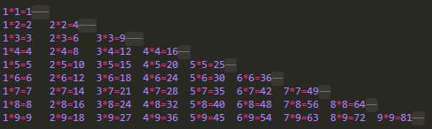

# Python编程：从入门到实践
## 0.None
python中**None**是一个特殊的值，表示为空，并不等同于 **数字 0** ,**空字符**（**' '**,**" "**），**空数组**（**[ ]**），**空元组**（**( )**）,**空字典**（**{ }**），**空集合**(**set( )**), 关键字 **None**，以及 布尔值 **Flase**。

## 1.字符串连接符
### 1.1  使用加号（+ ）连接符合并字符串

- 示例：

```python
str1 = 'Liu' str2 = 'Jin' print(str1 +' '+str2) 
```
- 运行结果：
Liu Jin


### 1.2 **f-string** 格式

**NOTICE**：**f-string** 字符串拼接的方法 在python3.7 才正式引入，因此**只有 python 3.7及以上版本支持**

- 语法：
```python
f'{variable1} strings {variable2} ... '
```
### 1.3 str.format()  格式

- 语法：
```python
'{} strings {} ... '.format(variable1, variable2)
```

- 示例:
```python
head = "hello"
tail = "world!"
print(f'{head}, {tail}')			# f-string 格式
print('{}, {}'.format(head,tail))	# str.format() 
```

- 运行结果:
```
hello, world!
hello, world!
```


## 2. print()方法使用之一
print()默认输出内容后面会换行，如果不需要可以添加 end = " " 控制输出
- 示例：
```python
for i in range(1,10): 	
     for j in range(1,i+1):
          print(str(j)+"*"+str(i)+"="+str(i*j),end="\t")
     print() 
```
- 输出结果：

1\*1=1	

1\*2=2	2\*2=4	

1\*3=3	2\*3=6	3\*3=9	

1\*4=4	2\*4=8	3\*4=12	4\*4=16	

1\*5=5	2\*5=10	3\*5=15	4\*5=20	5\*5=25	

1\*6=6	2\*6=12	3\*6=18	4\*6=24	5\*6=30	6\*6=36	

1\*7=7	2\*7=14	3\*7=21	4\*7=28	5\*7=35	6\*7=42	7\*7=49	

1\*8=8	2\*8=16	3\*8=24	4\*8=32	5\*8=40	6\*8=48	7\*8=56	8\*8=64	

1\*9=9	2\*9=18	3\*9=27	4\*9=36	5\*9=45	6\*9=54	7\*9=63	8\*9=72	9\*9=81	



## 3.制表符
与C语言略同
```python
print('nihao\tliujin\nnice to meet you too') 
print('nihao\tliujin\\nnice to meet you too') 
```

- 运行结果：
    nihao	liujin

    nice to meet you too

    nihao	liujin\nnice to meet you too

## 4.双引号和单引号
与php中类似，双引号和单引号都可以用作字符串，但多个在一起就容易混淆，如下：
‘python is a ’script‘ lan’会出错
“python is a ’script‘ lan”则不会

## 5.python中平方的表示
```python
4 ** 2  #代表四的二字方 
```

## 6.注释
注释标志  “#” 号

## 7.数组操作
```python
arr = ['one','two','three'] 
arr.append('five')	      #末尾追加 
arr.insert(3,'four')     #中间插入，在索引3的位置添加一个数，其后索引值均加1 
```
- 删除某一元素
```python
del  arr[0]			#删除索引值为0的元素之后其他元素索引值都减1 
num = arr.pop(2)	#删除一个元素并返回删除的元素的值 
arr.remove('two')  	#根据元素的值来删除，当需要删除的值出现多次需要循环，因为python中只会删除第一个出现的元素 
```

## 8.数组排序
```python
arr.sort(reverse=True)  	# 永久性地改变数组顺序,reverse=True时代表逆序排列 print(sorted(arr,reverse=True)) 	 #临时排序 
```
## 9.数组长度，索引倒序排序，数组最后一个值的相关函数
```python
arr.revese() 	# 按索引倒序
len(arr) 	    # 确定数组长度 
arr[-1]  	# 访问数组最后一个元素，无论数组长度如何变化。除非列表为空（[ ]）的时候。         
			#和其他语言一样python中数组越界也会报错 
```


##  10.for循环
- 示例：
```python
ums = [12,45,56,7,89,100,67,88,'end'];#数组并不按按照数据类型严格分类
for num in nums :    #python的foeach循环  for  element in array :  
 print(num)          #foreach 循环中的语句每一行需要都缩进（一个或多个的Tab或者空格）   
 print('我缩进了，结果呢？') # for循环中的语句每一行需要与上一行循环语句保持同样的缩进 
#print('我没缩进，结果又如何？，最后一个数字是：' + num) 
#str = 1 + '3'  报错:数字和字符之间不能用 + 符号连接 
print('我没缩进，结果又如何？，最后一个数字是：' + num) 
```


## 11.创建一个新的列表

```python
nums = list(range(1,12,2)) 
#list()将range的结果直接转换成一个列表 
#range()第三个参数代表从第一个参数1开始，每次递增 第三个参数的数量2 
print(nums) 
```

range()第三个参数代表从**第一个**参数开始，**每次递增 第三个参数的大小**


## 12.列表解析

**列表解析方式创建一个新的列表**

```python
#list_c = [11 for value in range(1,21)] #解析列表：[表达式(每次需要向数组赋的值) for value in values]
list_c = [(value*2)+4 for value in range(1,11)] print(list_c) 
```


## 13.列表切片

**列表的一部分称之为切片**

```python
array = ['wo','hen','nanshou','a!','b!','c!']
array[start : end]	#截取数组从索引值 start 到 end 之间的元素（不包括end） 
print(array[1:3])		#python数组索引和其他语言一样，从零开始 
print(array[:3])		#没有指定开始的索引值时默认从第一个数组开始 
print(array[2:])		#没有指定结束的索引值时默认从最后一个数组开始 
print(array[-100000000:])	#负数的绝对值大于数组长度时仍会输出所有数组元素 
print(array[-1:])		#负数表示，倒第几个元素
print(array[-3:1])	#倒数第三个元素（索引值为3）开始到第正数第一个，空集。。 
print(array[-3:4])  #倒数第三个元素索引值为 3，与索引值为4的元素之间(不包括4)刚好有个array[3] 
print(array[-3:3]) #倒数第三个元素索引值为 3，与索引值为3的元素之间(不包括3）为空。 
```

- 运行结果：

  ['hen', 'nanshou']

  ['wo', 'hen', 'nanshou']

  ['nanshou', 'a!', 'b!', 'c!']

  ['wo', 'hen', 'nanshou', 'a!', 'b!', 'c!']

  ['c!']

  []

  ['a!']

  []


## 14.复制列表

- 示例：

```python
shuzuTest = array[:]	#shuzuTest复制列表array的副本 
print( array)
print( shuzuTest) 
shuzuTest.append('worinidaye')	#在复制的副本列表中追加一个元素 
print(shuzuTest)
print(array) #这种方式并非复制一个列表的副本，而是将原来的列表与变量 shuzu 关联，所以列表array的值会随这shuzu变化而变化 
shuzu = array print(shuzu) 
shuzu.append('esed!') 
print(shuzu) print(array) 
```

- 运行结果：

  ['wo', 'hen', 'nanshou', 'a!', 'b!', 'c!']					#array原始的值	

  ['wo', 'hen', 'nanshou', 'a!', 'b!', 'c!']					#shuzuTest的值

  ['wo', 'hen', 'nanshou', 'a!', 'b!', 'c!', 'worinidaye']		#shuzuTes插入之后的值

  ['wo', 'hen', 'nanshou', 'a!', 'b!', 'c!']					#shuzuTes插入之后array的值

  ['wo', 'hen', 'nanshou', 'a!', 'b!', 'c!']					#array原始的值

  ['wo', 'hen', 'nanshou', 'a!', 'b!', 'c!']					#shuzu原始的值 

  ['wo', 'hen', 'nanshou', 'a!', 'b!', 'c!', 'esed!']			#shuzu操作之后shuzu的值

  ['wo', 'hen', 'nanshou', 'a!', 'b!', 'c!', 'esed!']			#shuzu操作之后array的值


## 15.元组 

**元组使用（）创建的数组，元素不可更改，但是可以变量覆盖**

```python
yuanzu = (100,200) 
print(yuanzu) 
yuanzu = (200,300) 
print(yuanzu) 
print(yuanzu[0]) 
#yuanzu[0] = 100            #error 
```
- 运行结果：

```
(100, 200)

(200, 300)

200

Traceback (most recent call last):

File "E:\VScode\Python\arr_demo2.py", line 39, in <module>

    yuanzu[0] = 100            #error

TypeError: 'tuple' object does not support item assignment
```

  

## 16.if条件判断
### 16.1.基本形式
```python
if condition_1:     
	statement_block_1 
elif condition_2:
	statement_block_2 
else:     
	statement_block_3 
if name != 'wang':     
	print('is not me')		#缩进 
```

### 16.2.条件运算符

  **> , < , > = , <= , and , or , in , not in**

### 16.3.判断列表是否为空

  **与php做法类似:**

```python
list_e = [] 
if list_e:     
    print("I\'m not empty") 
else:     
    print("I\'m empty truly") 
```

### 16.3 python的三元运算符

- 语法：
```
expression1 if boolean expression else expression2
```
- 示例：
```python
num = 7 if 1==2 else 8
print(num)
```
- 运行结果：
```
8
```


## 17.字典（键值对）

- 示例：

```python
dict_a =  {'name' : 'nidaye','age' : 24,'sex' : 'male'} 
print(dict_a['name'])		#读取键值对的值
dict_a['love']  = 'money'	#添加一个字段
del dict_a['love']			#删除一个键值对 
```

### 17.1.遍历字典

```python
for key , value in dict_a.items():
    print(key  + ' : ' +  value)
```

- 注意：

  ​     即便遍历字典时， 键—值对的返回顺序也与存储顺序不同。 Python不关心键—值对的存储顺序， 而只跟踪键和值之间的关联关系。

### 17.2.遍历键

```python
for key in dict_a.keys():
	print(key)
```

**or**

```python
for key in dict_a:
	print(key)
```

### 17.3.遍历值

```python
for value in dict_a.values():
	print(value)
```

### 17.4.集合

​	**集合（set） 类似于列表， 但每个元素都必须是独一无二的**

- 形式：

```python
favorite_languages = {
'jen': 'python',
'sarah': 'c',
'edward': 'ruby',
'phil': 'python',
}

for language in set(favorite_languages.values()):
	print(language.title())
```

- 运行结果：

  The following languages have been mentioned:

  Ruby

  C

  Python

### 17.5.字典的嵌套

#### 17.5.1.字典列表
```python
alien_0 = {'color': 'green', 'points': 5}
alien_1 = {'color': 'yellow', 'points': 10}
alien_2 = {'color': 'red', 'points': 15}
aliens = [alien_0, alien_1, alien_2]
for alien in aliens:
	print(alien)
```

#### 17.5.2.字典中存储列表
```python
# 存储所点比萨的信息
pizza = {
'crust': 'thick',
'toppings': ['mushrooms', 'extra cheese'],
}

# 概述所点的比萨
print("You ordered a " + pizza['crust'] + "-crust pizza " +
"with the following toppings:")

for topping in pizza['toppings']:
	print("\t" + topping)
```

#### 17.5.3.字典中储存字典

```python
users = {
        'aeinstein': {
                        'first': 'albert',
                        'last': 'einstein',
                        'location': 'princeton',
        				},
    
        'mcurie': {
                    'first': 'marie',
                    'last': 'curie',
                    'location': 'paris',
                    },
}

#print()方法似乎只能打印字符串类型的变量
print("Total number of aliens: " + str(len(aliens)))
```

## 18.input() 与 while

### 18.1. input

#### 18.1.基本用法

```python
name = input("please enter your name:")
```

- 说明：
		传入一个参数，返回一个字符类型的值；即使输入一个数字也会当做字符处理，如果当做数字用就会出错，如下：

- 示例：

```python
age = input('please enter your age:')
age >> 18 		#立马报错
```


#### 18.1. 与python2中的不同

 input()关于在Python2与python3的不同：

在python3中，input()函数会把输入的内容当做字符串处理，而在python中则会把它**将用户输入解读为Python代码**，并尝试运行它们。
**python2中的raw_input()与python3中的input()效果一样。**

### 18.2关于while 循环

- 示例1：
```python
list = ['liu','li','wang','huang']

flag = True     #python中布尔值唯一写法：True , False

while flag:
 name = input("please enter your first name\n")
 if name not in list:
  if name == 'zhang':
   break
  else:
   print('who are you?')
 else:
  continue
```

- 示例2：
```python
list = ['baozi','mantou','baozi','mi','mian','mi','mian','damo','baozi','baozi']
print("There\'s some foods,they are:")
print(list)
dislike = input("what do you dislike?\n ")
while dislike in list:
	list.remove(dislike)
print("There remains :")
print(list)
```

- 解析：

  ​	列表的**remove方法**只会删除列表中值匹配的**第一次出现的元素**所以需要通过循环来不断删除，通过条件 **dislike in list** 来判断要删除的元素是否存在列表里来控制是否终止循环。


## 19.python函数(方法)

### 19.1.基本形式

```python
def functionName($args1,$args2,...):
   # 函数体
	[return 返回值]
```


### 19.2.返回值

​	返回值可以是字符，数字，列表，字典类型等，甚至还可以为空。

**NOTICE**：与很多语言不同，**python可以返回多个值**

- 示例：

```python

def funct():
	head = 'hello, '
	tail = 'world!'
	return head, tail

x,y = funct()
print(x)
print(y)
print(funct())
```
- 运行结果：
```
hello, 
world!
('hello, ', 'world!')
```
- 解析：
从本例可以看出，python中 return 是可以返回多个值的，其返回的**多个值会以一个元组**的形式返回。


### 19.3. 参数

#### 19.3.1 位置参数

- 示例：
```python
def getName(name,call):
	"""Greeting"""         #文档注释
    print("Hello," + name + "you are " + call);
    name = input("please enter your name:\n") #位置实参 
    getName(name,' Hero') 
```
- RUN:

  please enter your name:
  liujin (*回车*)
- RES:

  Hello,liujinyou are  Hero

#### 19.3.2.关键字参数

- 示例：
```python
def getName(name,call):
	print("Hello," + name + ",you are " + call);
    name=input("please enter your name:\n") #关键字实参 
    getName(call='Hero',name = name) 
```
- RUN::
    please enter your name:
    liujin (*回车*)

- RES:
	Hello,liujin,you are Hero

**NOTICE：**
     **函数调用的时候，*如果第一个参数使用了关键字绑定*，后面的参数也必须使用关键字绑定！**

- 示例：
```python
def run(name,age,sex):
	print(name,end=" ")
    print(age,end=" ")
    print(sex,end=" ")         
```
   -  case 1:
```python
run(name='xiaoming',sex='boy','xiaoming') 
```
- 运行结果：

 run(name='xiaoming',sex='boy','xiaoming')
​                                 ^
**SyntaxError: positional argument follows keyword argument**

  - case 2:
```python
run('xiaoming',name='xiaoming',sex='boy') 
```
- 运行结果：
run('xiaoming',name='xiaoming',sex='boy')
**TypeError: run() got multiple values for argument 'name**


#### 19.3. 3.参数默认值

- 示例：
```python
def handsome(anwser,name='liujin'):
	print("who is the best handsome Man,your anwser is "+anwser+",but,the true is "+name)
anwser=input("your anwser?\n") 
handsome(anwser) 
```

- RUN:

  your anwser?

  wangerxiao *（回车）*

- RES:

  who is the best handsome Man,your anwser is wangerxiao,but,the true is liujin

**NOTICE:**

​		**如果一个函数的参数中含有*默认参数*，则这个默认参数后的所有参数都必须是默认参数 ，否则会抛出：SyntaxError: non-default argument follows default argument的异常。**

- 示例:
```python
def run(name,age="28",sex):#age应该放在最后，或者sex也改为引用型
    print(name,end=" ")
    print(age,end=" ")
    print(sex,end=" ") run('xiaoming','xiaoming','boy') 
```
- 运行结果：

​    		def run(name,age="28",sex):  
​          			 ^
**SyntaxError: non-default argument follows default argument**

#### 19.3.4.不定参数

##### 19.3.4.1.结合使用位置实参和任意数量实参

- 示例：
```python
def volume(shape,*three):
    #此种方式传直将被保存在一个元组里面
    """
    	return the volume of a cubic shape
    """
    #three[0] = 10          元组元素不可改变,除非覆盖
    #three = (4,4,4,)       多一个逗号,就会使得结果稍有变动,python函数内部机制是咋样的,英吹斯汀
    #three = (4,4,4,10)
    three = (4,4,4)
    info = {
        'shape':shape,
        'volume':three[0]*three[1]*three[2]
    }
    return info

print("the var info in the funciton is: ")
#print(info)  maybe also have global and tmp var
print("there is info you need")
print(volume('cuboid',3,3,3))
```

##### 19.3.4.2 使用任意数量的关键字实参

示例:
```python
def build_profile(first, last, **user_info):            
    #把前两个参数之外的所有参数放在一个字典里         
    """创建一个字典， 其中包含我们知道的有关用户的一切"""       
    profile = {}
    profile['first_name'] = first
    profile['last_name'] = last
    for key, value in user_info.items():
        profile[key] = value
    return profile
user_profile = build_profile(
                            'albert', 
                            'einstein',
                            location='princeton',
                            field='physics'
                            ) 
print(user_profile) 
```

### 19.4.模块

- 1) 定义:

模块 是扩展名为.py的文件， 包含要导入到程序中的代码

- 2) 导入的几种方法
```python
import uncertainAmountParams
import uncertainAmountParams as up
from uncertainAmountParamsimport volume
from uncertainAmountParams import volume as vo
from uncertainAmountParams import * 

uncertainAmountParams.volume('cuboid',4,4,4)
up.volume('cuboid',4,4,4)
volume('cuboid',4,4,4)
vo('cuboid',4,4,4) 
```
## 20.类

### 20.1.基本形式

- 示例：
```python
class Dog():		#python中类名通常用大写字母开头
#class Dog(object): #据说这是python2编写一个类的方法,但是我试过,好像不行
    def __init__(self,name,age):   
    #可以理解为python的构造函数，每次实例化类时都会运行，在此方法中形参self参数必不可少
    self.name=name        #传入的形参储存为属性的值
    self.age=age
    self.weight=10        #为属性weight赋初始值 
	print(self)
    def run(self):
        #类中所有的方法都必须带self参数！！！！
        """my dog can run fast"""
        print(self.name.title()+" can run fast! ")

#mydog=Dog("little CAT","3")
mydog=Dog("little CAT",3)		#实例化一个类
print("My dog's name is "+mydog.name.title()+".")
#print("My dog's age is "+mydog.age+".")
print("My dog's age is "+str(mydog.age)+".")
print("My dog's weight is "+str(mydog.weight));
mydog.weight=12                 		#修改属性值
print("after two months my dog's weight is "+str(mydog.weight));
mydog.run()
```

- 运行结果：

  My dog's name is Little Cat.

  My dog's age is 3.

  My dog's weight is 10

  after two months my dog's weight is 12

  Little Cat can run fast! 


### 20.2.继承

- 示例：
```python
#class Car(object):
# def __init__(self, make, model, year):
#--snip--       python2.7语法
class Car():
    """一次模拟汽车的简单尝试"""
    def __init__(self,make,model,year):
        self.make=make
        self.model=model
        self.year=year
        self.odometer_reading=0

    def get_descriptive_name(self):
        long_name=str(self.year)+" "+self.make+" "+self.model
        return long_name.title()

    def read_odometer(self):
    	print("This car has "+str(self.odometer_reading)+"miles on it.")

    def update_odometer(self,mileage):
        if mileage>=self.odometer_reading:
        	self.odometer_reading=mileage
        else:
        	print("You can't roll back an odometer!")

    def increment_odometer(self,miles):
    	self.odometer_reading += miles

class ElectricCar(Car):						#在类名后面的括号里加上所继承的类的类名
    """电动汽车的独特之处"""
    #def __int__(self,make,model,year):
    def __init__(self,make,model,year):
            #super().__init__(self,make,model,year)
            super().__init__(make,model,year)	
            #super()函数将子类和父类（或者说超类superless关联起来），不需要形参self
            self.battery_size = 70
            self.battery = Battery()				
            #实例化一个名为battery的Battery对象，并将其放入ElectricCar类的属性中

#class ElectricCar(Car):
    # def __init__(self, make, model, year):
    #  super(ElectricCar, self).__init__(make, model, year)
    #--snip--       python2.7语法

    def describe_battery(self):
        """打印一条描述电瓶容量的信息"""
        print("This car has a "+str(self.battery_size)+"-kWh battery.")

class Battery():
    """一次模拟电动汽车电瓶的简单尝试"""
    def __init__(self,battery_size=70):
        """初始化电瓶的属性"""
        self.battery_size = battery_size

    def describe_battery(self):
        """打印一条描述电瓶容量的消息"""
        print("This car has a " + str(self.battery_size) +"-kWh battery.")

my_tesla = ElectricCar("tesla","model s",2016)
print(my_tesla.get_descriptive_name())
print(my_tesla)
my_tesla.describe_battery()			#调用ElectricCar中的describe_battery()方法
my_tesla.battery.describe_battery()	#调用重写后子类Battery中的describe_battery()方法
```


运行结果：

    2016 Tesla Model S
    <__main__.ElectricCar object at 0x7f46275cb9b0>
    This car has a 70-kWh battery.
    This car has a 70-kWh battery.

### 20.3. **\_\_init\_\_()** 与 **_\_call\_\_()**

前面已经讲到，**\_\_init\_\_()** 方法在类进行实例化时必不可少。

**\_\_call\_\_()** 方法可以对类进行实例化后，可以用类的实例像对类进行实例化那样调用直接调用 **\_\_call\_\_()** 方法，如下例 **obj(args)**方法相当于**obj.\_\_call\_\_(args)**方法，但是需要注意的是，与Java不同，**\_\_call\_\_()** 不会在对对象进行实例化时调用，只有在实例化以后，用实例化对象调用这个方法的时候才会被调用。

- 示例：

```python
class Construc():
    def __init__(self,name): 
        self.name = name

    def __call__(self): 
    	print(self.name)
        
obj =  Construc("wang")
fname = obj() 
print(obj.name)
obj1 =  Construc("张")
f_namr = obj1.__call__()
print(obj1.name) 
```

- 运行结果：
    wang
    wang
    张
    张
### 20.4.导入类

`1` 导入单个类：

```python
from car import Car	# car(文件名)	Car（类名)
```
`2` 导入多个类
```python
from car import Car, ElectricCar
```
`3` 导入整个模块
```python
import car	# car(文件名)
```
`4` 导入模块中的所有类

```python
from module_name import *
```

## 21.文件

### 21.1.文件的读取

- 示例：
```python
#with open("../recycle/confirmed_users.txt") as py_object:
#python读文件存在严重的乱码问题
with open('pi_digits.txt') as file_object:  
#使用with关键字可以使得文件在不需要访问的时候将其关闭，此举可以避免使用close()
    contents = file_object.read()      
    #read()到达文件末尾时会返回一个空字符 ，输出是会显示换行的效果
    #print(contents)
    #使用此方式输出会多一个空行
    print(contents.rstrip())
    #使用.rstrip()去除空行
```
- 输出结果：
- 
    3.1415926535
      8979323846
      2643383279

- 解析：
open()函数打开一个文件并返回一个表示文件pi_digits.txt的对象file_object，使用文件对象file_object调用read()函数读取文件内容。

- 其他方式：

  ```python
  filename = "test.txt"
  
  f_obj = open(filename, "r")
  
  for line in f_obj.readlines():   #	方式1
  	print(line,end='')
  
  while f_obj:
  	line = f_obj.readline()		#	方式2
  	print(line,end='')
  	if not line:	#判断文件读取到末尾的方式，判断行内容是否为空， not line 等价于 line == ''
  		break
  
  f_obj.close()
  ```

  - 解析：

    方式2使用逐行读取的方法，不必使用变量将所有行存入一个数组内部，只需在使用完后关闭文件对象即可。

### 21.2.逐行读取文件内容

- 示例：
```python
with open('text/pi_digits.txt') as file_object:
    
    #array_line = file_object.readline()        
    #从输出结果我们看到这种方法类似与游标

    array_lines = file_object.readlines()
    array_line = file_object.readline()

print(array_line)
print(array_lines)

for line in array_lines:
	print(line.rstrip())					#rstrip()方法只能删除尾部指定的字符

str = ''
for line in array_lines:
	str += line.strip()						
    #strip()方法可以删除头尾空格和空行

print(str)
print(len(str))
print(str[-1])	
#字符串和数组一样可以这么用，没想到吧？
print(str[2:7])								
#可以把字符串看作包含一个个字符的列表
```

- 输出结果：
    ['3.1415926535\n', '  8979323846\n', '  2643383279\n']

    3.1415926535
      8979323846
      2643383279

    3.141592653589793238462643383279

    32
    9
    14159

### 21.3.文件的写入

- 示例：
```python
with open('text/newfile.txt','w') as file_object:	#打开一个不存在的文件会自动新建这个文件
	file_object.write('wo qi shi hen ai ni')
	#array_list = file_object.readlines()
    #open方法写模式（'w')立的文件对象只有写的权限

with open('text/newfile.txt') as new_file_object:	
	#似乎open())方法默认的方法就是读方法('r')
	content = new_file_object.readlines()

for line in content:
	print(line.strip())

with open('text/newfile.txt','a') as add_object:
	#附加模式('a')，在已有内容后添加新的内容
	add_object.write('\n我可能很爱自己！么么哒。。。')
```

### 20.4.文件解析

- 示例：
```python
def words_count(file_name):
	try:
		with open(file_name) as article_object:
			#content = article_object.readlines()	
			#readlines()用多了,把read()都给忘了
			
			content = article_object.read()
			content_array = content.split()			
			#split()通过空格将字符串分割成若干部分，并将这些部分存在一个列表里
			cnt = str(len(content_array))
		
		#print(str)
		print("这本书有" + cnt + "个字！")
	except FileNotFoundError:
		pass			#不做任何操作							
		# print("文件未找到！")

#file_name = "Secrets of Radar.txt"
file_name = "text/divison11111.py"
words_count(file_name)
```
- 解析：
**split()** 通过空格**将字符串分割成**若干部分，并将这些部分存在一个**列表**里
### 20.5.json文件的写入读取

- 示例：写入
```python
import json
json_file = "text/write_json_file.txt"
num_list = [1,2,3,4,5,6,9]
try:
    with open(json_file,"w") as f_obj: 	
        json.dump(num_list,f_obj)
        #除了能输入数组之外，暂时看不出猫腻 		
        #f_obj.write(num_list)
        #TypeError: write() argument must be str, not list
except FileNotFoundError:
	print("文件不存在") 
```

- 示例：读取
```python
iimport json
try:
    file = "text/write_json_file.txt" 
    with open(file) as f_obj:
        # content = f_obj.read()
        #暂时没看出来二者有什么区别
        content = json.load(f_obj)
        print(content)
except FileNotFoundError: 	
	print("文件未找到") 
```
## 22.异常初探

`1` 除以零异常

- 示例：
```python
while True:

	num1 = input("请输入被除数：")
	if num1 == 'q':
		print("拜拜！")
		break
	num2 = input("请输入除数：")
	
	if num2 == 'q':
		print("拜拜！")
		break
	try:
		res = int(num1)/int(num2)	#可能存在异常的代码
	except  ZeroDivisionError:		
		print("除数不能为0")			#异常的处理
	else:
		print(str(res))				#无异常的正常操作
```


`2` 开文件异常
- 示例：
```python
try:
    with open("text/test_files.txt") as f_obj: 		
        f_obj.readline()
except FileNotFoundError:
	print("文件不存在！") 
```

## 23.测试模块初探

- 示例：survey.py	匿名调查类
```python
class AnonymousSurvey():
    """收集匿名调查问卷的答案"""
    def __init__(self,question):                 
        """存储一个问题，并为存储答案做准备"""           
        self.question = question                 
        self.responses = []
        
    def show_question(self):                 
        """显示调查问卷"""
        print(self.question)
        
   def store_response(self,new_response):           
        """储存单份调查答卷"""                 
        self.responses.append(new_response)          
   def show_results(self):                 
        """显示收集到的所有答卷"""                 
        print("Survey results:")  
        
        for response in self.responses:             
        	print("- "+response)         
```

- 示例：language_survey.py
```python
import unittest from survey
import AnonymousSurvey
class TestAnonymousSurvey(unittest.TestCase):#继承unittest.TestCase类         
    	"""针对AnonymousSurvey类的测试"""
		def setUp(self):#setUp()方法会在TestCase类中首先执行，        
            """                 
            创建一个调查对象和一组答案，供使用的测试方法使用 
            """
        	question = "What language did you first learn to speak?" 
        	self.my_survey = AnonymousSurvey(question)
            self.responses = ['English','Spanish','Mandarin']
       def test_store_single_response(self):#测试方法以test开头，这样的话        
        	"""测试单个答案会被妥善存储"""
            self.my_survey.store_response(self.responses[0])         
            self.assertIn(self.responses[0],self.my_survey.responses) 

unittest.main()#unittest.main()方法会自动执行所有以test开头的方法 
```

## 24.raise_for_status()方法

​		在访问网络链接时，经常会遇到网络无法响应的情况，使用raise_for_status()方法会自动报异常（自带报错效果），当状态码为200，即链接正常时，会返回None。


## 25.基本数据类型之string类型

### 25.1.与列表的比较

​		字符串类型与列表类型很相似，因此对列表的许多操作对字符串也看到一使用，比如按下标取值、切片、用于for循环，用于len()以及用于in和not in操作符。

​	但是，与与列表是可变类型的数据不同，**字符串是不可变的**，举例如下：

- 示例：

```python
name = ‘nidaye’
name[3] = 'er' 
```

- 运行结果：

  Traceback (most recent call last):

    File "<stdin>", line 1, in <module>

  TypeError: 'str' object does not support item assignment

**如果需要用到字符串的内容，可用切片和连接使用该字符串。**


### 25.2.字符串中三重引号的多行字符串

```python
print('''I              love                 with                     you ''') 
```

- 运行结果：

I

​                love

​                        with

​                                you


作用与html中的\<pre\>标签类似

###  \*25.3 常用的方法

字符串常用的方法有很多，其中有replace()

用法为 **str.replace(old,new)**

关于更多字符串类型的基本方法详见python官方文档中的 String Method


## 26.粘贴和赋值功能的应用：

导入 **pyperclip** 包，使用其中的copy()和paste()方法:

- 示例：

```python
import pyperclip 
command = "cd /home"
pyperclip.copy(command)		#向剪切板发送字符
print(pyperclip.paste())	#读取剪切板的内容 print("已复制到剪切板。") 
```

- 运行结果：

  cd /home

  已复制到剪切板。

  

## 27.if \_\_name\_\_ == \"\_\_main\_\_"

当前模块被其他包引入时，在此条件下的所有语句将不会再引入的python文件中执行。

__name__ 是模块的唯一标识，只有在本模块下的值是 “__main__”，看着这个 “ ” 双引号，对了没错，__name__时字符串类型的变量，不信的话可以用 **type()** 方法 **查看变量类型**

也可以用作方法名，如下例所示，可以用来查看变量引用的方法
- 示例：
```python
def test():
    print("今天天气好晴朗")
    fobj = test print(fobj.__name__) 
```
其他，一无所知。。。

来日方长，慢慢研究


## 28. python 运算符

[本节知识点来源网址](https://www.runoob.com/python/python-operators.html)

### 28.1 算数运算符

以下假设变量： **a=10，b=20**：

| 运算符 | 描述                                            | 实例                                               |
| :----: | ----------------------------------------------- | -------------------------------------------------- |
|   +    | 加 - 两个对象相加                               | a + b 输出结果 30                                  |
|   -    | 减 - 得到负数或是一个数减去另一个数             | a - b 输出结果 -10                                 |
|   *    | 乘 - 两个数相乘或是返回一个被重复若干次的字符串 | a * b 输出结果 200                                 |
|   /    | 除 - x除以y                                     | b / a 输出结果 2                                   |
|   %    | 取模 - 返回除法的余数                           | b % a 输出结果 0                                   |
|   **   | 幂 - 返回x的y次幂                               | a**b 为10的20次方， 输出结果 100000000000000000000 |
|   //   | 取整除 - 返回商的整数部分（**向下取整**）       | `>>> 9//2`<br>` 4 `<br>`>>> -9//2`<br>` -5`        |

**注意：**Python2.x 里，整数除整数，只能得出整数。如果要得到小数部分，把其中一个数改成浮点数即可。


### 28.2 比较运算符

以下假设变量a为10，变量b为20：

| 运算符 | 描述                                                         | 实例                                     |
| ------ | ------------------------------------------------------------ | ---------------------------------------- |
| ==     | 等于 - 比较对象是否相等                                      | (a == b) 返回 False。                    |
| !=     | 不等于 - 比较两个对象是否不相等                              | (a != b) 返回 true.                      |
| <>     | 不等于 -  比较两个对象是否不相等                             | (a <> b) 返回 true。这个运算符类似 != 。 |
| >      | 大于 - 返回x是否大于y                                        | (a > b) 返回 False。                     |
| <      | 小于 - 返回x是否小于y。所有比较运算符返回1表示真，返回0表示假。这分别与特殊的变量True和False等价。 | (a < b) 返回 true。                      |
| >=     | 大于等于	- 返回x是否大于等于y。                           | (a >= b) 返回 False。                    |
| <=     | 小于等于 -	返回x是否小于等于y。                           | (a <= b) 返回 true。                     |


### 28.3 赋值运算符

以下假设变量a为10，变量b为20：

| 运算符 | 描述             | 实例                                  |
| :----: | ---------------- | ------------------------------------- |
|   =    | 简单的赋值运算符 | c = a + b 将 a + b 的运算结果赋值为 c |
|   +=   | 加法赋值运算符   | c += a 等效于 c = c + a               |
|   -=   | 减法赋值运算符   | c -= a 等效于 c = c - a               |
|   *=   | 乘法赋值运算符   | c *= a 等效于 c = c * a               |
|   /=   | 除法赋值运算符   | c /= a 等效于 c = c / a               |
|   %=   | 取模赋值运算符   | c %= a 等效于 c = c % a               |
|  **=   | 幂赋值运算符     | c \*\*= a 等效于 c = c\*\* a          |
|  //=   | 取整除赋值运算符 | c //= a 等效于 c = c // a             |


### 28.4 位运算符

 按位运算符是把数字看作二进制来进行计算的。Python中的按位运算法则如下：

下表中变量 a 为 60，b 为 13，二进制格式如下：

```
a = 0011 1100

b = 0000 1101

-----------------

a&b = 0000 1100

a|b = 0011 1101

a^b = 0011 0001

~a  = 1100 0011
```

| 运算符 | 描述                                                         | 实例                                                         |
| ------ | ------------------------------------------------------------ | ------------------------------------------------------------ |
| &      | 按位与运算符：参与运算的两个值,如果两个相应位都为1,则该位的结果为1,否则为0 | (a & b) 输出结果 12 ，二进制解释： 0000 1100                 |
| \|     | 按位或运算符：只要对应的二个二进位有一个为1时，结果位就为1。 | (a \| b) 输出结果 61 ，二进制解释： 0011 1101                |
| ^      | 按位异或运算符：当两对应的二进位相异时，结果为1              | (a ^ b) 输出结果 49 ，二进制解释： 0011 0001                 |
| ~      | 按位取反运算符：对数据的每个二进制位取反,即把1变为0,把0变为1 。~x 类似于 -x-1 | (~a ) 输出结果 -61 ，二进制解释： 1100 0011，在一个有符号二进制数的补码形式。 |
| <<     | 左移动运算符：运算数的各二进位全部左移若干位，由 << 右边的数字指定了移动的位数，高位丢弃，低位补0。 | a << 2 输出结果 240 ，二进制解释： 1111 0000                 |
| >>     | 右移动运算符：把">>"左边的运算数的各二进位全部右移若干位，>> 右边的数字指定了移动的位数 | a >> 2 输出结果 15 ，二进制解释： 0000 1111                  |

------


### 28.5 逻辑运算符

Python语言支持逻辑运算符，以下假设变量 a 为 10, b为 20:

| 运算符 | 逻辑表达式 | 描述                                                         | 实例                    |
| :----: | ---------- | ------------------------------------------------------------ | ----------------------- |
|  and   | x and y    | **布尔**"与" - 如果 x 为 False，x and y 返回 False，否则它返回 y 的计算值。 | (a and b) 返回 20。     |
|   or   | x or y     | **布尔**"或"	- 如果 x 是非 0，它返回 x 的值，否则它返回 y 的计算值。 | (a or b) 返回 10。      |
|  not   | not x      | **布尔**"非" - 如果 x 为 True，返回 False 。如果 x 为 False，它返回 True。 | not(a and b) 返回 False |

### 28.6 成员运算符

除了以上的一些运算符之外，Python还支持成员运算符，测试实例中包含了一系列的成员，包括字符串，列表或元组。

| 运算符 | 描述                                                    | 实例                                              |
| ------ | ------------------------------------------------------- | ------------------------------------------------- |
| in     | 如果在指定的序列中找到值返回 True，否则返回 False。     | x 在 y 序列中 , 如果 x 在 y 序列中返回 True。     |
| not in | 如果在指定的序列中没有找到值返回 True，否则返回 False。 | x 不在 y 序列中 , 如果 x 不在 y 序列中返回 True。 |


### 28.7 身份运算符

  身份运算符用于比较两个对象的存储单元

| 运算符 | 描述                                        | 实例                                                         |
| ------ | ------------------------------------------- | ------------------------------------------------------------ |
| is     | is 是判断两个标识符是不是引用自一个对象     | **x is y**, 类似 **id(x) == id(y)** , 如果引用的是同一个对象则返回 True，否则返回 False |
| is not | is not 是判断两个标识符是不是引用自不同对象 | **x is not y** ， 类似 **id(a) != id(b)**。如果引用的不是同一个对象则返回结果 True，否则返回 False。 |

**注：** [id()](https://www.runoob.com/python/python-func-id.html) 函数用于获取对象内存地址。

#### \* is 与 == 区别

> **is 与 == 区别：**
>
> is 用于判断两个变量引用对象是否为同一个(同一块内存空间)， == 用于判断引用变量的值是否相等。
>
> ```
> >>> a = [1, 2, 3]
> >>> b = a
> >>> b is a 
> True
> >>> b == a
> True
> >>> b = a[:]
> >>> b is a
> False
> >>> b == a
> True
> ```

------

### 28.8 Python运算符优先级

以下表格列出了从最高到最低优先级的所有运算符：

| 运算符                   | 描述                                                   |
| ------------------------ | ------------------------------------------------------ |
| **                       | 指数 (最高优先级)                                      |
| ~ + -                    | 按位翻转, 一元加号和减号 (最后两个的方法名为 +@ 和 -@) |
| * / % //                 | 乘，除，取模和取整除                                   |
| + -                      | 加法减法                                               |
| >> <<                    | 右移，左移运算符                                       |
| &                        | 位 'AND'                                               |
| ^ \|                     | 位运算符                                               |
| <= < > >=                | 比较运算符                                             |
| <> == !=                 | 等于运算符                                             |
| = %= /= //= -= += *= **= | 赋值运算符                                             |
| is is not                | 身份运算符                                             |
| in not in                | 成员运算符                                             |
| not and or               | 逻辑运算符                                             |
