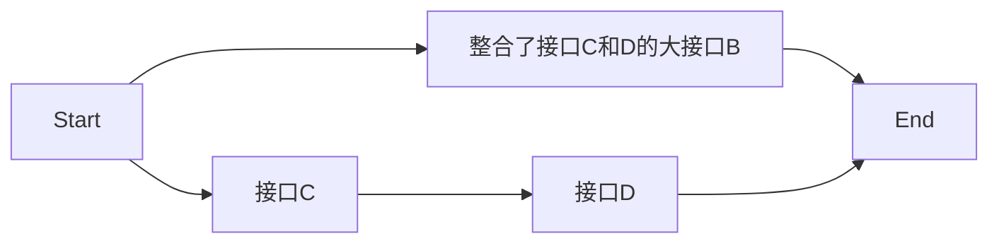

# 一、项目名称

​		徐小湛《高等数学》课件爬虫项目

#  二、项目描述

​		根据同学叶某的建议，爬取某博客网站某博主公布的 徐小湛《高等数学》ppt课件，最好能整理成pdf文件有助于在 iPad 上查看。

#  三、项目分析

​		根据叶某提示，该博主公布之课件均以图片的形式发布在其博客上，如果能抓取所有图片，后面的整理工作将不再困难。网址为：[徐小湛的博客-高等数学课件目录](http://xuxzmail.blog.163.com/blog/static/25131916200821381853933/) 。因此，项目可分为连个阶段：1.图片爬取阶段；2.合并整理图片为 pdf 文件阶段。

#  四、实现过程

## 1. 图片爬取阶段

  - 使用类库：

    bs4, requests, os, sys等

  - 重难点分析：

    抓取图片类 体积不大的 文件并不困难，难的是需要从网站中筛选出有用的链接，这类链接在一些网站通常使用前端技术隐藏，只有在触发相应的事件后才能显示出来。不过显然，这个网站并没有花那么闲心去加密处理这些资源，使用的前端技术比较常规，看不到什么现代前端框架的影子。但是打开谷歌浏览器分析此人的网页源码，发现，此人一定不是什么好人，代码及其不规范，规律不那么靠谱，所幸，大部分还是比较规律的，极个地方只能用特别的方法处理。
    
- 源码：

```python
import os
import sys
import requests
from bs4 import BeautifulSoup
from threading import Thread, Lock

lock = Lock()

def get_chapters(url):

	try:
		response = requests.get(url)
		soup = BeautifulSoup(response.text,features="html.parser")

		inital_content = soup.select('a[href]')		# 筛选所有 带有 href 属性的 a 标签

		for item in inital_content:

			if 'http://xuxzmail.blog.163.com/blog/static/' in item.get("href"):
				print(item.get("href"))

			# 比较无奈的做法，首先打印出相似的链接，然后手动筛选，并将最后结果保存到 chapters.txt 文件中


	except Exception as e:
		print(e)


def put_all_chapters(chapterfile):
	
	try:
		threads = []

		with open(chapterfile,"r") as f_obj:
			chapter_urls = f_obj.readlines()

		for chapter_url in chapter_urls:

			# get_ppts(chapter_url.strip())		# 循环顺序执行，用于排错调试

			t = Thread(
						target=get_ppts,
						args=(chapter_url.strip(),)
				)

			threads.append(t)


		for thread in threads:
			thread.start() 

		for thread in threads:
			thread.join(timeout=60)

	except Exception as e:
		print(e)


def get_ppts(chapter_url):

	try:
		i = 1
		
		threads = []
		
		response = requests.get(chapter_url)
		soup = BeautifulSoup(response.text,features="html.parser")
		
		ppts = soup.select('.m-3 .nbw-blog img')
		
		if ppts == []:	# 极个别特例，能在浏览器查找，但是却不能获取内容，前端知识不牢，暂不研究
			ppts = soup.select('img[alt="10.1 对弧长的曲线积分 - Calculus - 高等数学"]')

		chapter_name = soup.select('.m-3 .nbw-ryt .left .nbw-bitm .title .tcnt')[0].getText()

		for ppt in ppts:

			filename = chapter_name + str(i)
		
			# print(ppt.get('src'))
			# download(chapter_name,filename,ppt.get('src'))	# 循环顺序执行，用于排错调试

			t = Thread(
						target=download,
						args=(chapter_name,filename,ppt.get('src'))
						)

			threads.append(t)

			i = i + 1

		for thr in threads:
			thr.start()

		for thr in threads:
			thr.join(timeout=60)		#超过60秒停止阻塞，放弃治疗

		print(chapter_name + '\t下载完成')

	except Exception as e:
		print(e)


def download(filepath,filename,pic_url):
	"""下载器"""
	#下载位置
	try:
		pic_root = "imgs/"
		path = pic_root + filepath
		with lock:
			if(os.path.exists(path) == False):
				os.makedirs(path)

		suffix = pic_url.split('.')[-1]

		file = os.path.join(path, (filename + '.' +suffix))

		if(os.path.exists(file) == False):

			with open(file,"wb") as f_obj:
				pic = requests.get(pic_url)
				for chunk in pic.iter_content(100000):
					f_obj.write(chunk)

	except Exception as e:
		print(e)
	

# url = "http://xuxzmail.blog.163.com/blog/static/2513191620073297190462/"
# url = "http://xuxzmail.blog.163.com/blog/static/25131916200732971633378/"
# get_ppts(url)

chapterfile = "chapters.txt"
put_all_chapters(chapterfile)
```

接下来对每个方法逐个分析;

### 1.1 源码分析
#### 1.1.1  get_chapters() 方法
获取每一章和每一小节相应的链接

```python
def get_chapters(url):
    '''
    	获取所有图片链接
    	比较无奈的做法，首先打印出相似的链接，然后手动筛选，并将最后结果保存到 chapters.txt 文件中
    '''
	try:
		response = requests.get(url)
		soup = BeautifulSoup(response.text,features="html.parser")

		inital_content = soup.select('a[href]')		# 筛选所有 带有 href 属性的 a 标签

		for item in inital_content:

			if 'http://xuxzmail.blog.163.com/blog/static/' in item.get("href"):
				print(item.get("href"))

	except Exception as e:
		print(e)
```

- 解析：

  首先使用 **requests** 库的 **get()** 方法向该网站的服务器端发送一个 **get请求** ，得到一个 **Response** 对象。

  第二步，获取 **Response** 对象的 **text属性** 响应的html文本信息，并座位 bs4 库的 **BeautifulSoup** 类构造方法的一个参数初始化  **BeautifulSoup** 类，返回 **BeautifulSoup** 对象。 **BeautifulSoup** 对象有很多方法可以帮助我们解析 html 文档结构，从而筛选出我们需要的信息。这里我们使用的是功能强大的 **select() ** 方法。

  本例中 **select() **方法的 "  a[href] " 参数表示，**带有 href 属性的 a标签**，也可以写成 "a[href="http://XXXXXX"]" 的形式，表示 href 属性值为"http://XXXXXX" 的 标签。

  更多关于 select() 方法用法 和 其他方法请看 BeautifulSoup  的官方文档。


​	比较遗憾和难受的是，在抓取链接时发现不少无用的链接，因此只能使用筛选的方法大致地找出有用的链接。


#### 1.1.2  get_ppts() 方法（多线程）

从筛选的链接中获取图片链接

```python
def get_ppts(chapter_url):

	try:
		i = 1
		
		threads = []
		
		response = requests.get(chapter_url)
		soup = BeautifulSoup(response.text,features="html.parser")
		
		ppts = soup.select('.m-3 .nbw-blog img')
		
		if ppts == []:	# 极个别特例，能在浏览器查找，但是却不能获取内容，前端知识不牢，暂不研究
			ppts = soup.select('img[alt="10.1 对弧长的曲线积分 - Calculus - 高等数学"]')

		chapter_name = soup.select('.m-3 .nbw-ryt .left .nbw-bitm .title .tcnt')[0].getText()

		for ppt in ppts:

			filename = chapter_name + str(i)
		
			# print(ppt.get('src'))
			# download(chapter_name,filename,ppt.get('src'))	# 循环顺序执行，用于排错调试

			t = Thread(
						target=download,
						args=(chapter_name,filename,ppt.get('src'))
						)

			threads.append(t)

			i = i + 1

		for thr in threads:
			thr.start()

		for thr in threads:
			thr.join(timeout=60)		#超过60秒停止阻塞，放弃治疗

		print(chapter_name + '\t下载完成')

	except Exception as e:
		print(e)

```

- 解析：

  首先和上个方法类似，利用 requests库的get方法和 BeautifulSoup 的 select() 方法，在谷歌浏览器的调试模式的帮助下分别获取图片链接，用getText() 方法返回标签的内容（即章节名称）。由于 css 属性的不一致，这里我们使用 if 语句分支出了一个特例。

  接下来 使用多线程的方法 首先创建多个线程 然后启动，阻塞直至下载完成退出主程序。每个线程调用的都是 download()方法，被传递不同的参数。

#### 1.1.3  put_all_chapters() 方法（多线程）

获取所有章的图片链接

```python
def put_all_chapters(chapterfile):
	
	try:
		threads = []

		with open(chapterfile,"r") as f_obj:
			chapter_urls = f_obj.readlines()

		for chapter_url in chapter_urls:

			# get_ppts(chapter_url.strip())		# 循环顺序执行，用于排错调试

			t = Thread(
						target=get_ppts,
						args=(chapter_url.strip(),)
				)

			threads.append(t)


		for thread in threads:
			thread.start() 

		for thread in threads:
			thread.join(timeout=60)

	except Exception as e:
		print(e)
```

- 解析：

  由于每个章节的链接都被手动地存入一个文本文件，所以首先要 使用 open() 方法 用只读的方式打开它，使用  ***with***  关键字的上下文管理办法可以自动地在使用完文件指针自动关闭它而不用到 **close()** 方法关闭。使用文件指针的 **readlines()**方法可以将读取的内容按列表的形式读取出来。

  接下来使用多线程的方法创建多个线程，每个线程调用 get_ppts() 方法，并传入从文本文件读取的不同章节的链接作为 get_ppts() 方法的唯一参数传入。由于使用readlines() 方法读出的每个元素在末尾被多一个 ”\n“ 换行符，所以用 **rstrip()** 方法去除尾部的各种空格符（包括，空格，换行，制表符等）。

  需要注意的是，这里使用多线程时，调用的函数只有一个。参数被指定要用一个元组的方式传入，在**只有一个参数**时，必须在这个参数后加一个 "**,**" ，程序才能正常运行。

#### 1.1.4  download() 方法（上锁）

用来下载图片

```python
def download(filepath,filename,pic_url):
	"""下载器"""
	#下载位置
	try:
		pic_root = "imgs/"
		path = pic_root + filepath
		with lock:
			if(os.path.exists(path) == False):
				os.makedirs(path)

		suffix = pic_url.split('.')[-1]

		file = os.path.join(path, (filename + '.' +suffix))

		if(os.path.exists(file) == False):

			with open(file,"wb") as f_obj:
				pic = requests.get(pic_url)
				for chunk in pic.iter_content(100000):
					f_obj.write(chunk)
```

- 解析：

  首先，此处出现了，多线程中常出现的 **Lock ** （即锁）的概念，表示在多个线程在遇到这个语句范围内，不能多个线程同时执行这段语句，如果一个线程已经获得这个语句的执行权，那么其他线程将被阻塞，直至当前线程释放这个锁。

  线程 锁 的使用方式大致如下：

  - 1. 从 threading 模块中引入 Lock 类，第一步需要实例化一个 Lock 类，可以使用如 ：lock = Lock() 的方式进行实例化。
  - 2. 选择需要上锁的程序片段，并将其用 lock ”包起来“，可以使用以下两种方法：
       2.1. 常规操作：
       
       ```python
       lock.acquire（）
       # codes
       lock.release()
       ```
       
       2.2. 上下文管理法：
       
       ```python
       with lock:
           # codes
       ```

由于线程锁会阻塞线程，因此会增加线程等待的时间，应尽量避免。


- 其次的一个小关注点	

  在文件下载中，通常知道指定的文件格式，因此在以前，每当下载图片时我会把格式写成固定的 "jpg" 格式，遇到特殊情况，比如上千张图片中混进入了一张 "png" 格式的图片，就会很麻烦，因此对于下载的文件还是有必要去判断它的文件类型的。通常有两种方法，第一种，比较准确，可以通过响应头的信息中得到该文件的大量有用信息，如可以用作断点续传的文件大小信息，文件格式等。但是此网站的返回头并不包含以上信息。

  第二种方法，就是用后缀名判断的方法了，每个图片都会有一个链接，每个链接通常都会以 ”.xxx“ 的形式结尾，这样可以使用 python 的**split()** 方法将该链接 以 ”**.**“ 为界分割成若干个列表，只要取得这个列表的最后一个元素即，后缀名即可。python 数组可以使用 "**arr[-1]**" 的形式快速地去除列表的最后一个元素。


**至此，图片爬取阶段的工作全部分析完毕了。**


### 2.合并整理图片为 pdf 文件阶段

- 使用类库：

  fpdf, PyPDF2, os, sys等

- 重难点分析：

  这个阶段其实也有两个任务。一，需要将图片按照其组织形式，如按章节，小节等等形式将这些图片合并成一个pdf 文件；二，将多个pdf文件整合成一个大的pdf文件，最好可以顺便添加目录。

  由于合并可以分为好几种，例如，可以直接将所有图片直接合并成一个pdf 文件，也可以按照每一小节，或者每一个章合并成一个pdf文件，为了保持每个方法的功能小型化且专一化的特征，也有利于即使排查错误，因此，我 用按照小节合并，再逐个整合的方法实现。


​		插个题外话，关于为什么接口要小型化，某日我有了我自己的思考，大致内容如下图;


这个很丑的草图种，从 Start 到 End 之间 连接线的长度表示，每个程序占用的内存空间的大小，假设 除却多个函数之间 程序栈的空间大小，接口C （m）和 接口D（n） 运行时大小约等于 接口B（l），即（`$m+n \approx l$`）。再并发为 k 的情况下对比，访问接口B 和 分别访问接口C 和接口D 所占的内存，接口B 为  `$k \times l \approx m \times k + n \times k$` ，接口C 和 D 的综合为 `$m \times x + n \times y $`  (`$x+y  \leq k$`)，很显然，除却相比之下多出的程序栈空间，相等的并发情况下小型化的接口在同一时刻所占的内存会更小，这更能减少宕机的发生。

随手百度发现，对于图片合并成pdf文件，网上也有没太多简单快捷方便的方法，于是Google以下，发现了一个 关于 pdf 比较冷门的库 **fpdf **，再回头百度，发现国内关于这个库的介绍少之又少，中文文档都没有，但是看到了一个关于实现上述功能的例子，于是开始使用这个库为 图片转 pdf 作准备。

然后就是合并pdf文件了，这个倒是没有什么特别的库，大多方式不是直接使用PyPDF2 的方法就是间接封装，我一开始使用的是 《Python编程快速上手 让繁琐工作自动化》这本书上的 原始比较底层的方法，后来才发现这个库其实已经有了一个关于合并pdf的类和方法。

实现如下：

#### 2.1 图片合并成pdf文件
- 源码：
```python
import os
import sys
from fpdf import FPDF
from threading import Thread, Lock

lock = Lock()

def collect_chapter(chapter_name,part_name):
	'''
		由于不图片格式校验时出现的不明原因，用文件遍历的方式好像不行，所有单独列出
	'''
	try:		
		file_dir = "pdfs/"
		pdf = FPDF('P','cm', (20,15))

		re_path = ''
		# for current_folder,sub_folders,filenames in os.walk(part_name + "/" + chapter_name + "/"):
		for current_folder,sub_folders,filenames in os.walk(os.path.join(part_name,chapter_name)):	# 不要再用这种 平台不兼容 而且很丑陋的方式

			for filename in filenames:
				img = os.path.join(current_folder,filename)
				pdf.add_page()
				pdf.image(img,(20-16.93)/2, (15-12.7)/2)

			with lock:

				if(os.path.exists(file_dir) == False):
					os.makedirs(file_dir)

				re_path = file_dir + part_name.split('\\')[1]		# on Windows
				# re_path = file_dir + part_name.split('/')[1]		# on Linux， don't recognise the double slash  ('//') 

				if(os.path.exists(re_path) == False):
					os.makedirs(re_path)

		# pdf.output(re_path + "/" + chapter_name + ".pdf", "F")		# 不要再用这种 平台不兼容 而且很丑陋的方式
		pdf.output(os.path.join(re_path, chapter_name + ".pdf"), "F")

		print(chapter_name + "\t整合完成！")

	except Exception as e:
		print(e)

def down_part(part_name="."):
	
	try:
		threads = []
		chapters = []

		for current_folder,sub_folders,filenames in os.walk(part_name):
			# print(sub_folders)
			# chapters = sub_folders[:]			# 即使时保存列表的副本，在被保存的列表被释放后，副本也会被释放，可以推测副本引用是原列表的指针副本
			for sub_folder in sub_folders:
				chapters.append(sub_folder)

		for chapter in chapters:

			# collect_chapter(chapter,part_name)		# 

			t = Thread(
						target=collect_chapter,
						args=(chapter, part_name)
						)

			threads.append(t)

		for thread in threads:
			thread.start()

		for thread in threads:
			thread.join()

	except Exception as e:
		print(e)


def get_parts(root_dir="imgs"):

	try:
		parts = []

		for current_folder,sub_folders,filenames in os.walk(root_dir):
			return sub_folders

	except Exception as e:
		print(e)

def parts_down(root_dir="imgs"):

	try:

		parts = get_parts(root_dir)

		for part in parts:
			part = os.path.join(root_dir,part)
			down_part(part)

	except Exception as e:
		print(e)

parts_down()
```

接下来对每个方法逐个分析：


##### 2.1.1 源码分析
###### 2.1.1.1 collect_chapter() 方法（fpdf库）

用于将图片转换成 pdf 文件，整个程序的核心内容

```python
def collect_chapter(chapter_name,part_name):
	'''
		由于不图片格式校验时出现的不明原因，用文件遍历的方式好像不行，所有单独列出
	'''
	try:		
		file_dir = "pdfs/"
		pdf = FPDF('P','cm', (20,15))

		re_path = ''
		# for current_folder,sub_folders,filenames in os.walk(part_name + "/" + chapter_name + "/"):# 不要再用这种 平台不兼容 而且很丑陋的方式
		for current_folder,sub_folders,filenames in os.walk(os.path.join(part_name,chapter_name)):

			for filename in filenames:
				img = os.path.join(current_folder,filename)
				pdf.add_page()
				pdf.image(img,(20-16.93)/2, (15-12.7)/2)

			with lock:

				if(os.path.exists(file_dir) == False):
					os.makedirs(file_dir)

				re_path = file_dir + part_name.split('\\')[1]		# on Windows
				# re_path = file_dir + part_name.split('/')[1]		# on Linux， don't recognise the double slash  ('//') 

				if(os.path.exists(re_path) == False):
					os.makedirs(re_path)
                    
		pdf.output(os.path.join(re_path, chapter_name + ".pdf"), "F")

		print(chapter_name + "\t整合完成！")

	except Exception as e:
		print(e)
```

- 解析：

  1. 注释的原因就是上述下载文件时将所有文件默认后缀为"jpg"格式的后果，在对下载器修改之后，此问题已解决。

  2. 接下来重点介绍 fpdf 类的 FDPF 的构造方法和 image() 方法。根据官方文档，解释如下：

     ## __construct

     `__construct([string orientation [, string unit [, mixed size]]])`

     参数解释：

     *orientation*: 表示 pdf 页面的显示方法，可选参数有

     - `P` or `Portrait`

     - `L` or `Landscape`

       通俗地将就是宽屏还是竖屏的显示方式，P 代表 宽屏模式，L 代表竖屏模式
  
       ***默认是 P***
  
     *unit*： 表示衡量页面的单位，可选参数有（看得懂，不翻译了）

     - `pt`: point
     - `mm`: millimeter
     - `cm`: centimeter
     - `in`: inch
  
     ***默认是 mm***
  
     *size*：表示pdf页面的格式,可选参数有
  
     - `A3`
     - `A4`
     - `A5`
     - `Letter`
     - `Legal`
  
     ***默认是 A4***
  
     **也可以自定义元组**，如下例：
  
     ```python
     pdf = FPDF('P','mm',(100,150))
     ```
  
       ## Image
  
     `Image(string file [, float x [, float y [, float w [, float h [, string type [, mixed link]]]]]])`
  
     参数解释：
  
     - `file`
  
        图片的文件路径或 url 链接
  
     - `x`
  
       相对于pdf页面水平方向的偏移量
  
     - `y`
  
       相对于pdf页面水平方向的偏移量，这两个参数在调整图片在 pdf 页面种的相对位置很有用，例如上例就是利用了这两个参数将图片放置于 pdf 页面的相对居中的位置。
  
     - `w`
  
       图片的宽度
  
     - `h`
  
       图片的高度
  
     - `type`
  
       图片格式
  
     - `link`
  
        URL or identifier returned by AddLink(). 
  
       
  
       ## output
  
       ```
       fpdf.output(name = '', dest = '')
       ```
  
     参数解释：
  
     - `name`
  
       文件名，用来写入文件时使用。
  
     - `dest`
  
       文档储存的目的地，有以下参数可选：
  
       >- I` or `D`: 将文档写入 *sys.stdout*.选这个参数时默认没有 name 参数，即文件名.
       >- `F`: 存为文件的形式
       >- `S`: 将文档以字符串的形式返回
       
     - 说明
      使用这个方法时不必调用 pdf.close() 方法，此方法会自动调用。
  
      以上翻译均为浅显的说明，关于以上参数具体的描述请参见官方文档，网址 [pyfpdf](https://pyfpdf.readthedocs.io/en/latest/index.html)
  
     
  
  3. 步骤：
  
     首先使用构造方法创建一个自定义大小的pdf页面空白的pdf对象 ：pdf = FPDF('P','cm', (20,15))
  
     然后向这个空白对象添加pdf页面：pdf.add_page()，紧接着向新页添加自定义尺寸的图片：pdf.image(img,(20-16.93)/2, (15-12.7)/2)， 第二个参数(20-16.93)/2，20代表pdf页面的宽度，16.93代表的是图片的宽度，即表示将图片放置于pdf页面水平居中的位置。下一个参数，同理。
     
     最后使用output() 方法将文档内容写入文件。
     

###### 2.1.1.2 语法规范（平台路径名）

     ```python
          # pdf.output(re_path + "/" + chapter_name + ".pdf", "F")		
          # 不要再用这种 平台不兼容 而且很丑陋的方式
          pdf.output(os.path.join(re_path, chapter_name + ".pdf"), "F")
     ```
​    在文件名拼接的时候务必使用 规范的 os.path.join() 方法，而不要用字符串拼接的方法，不仅仅是由于这种写法繁琐而且相当不美观，还存在平台不兼容，在window和Linux上的区别在本例:
​    ```python
​         re_path = file_dir + part_name.split('\\')[1]		# on Windows
​         # re_path = file_dir + part_name.split('/')[1]		# on Linux， don't recognise the double slash  ('//') 
​    ```

可以使用python的platform库的**platform()**方法查看所在平台。


#### 2.2 合并pdf文件

- 源码：(旧版)

```python
import re
import os
import sys
from PyPDF2 import PdfFileMerger
from PyPDF2 import PdfFileReader, PdfFileWriter

def  merge_new(part_name):
	'''
		合并每一小节的 pdf 文档整合成 每章 文档
		根据官方文档提供的 PdfFileMerger 类, 自测耗时 3.3 s
	'''
	try:
		ch_sets = order_by(part_name)

		merge_obj = PdfFileMerger()

		for pdf in ch_sets:
			# with open(pdf,"rb") as pdf_obj:
			# 	merge_obj.append(pdf_obj)		# 这种方法会导致无法读取到页面内容,至于为什么有待研究

			merge_obj.append(open(os.path.join(part_name,pdf),"rb"), pdf[:-len(os.path.splitext(pdf)[1])])

		part_file = part_name.split("\\")[1] + ".pdf"

		if os.path.exists(part_file) == False:

			with open(part_file,"wb") as res:
				merge_obj.write(res)

			print(part_file + "\t合并完成!")

		else:
			print(part_file + "\t文件已存在")

	except Exception as e:
		print(e)


def merge_pdfs(part_name):
	'''
		合并每一小节的 pdf 文档整合成 每章 文档
		自己写的合并方法,调用了下面自己写的一个合并两个文档的方法
		不带书签,自测耗时 11.8 s
	'''
	try:

		count = 1
		ch_sets = order_by(part_name)
		
		current_folder = os.path.dirname(__file__)
		new_name = os.path.join(current_folder, part_name.split("\\")[1] + '.pdf') # "\\" on windows, "/" on Linux

		if os.path.exists(new_name) == False:		# 这样的循环嵌套的和条件判断我内心是拒绝的，但是 达到目的是第一位

			for ch_set in ch_sets:

				if count == 1:
					merge_two_pdf( os.path.join(part_name, ch_sets[0]), os.path.join(part_name, ch_sets[1]), 'tmp' + str(count))

				elif count > 1 and count < len(ch_sets):		# 注意列表的下标总是从 0 开始
					merge_two_pdf('tmp' + str(count-1) + '.pdf', os.path.join(part_name, ch_sets[count]), 'tmp' + str(count))

					if os.path.exists('tmp' + str(count-1) + '.pdf'):
						os.remove('tmp' + str(count-1) + '.pdf')
					else:
						print("要删除的文件不存在！")

				count = count + 1

			old_name = os.path.join(current_folder, 'tmp' + str(count-2) + '.pdf')

			if os.path.exists(new_name) == False:
				os.rename(old_name,new_name)

			print(part_name.split("\\")[1] + "\t合并成功!")
		
		else:
			print(part_name.split("\\")[1] + "\t文件已存在！")

		return part_name

	except Exception as e:
		print(e)


def merge_two_pdf(pdf1,pdf2,part_name):
	'''
		自己从 书本看的照抄的 合并文件的方法
	'''
	try:

		pdf1FileObj = open(pdf1, "rb")
		pdf2FileObj = open(pdf2, "rb")

		pdf1Reader = PdfFileReader(pdf1FileObj)
		pdf2Reader = PdfFileReader(pdf2FileObj)

		pdfWriter = PdfFileWriter()

		for pageNum in range(pdf1Reader.numPages):
			pageObj = pdf1Reader.getPage(pageNum)
			pdfWriter.addPage(pageObj)

		for pageNum in range(pdf2Reader.numPages):
			pageObj = pdf2Reader.getPage(pageNum)
			pdfWriter.addPage(pageObj)

		# if os.path.exists(part_name + ".pdf") == False:
		pdfOutputFileObj = open(part_name + ".pdf","wb")
		pdfWriter.write(pdfOutputFileObj)
		
		pdfOutputFileObj.close()

		pdf1FileObj.close()
		pdf2FileObj.close()

		return part_name + ".pdf"

	except Exception as e:
		print(e)

def find_title(ch_no,chapters):
	'''
		简单粗暴地返回章节名的方法
	'''
	try:

		for chapter in chapters:

			if str(ch_no) in chapter:
				return chapter
		return False

	except Exception as e:
		print(e)

def order_by(part_name):
	'''
		简陋的章节文件重排序方法
	'''
	try:
		ch_no = 0

		ch_sets = []

		filenames = []

		sorted_chsets = []

		for current_folder,sub_folders,filenames in os.walk(part_name):

			for filename in filenames:

				# if re.search(r'\d+\.\d+',filename):

				sp_filename = filename.split(" ")

				ch_no = sp_filename[0].split('.')[0]

				ch_sets.append(int(sp_filename[0].split('.')[1]))

			ch_sets.sort()

		# 生成器方法，无需返回值只有在被循环调用的时候才会逐个去取，
		# 在数据量大的时候非常有用,
		# 但是由于知识和想象力的限制,暂时用不上

		# for ch_set in ch_sets:	
		# 	yield find_title(str(ch_no) + '.' + str(ch_set),filenames)

		for ch_set in ch_sets:
			sorted_chsets.append(find_title(str(ch_no) + '.' + str(ch_set),filenames))

		return sorted_chsets

	except Exception as e:
		print(e)


def get_chapters(root_dir):
	'''
		简单的文件遍历方法,从一个给定的目录重获取 文件夹名
	'''
	try:
		relative_sub_folders = []
		for current_folder,sub_folders,filenames in os.walk(root_dir):
			# print(current_folder)
			for sub_folder in sub_folders:
				# print(sub_folder)
				relative_sub_folders.append(os.path.join(current_folder, sub_folder))
		
		return relative_sub_folders	

	except Exception as e:
		print(e)


def merge_chpter(root_dir):
	'''
		合并小节成章
	'''
	chapters = get_chapters(root_dir)

	for chapter in chapters:
		merge_pdfs(chapter)		# 自写蹩脚方法


def  merge_all(root_dir):
	'''
		合并每一小节的 pdf 文档整合成 每章 文档
		根据官方文档提供的 PdfFileMerger 类, 自测耗时 3.3 s
	'''
	try:

		merge_obj = PdfFileMerger()

		for current_folder,sub_folders,filenames in os.walk(root_dir):

			for filename in filenames:

				merge_obj.append(open(os.path.join(root_dir,filename),"rb"), filename[:-len(os.path.splitext(filename)[1])])

		filename = "final" + ".pdf"

		if os.path.exists(filename) == False:

			with open(filename,"wb") as res:
				merge_obj.write(res)

			print(filename + "\t合并完成!")

		else:
			print(filename + "\t文件已存在")

	except Exception as e:
		print(e)


root_dir="chapters"
# merge_chpter(root_dir)
merge_all(root_dir)
```


##### 2.2.1 源码分析（旧版）

###### 2.2.1.1 merge_two_pdf() 方法

首先 创建两个 以二进制只读模式读取 两个pdf 文件的 文件对象，

然后 向 PdfFileReader()方法 对象传入 创建的文件对象，并生成两个 PdfFileReader 对象，
  接下来 创建一个空的 PdfFileWriter 对象，使用 for 循环向这个新建的对象依次逐页添加两个 pdf 文件的内容，具体操作为：
    首先 通过 PdfFileReader 对象 的 numPages 属性获取页码数量（从 0 开始），
    然后 向 getPage() 方法传递页码数并获取每页的内容，生成一个 pdf 页对象
    再向 PdfFileWriter 对象的 addPage() 传递 上述步骤的 pdf 页对象并添加到PdfFileWriter中。

最后 使用 PdfFileWriter 对象的 write() 方法将 pdf 文档内容写入一个 文件对象中并**关闭所有 创建的pdf读（PdfFileReader）写（PdfFileWriter）对象。**
    
###### 2.2.1.2 order_by() 方法

由于当章节大于10时，章节排序会出现类似 

……

1.11.xxx 

1.10.xxx

1.1.xxx

1.2.xxx 

……

奇怪的排序方式。所以要想按照合理的章节顺序合并pdf，必须以章节数字正常的排序输出才能达到预期结果。

如上的代码，此方法是先将每个部分的小节序号从章节总标题字符中提取出来，将他们组成一个有序的列表，然后用循环按顺序将小节序号依次取出，再拼接成原来的完整的标题字符串。
- **Notice**:
```python
for ch_set in ch_sets:	
	yield find_title(str(ch_no) + '.' + str(ch_set),filenames)
```

- 解析：

这是一个生成器方法，特点是，当在循环中使用  **yield** 关键字代替 **return** 一个列表或者字典类型的复合数据类型时，该函数在被调用时只会将单个元素一个一个返回，而不是返回整个列表或者字典类型的数据。当列表或者字典类型的数据比较大时会有效地节约内存空间。

这只是 **yield** 关键字的一个简单用法，在python3.5 **async/await** 关键字在协程中出现之前，由于可以暂停程序块等待下次运行，**yield** 关键字还被广泛用于 python 协程，更多知识待以后深入学习。


###### 2.2.1.3 merge_pdfs() 方法

首先使用 **order_by()** 方法获得排列好的小节列表，然后调用 **merge_two_pdf()** 方法从第一个和第二个pdf文件开始合并成一个临时的pdf文件，再用这个临时的pdf合并第三个pdf文件，每次合并完成后删除临时文件，依次类推合并至最后一个pdf文件，再将文件名改为最后的名称。

注意以下语句：

```python
os.path.join(current_folder, part_name.split("\\")[1] + '.pdf') # "\\" on windows, "/" on Linux
```

- **Notice**:

  当需要给定文件路径时最好使用 **os.path.join()** 方法来拼接文件夹和文件名，而不使用字符串直接拼接的方法，因为不同的平台的路径表示不同，例如，在windows 中使用 "**\\\\**" 来分割路径，而在 Linux 中则使用  "**/**"  分割。

##### 2.2.2 源码分析（新版）

```python
import re
import os
import sys
from PyPDF2 import PdfFileMerger

def  merge_new(part_name):
	'''
		合并每一小节的 pdf 文档整合成 每章 文档
		根据官方文档提供的 PdfFileMerger 类, 自测耗时 3.3 s
	'''
	try:

		ch_sets = order_by(part_name)

		merge_obj = PdfFileMerger()

		for pdf in ch_sets:
			# with open(pdf,"rb") as pdf_obj:
			# 	merge_obj.append(pdf_obj)		# 这种方法会导致无法读取到页面内容,至于为什么有待研究

			merge_obj.append(open(os.path.join(part_name,pdf),"rb"), pdf[:-len(os.path.splitext(pdf)[1])])

		directory = "chapters"

		if os.path.exists(directory) == False:
			os.mkdir(directory)

		part_file = part_name.split("\\")[1] + ".pdf"

		filepath = os.path.join(directory,part_file)

		if os.path.exists(filepath) == False:

			with open(filepath,"wb") as res:
				merge_obj.write(res)

			print(part_file + "\t合并完成!")

		else:
			print(part_file + "\t文件已存在")

	except Exception as e:
		print(e)


def order_by(part_name):
	'''
		简陋的章节文件重排序方法(使用lambda表达式作为sorted()函数的key的简便写法)
		(居然还有这种操作！！！！)
	'''
	try:

		file_list = os.listdir(part_name)	# 有简单的 ls 方法可以查看当前目录内容就不要用 os.walk()遍历方法了

		arr = sorted(file_list, key=lambda x : int(x.split("讲")[0][1:]))

		return arr

	except Exception as e:
		print(e)


def merge_chpters(root_dir):
	'''
		合并小节成章
	'''
	chapters = os.listdir(root_dir)

	for chapter in chapters:
		merge_new(os.path.join(root_dir,chapter))			# 官方文档指定方法


def  merge_all(root_dir,pdf_name):
	'''
		合并每一小节的 pdf 文档整合成 每章 文档
		（不能根据章排序，有待改进）
		根据官方文档提供的 PdfFileMerger 类, 自测耗时 3.3 s
	'''
	try:

		merge_obj = PdfFileMerger()

		filenames = os.listdir(root_dir)

		for filename in filenames:

			merge_obj.append(open(os.path.join(root_dir,filename),"rb"), filename[:-len(os.path.splitext(filename)[1])])

		pdf_name = pdf_name + ".pdf"

		if os.path.exists(pdf_name) == False:

			with open(pdf_name,"wb") as res:
				merge_obj.write(res)

			print(pdf_name + "\t合并完成!")

		else:
			print(pdf_name + "\t文件已存在")

	except Exception as e:
		print(e)


# root_dir="徐小湛线性代数–课件"
# root_dir="概率论与数理统计-课件"
# merge_chpters(root_dir)
```


###### 2.2.2.1 merge_new() 方法

首先创建一个 **PdfFileMerger** 对象，调用 **order_by()** 方法，从排列好的小节列表依次取出 各pdf文件的完整路径，然后使用 **PdfFileMerger** 类的 **append()** 方法依次添加 pdf 文件对象到**PdfFileMerger**  对象中。

关于**PdfFileMerger** 类的 **append()** 的官方说明如下：

`append`(*fileobj*, *bookmark=None*, *pages=None*, *import_bookmarks=True*)

Identical to the [`merge()`](https://pythonhosted.org/PyPDF2/PdfFileMerger.html#PyPDF2.PdfFileMerger.merge) method, but assumes you want to concatenate all pages onto the end of the file instead of specifying a position.

| Parameters: | **fileobj** – A File Object or an object that supports the standard read and seek methods similar to a File Object. Could also be a string representing a path to a PDF file. |
| :---------- | ------------------------------------------------------------ |
|             | **bookmark** (*str*) – Optionally, you may specify a bookmark to be applied at the beginning of the included file by supplying the text of the bookmark. |
|             | **pages** – can be a [Page Range](https://pythonhosted.org/PyPDF2/Easy Concatenation Script.html#page-range) or a `(start, stop[, step])` tuple to merge only the specified range of pages from the source document into the output document. |
|             | **import_bookmarks** (*bool*) – You may prevent the source document’s bookmarks from being imported by specifying this as `False` |

最后使用**PdfFileMerger** 类的 **write()** 方法，将**PdfFileMerger** 对象写入 一个给定的文件对象中，关于 **write()** 方法的官方文档如下：

`write`(*fileobj*)[¶](https://pythonhosted.org/PyPDF2/PdfFileMerger.html#PyPDF2.PdfFileMerger.write)

Writes all data that has been merged to the given output file.

Parameters: **fileobj** – Output file. Can be a filename or any kind of file-like object. 


###### 2.2.2.2 order_by() 方法
- code:
```python
def order_by(part_name):
	'''
		简陋的章节文件重排序方法(使用lambda表达式作为sorted()函数的key的简便写法)
		(居然还有这种操作！！！！)
	'''
	try:

		file_list = os.listdir(part_name)	# 有简单的 ls 方法可以查看当前目录内容就不要用 os.walk()遍历方法了

		arr = sorted(file_list, key=lambda x : int(x.split("讲")[0][1:]))

		return arr

	except Exception as e:
		print(e)
```

- 解析：

此处的 **sorted()** 的 关键参数 **key** 是一个 **lambda**表达式，也被称为 **匿名函数**，如上例：

```python
lambda x : int(x.split("讲")[0][1:]))
```

其中，位于 **lambda**关键字之后，冒号之前的 **x** 相当于函数中的 **参数**，冒号之后表达式相当于函数的**返回值**，因此此处的 

```python
sorted(file_list, key=lambda x : int(x.split("讲")[0][1:]))
```

意思就是 该列表的排列顺序由 列表的每个元素 **x**,在进行表达式 **int(x.split("讲")\[0\]\[1:\])** 运算后进行的排列。